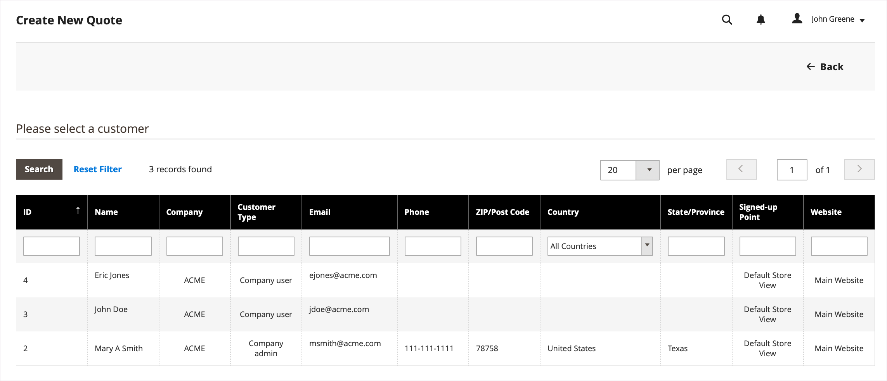
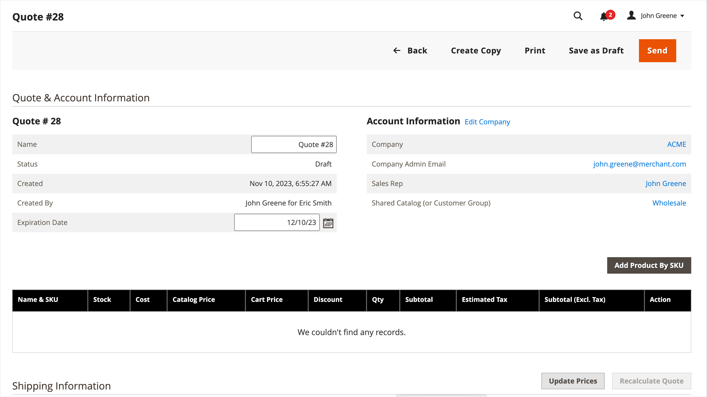
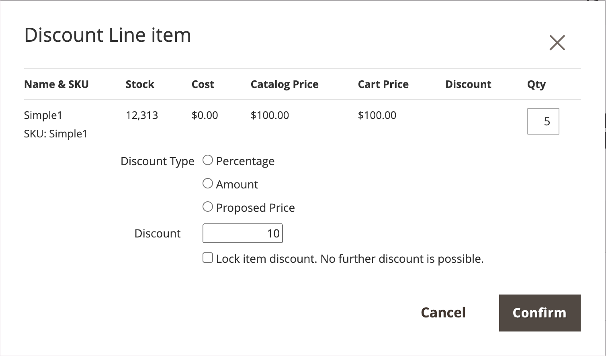
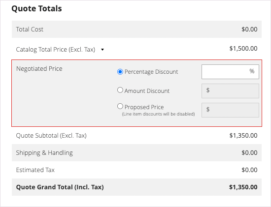
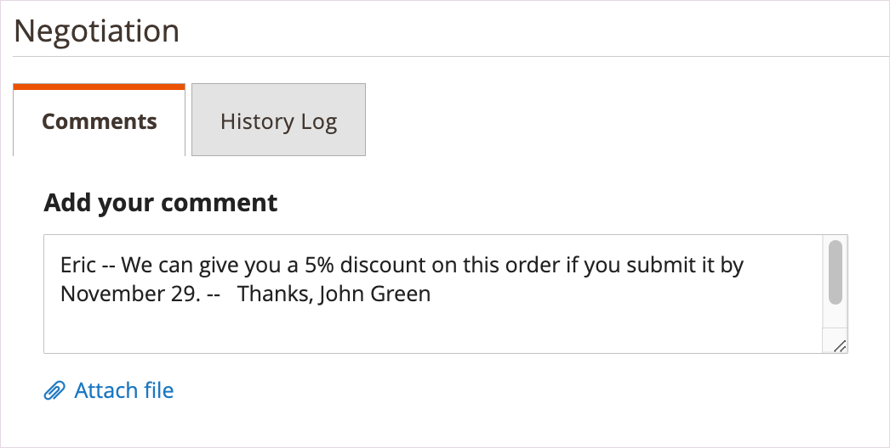

# Initiate a Quote for a Buyer

If quotes are enabled in the [Sales features configuration](configure-quotes.md), a sales representative can initiate the negotiation process with a company buyer by creating a quote from the Admin.

- Draft quotes are visible only to the seller.
- Draft quotes cannot be submitted until the sales representative adds items, relevant discounts, and notes to create the initial offer for the buyer.
- A seller can create a quote from the Quotes or Customer Grid.

The Sales Representative sends the quote to the buyer to initiate the negotiation process. See [Negotiate a Quote](quote-price-negotiation.md).

## Sales representative quote creation experience

A Sales Representative can create a quote from the Quotes or Customer Grid.

>[!NOTE]
>
>For a video demo of a seller creating a quote for a buyer, see [Sales Representative initiates the quote](https://experienceleague.adobe.com/docs/commerce-learn/tutorials/b2b/b2b-quote/sales-rep-initiates-quote.html) in _Commerce Videos and Tutorials_.

### Create a quote from the Quote grid

1. The sales representative logs in to the Admin as an administrator with [Sales Operations permissions](../systems/permissions.md) to manage quotes.

1. In the Admin, go to the [!UICONTROL Quotes] grid by selecting **[!UICONTROL Sales]**, and then select **[!UICONTROL Quotes]**.

1. Create a quote for a buyer.

   - From the Quotes grid, select **[!UICONTROL Create New Quote]**.

     {width="700" zoomable="yes"}

   - On the [!UICONTROL Create New Quote] page, select the customer (Company buyer) to create the quote.

     {width="700" zoomable="yes"}

     A new quote displays in `Draft` status.

     {width="700" zoomable="yes"}

   - Update the quote name and modify the expiration date as needed.

   - Save the quote as a draft.

## Prepare the quote for the buyer

After creating the draft quote, add product items, apply discounts, and communicate with the buyer by adding comments and any related files to the quote. Then, send the quote to the buyer for review, or save it as a draft.

1. Add items to the quote by selecting **[!UICONTROL Add Product By SKU]**. Enter the SKU number and quantity, and then select **[!UICONTROL Add Product]**.

   {width="675" zoomable="yes"}

1. Apply line item discounts to products as needed.

   - From the [!UICONTROL Select] action menu, choose **[!UICONTROL Discount Item]**.

   - On the [!UICONTROL Discount Line item] form, select the **[!UICONTROL Discount Type]**.

     {width="675" zoomable="yes"}

   - In the [!UICONTROL Discount] field, enter the value for the discount type. For example, if you selected a percentage discount, enter 10 to apply a 10% discount to the line item.

   - Optionally, lock the line item discount value so that the product price is not further reduced by any discounts applied at the quote level.

     After confirming the change, the line item attributes in the product grid update to show the discount amount applied. If the discount is locked, a lock icon displays.

   A Sales Representative can request a discount from a specific line item in a quote.
   
   >[!NOTE]
   >
   >For a video demo of a how discounts at the line item work, see [Sales Representative applies discount to a quote line item](https://experienceleague.adobe.com/docs/commerce-learn/tutorials/b2b/b2b-quote/quote-line-item-discount.html) in _Commerce Videos and Tutorials_.

1. Apply a quote-level discount as needed:

   - In the [!UICONTROL Quote Totals - Negotiated Price] section, select the discount type, and then enter the value to apply.

     {width="700" zoomable="yes"}

   The product grid updates to show the discount.

1. Add additional information for the buyer.

   On the **[!UICONTROL Negotiation - Comments]** tab, add a note and attach any supporting files required for the buyer.

   {width="700" zoomable="yes"}

   By default, an [attached file](configure-quotes.md) can be up to 2 MB, in any of the following file formats: DOC, DOCX, XLS, XLSX, PDF, TXT, JPG or JPEG, PNG.

1. Add shipping address during negotiations.

   A Sales Representative can make a shipping and delivery selection once the buyer has added a shipping address to the quote.

   Shipping options are locked on checkout.

   For details on the buyer adding a shipping address, see [Quotes](account-dashboard-my-quotes.md)

1. Process the quote.

   Save the quote as a draft, or send it to the buyer.

   - If you save the quote as a draft, the status updates to `Draft` and a confirmation message is displayed.

   - If you send the quote to the buyer, the status changes to `Submitted`. The buyer receives an email notification to review the quote. The quote is locked until the buyer returns it for further negotiation. The seller can view the quote from the Quote grid or the Customer grid.

## View and create quotes from Customer Grid

1. In the Admin, go to the [!UICONTROL Customer] grid by selecting **[!UICONTROL Customers]**, and then select **[!UICONTROL All Customers]**.

1. Select the customer ID for a Company buyer.

   {width="700" zoomable="yes"}

1. Select **[!UICONTROL Edit]** to view the customer information.

1. Create a quote for the customer by selecting, **[!UICONTROL Create Quote]** and following the process to update the draft quote and send it to the customer.

1. View the customers existing quotes by selecting **[!UICONTROL Quotes]**.

   {width="700" zoomable="yes"}

1. Open a quote by selecting **[!UICONTROL View]**.

For details on managing the quote negotiation process, see [Negotiate a quote](quote-price-negotiation.md)
