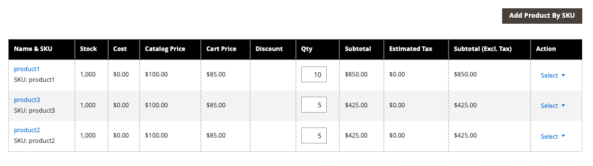
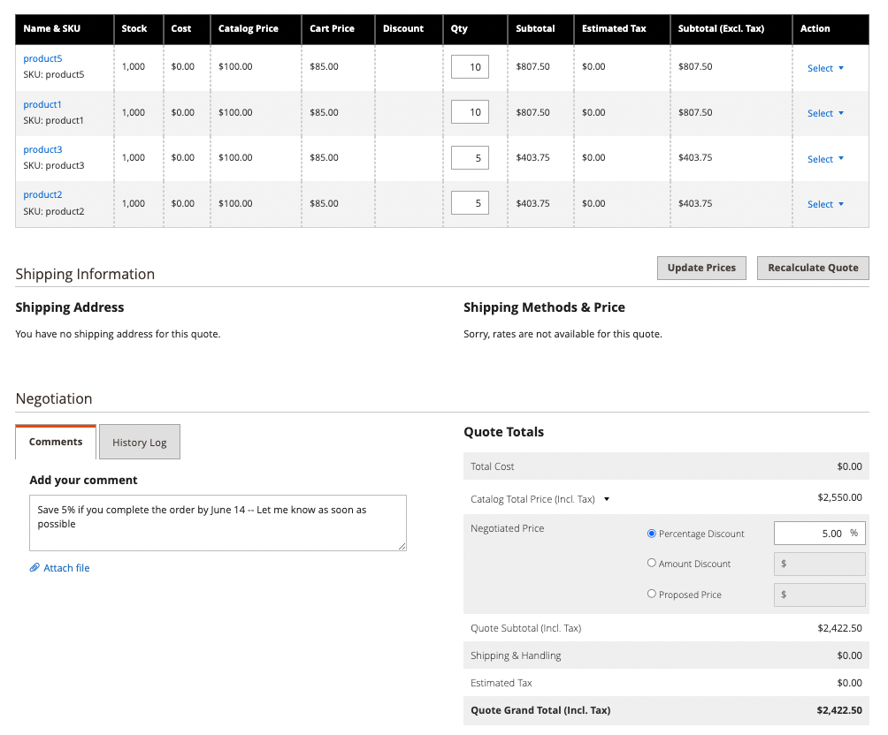
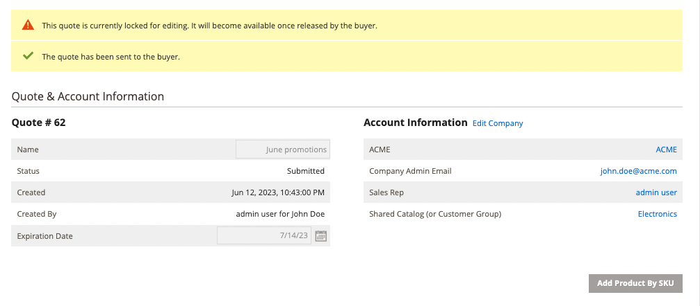
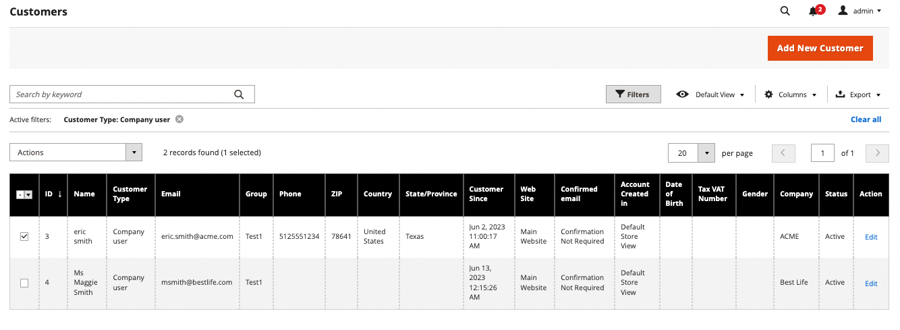
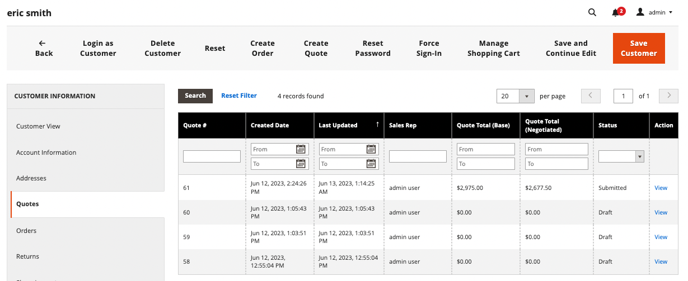

# Initiate a Quote for a Buyer

If quotes are enabled in the [Sales features configuration](configure-quotes.md), a sales representative can initiate the negotiation process with a company buyer by creating a draft quote.

- Draft quotes are visible only to the seller.
- Draft quotes cannot be submitted until the sales representative adds items, relevant discounts, and notes to create the initial offer for the buyer.
- A seller can create a quote from the Quotes or Customer Grid.

The Sales Representative sends the quote to the buyer to initiate the negotiation process. See [Negotiate a Quote](quote-price-negotiation.md).

## Sales representative quote creation experience

A Sales Representative can create a quote from the Quotes or Customer Grid.

>[!NOTE]
>
>For a video demo of a seller creating a quote for a buyer, see [Sales Representative initiates the quote](https://experienceleague.adobe.com/docs/commerce-learn/tutorials/b2b/b2b-quote/sales-rep-initiates-quote.html) in _Commerce Videos and Tutorials_.

### Create a quote from the Quote grid

1. The sales representative logs in to the Admin as an administrator with [Sales Operations permissions](../systems/permissions.md) to manage quotes.

1. In the Admin, go to the [!UICONTROL Quotes] grid by selecting **[!UICONTROL Sales]**, and then select **[!UICONTROL Quotes]**.

1. Create a draft quote for a buyer.

   - From the Quotes grid, select **[!UICONTROL Create New Quote]**.

     {width="700" zoomable="yes"}

   - On the [!UICONTROL Create New Quote] page, select the customer (Company buyer) to create the quote.

   - Select the store where the company buyer can submit an order after the negotiation process completes.

     A new quote displays in `Draft` status.

    {width="700" zoomable="yes"}

1. Prepare the quote to submit to the buyer.

   - Update the quote name and modify the expiration date as needed.

   - Add items to the quote by selecting **[!UICONTROL Add Product By SKU]**. Enter the SKU number and quantity, and then select **[!UICONTROL Add Product]**.

     {width="700" zoomable="yes"}

1. Apply a quote discount and add a note to the buyer.

   {width="700" zoomable="yes"}

   When you add a discount, the quote price updates automatically.

1. If needed, attach a supporting document or image to the quote by selecting **[!UICONTROL Attach file]**.

   By default, an [attached file](configure-quotes.md) can be up to 2 MB, in any of the following file formats: DOC, DOCX, XLS, XLSX, PDF, TXT, JPG or JPEG, PNG.

1. Submit the quote to the buyer by selecting **[!UICONTROL Send]**.

   After submitting the quote, the status updates to draft and a confirmation message is displayed:

   {width="700" zoomable="yes"}

  The buyer receives an email notification to review the quote. The quote is locked until the buyer returns it for further negotiation. The Seller can view the quote from the Quote grid or the Customer grid.

## View and create quotes from Customer Grid

1. In the Admin, go to the [!UICONTROL Customer] grid by selecting **[!UICONTROL Customers]**, and then select **[!UICONTROL All Customers]**.

1. Select the customer ID for a Company buyer.

   {width="700" zoomable="yes"}

1. Select **[!UICONTROL Edit]** to view the customer information.

1. Create a quote for the customer by selecting, **[!UICONTROL Create Quote]** and following the process to update the draft quote and send it to the customer.

1. View the customers existing quotes by selecting **[!UICONTROL Quotes]**.

   {width="700" zoomable="yes"}

1. Open a quote by selecting **[!UICONTROL View]**.

For details on managing the quote negotiation process, see [Negotiate a quote](quote-price-negotiation.md)
