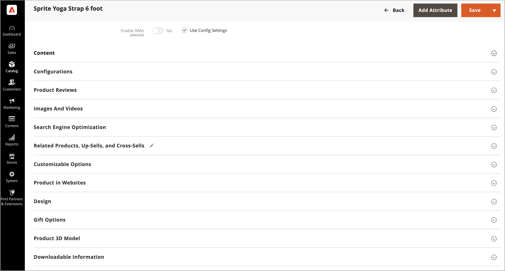

# Manage product 3D models with the [!DNL AR Viewer] for Adobe Commerce

For each product, you can upload a `.USDZ` file that allows for AR and 3D models to be used in your product listing.

The [!DNL AR Viewer] only supports `.USDZ` files.

## Install the extension

[!DNL AR Viewer] is installed as an extension from the [Adobe Commerce Marketplace](https://commercemarketplace.adobe.com/magento-module-arviewer.html){target=_blank}.

See the [_Installation Guide_](https://experienceleague.adobe.com/docs/commerce-operations/installation-guide/tutorials/extensions.html) for more information about the extension installation process.

After the [!DNL AR Viewer] extension is installed and configured, Admin users can set up, customize, and manage product listings to include 3D models.

## Add a 3D model

1. Open the product in edit mode.

1. To work with a specific store view, set the **[!UICONTROL Store View]** chooser to the applicable view.

   >[!NOTE]
   >
   >New product 3D models are _always_ uploaded and visible in _all_ store views, even if the `All Store Views` scope is not used for upload.   To hide any product 3D models from a specific store view, you must switch to that Store View, select the **[!UICONTROL Hide from Product Page]** checkbox for the 3D model, and click **[!UICONTROL Save]**.

1. Scroll down and expand the _[!UICONTROL Product 3D Model]_ section.

   {width="700" zoomable="yes"}

1. Add the 3D model (`.USDZ` file) of the product.

1. Click **[!UICONTROL Save]**.

### Delete a 3D model

To remove a 3D model from the product details: 

1. Click **[!UICONTROL Delete]**. 

1. Click **[!UICONTROL Save]**.

## View product 3D models

When the product details are updated with the 3D model:

1. The [!DNL AR Viewer] generates a QR code in the product description that encodes the AR file.

1. A customer can see this QR code in the product page.

1. When customers scan the QR code with their mobile devices, an AR experience is rendered on the mobile device.

>[!NOTE]
>
> For a series of demonstration videos of a user adding a 3d model to a product, see the [AR Viewer for Adobe Commerce](https://experienceleague.adobe.com/docs/commerce-learn/tutorials/catalog/augmented-reality.html) page in _Commerce Videos and Tutorials_.
