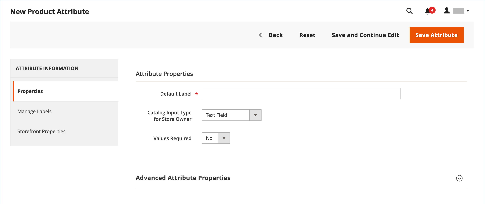
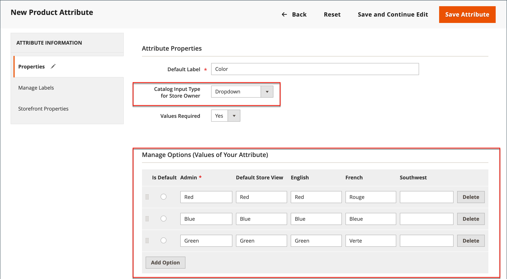
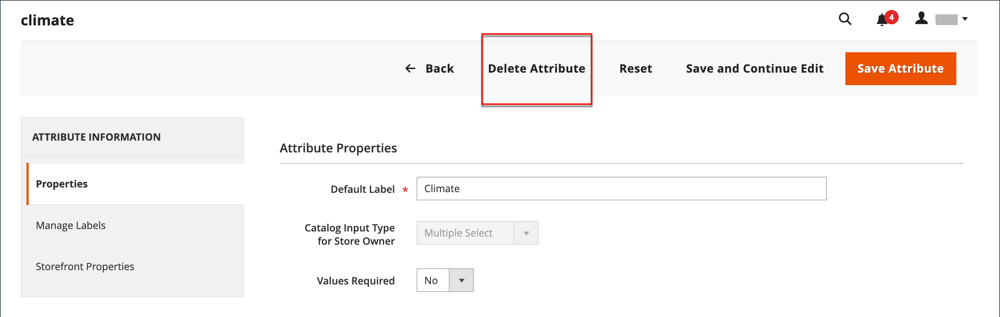

# Create and delete product attributes

You can create attributes while working on a product or from the _[!UICONTROL Product Attributes]_ page. The following steps show how to create attributes from the _[!UICONTROL Stores]_ menu.

## Step 1: Describe the basic attribute properties

1. On the _Admin_ sidebar, go to **[!UICONTROL Stores]** > _[!UICONTROL Attributes]_ > **[!UICONTROL Product]**.

1. Click **[!UICONTROL Add New Attribute]**.

   {width="600" zoomable="yes"}

1. For **[!UICONTROL Default Label]**, enter a label that identifies the attribute.

1. To determine the type of input control that is used for data entry, set **[!UICONTROL Catalog Input Type for Store Owner]** to one of the following:

   |Property|Description|
   |--- |--- |
   |`Text Field`|A single-line input field for text.|
   |`Text Area`|A multiple-line input field for entering paragraphs of text, such as a product description. You can use the WYSIWYG Editor to format the text with HTML tags, or enter the tags directly into the text.|
   |`Text Editor`|A fully functioning text editor at the attribute location.|
   |Date|Displays a date value in the [preferred format](attributes-input-types.md#date-and-time-options) and [time zone](../getting-started/store-details.md#locale-options). Date values can be selected from a list or a calendar (  ).   **_Note:_** Depending on your system configuration, _Admin_ users can enter dates directly into a field or select a date from the calendar or list. For information about specifying date and time values, see [Date and time options](attributes-input-types.md#date-and-time-options).|
   |`Yes/No`|Displays a drop-down list with pre-defined options of `Yes` and `No`.|
   |`Dropdown`|Displays a drop-down list of values that accepts only a single selection. The Dropdown input type is a key component of [configurable products](product-create-configurable.md).|
   |`Multiple Select`|Displays a drop-down list of values that accepts multiple selections.|
   |`Price`|This input type is used to create price fields that are in addition to the predefined attributes: Price, Special Price, Tier Price, and Cost. The currency used is determined by your system configuration.|
   |`Media Image`|Associates an extra image with a product, such as a product logo, care instructions, or ingredients from a food label. When you add a media image attribute to the attribute set of a product, it becomes an extra image type, along with Base, Small, and Thumbnail. The media image attribute can be excluded from the [storefront media browser](catalog-images-video.md#storefront-media-browser).|
   |`Fixed Product Tax`|Lets you define [FPT rates](../stores-purchase/fixed-product-tax.md) based on the requirements of your locale.|
   |`Visual Swatch`|Displays a swatch that depicts the color, texture, or pattern of a configurable product. A [visual swatch](swatches.md) can be filled with a hexadecimal color value, or display an uploaded image that represents the color, material, texture, or pattern of the option.|
   |`Text Swatch`|A text-based representation of a configurable product option that is frequently used for size. [Text swatches](swatches.md#text-based-swatches) can also include hexadecimal color values.|
   |`Page Builder`|A fully functioning [Page Builder](../page-builder/introduction.md) workspace at the attribute location that makes it easy to add engaging content to the product page.|

   {style="table-layout:auto"}

1. If you want to require an option selection before the customer can purchase the product, set **[!UICONTROL Values Required]** to `Yes`.

1. For [!UICONTROL Dropdown] and [!UICONTROL Multiple Select] input types, do the following:

   - Under _[!UICONTROL Manage Options]_, click **[!UICONTROL Add Option]**.

   - Enter the first value that you want to appear in the list.

      You can enter one value for the Admin, and a translation of the value for each store view. If you have only one store view, you can enter only the Admin value and it is used for the storefront as well.

   - Click **[!UICONTROL Add Option]** and repeat the previous step for each option that you want to include in the list.

   - Select **[!UICONTROL Is Default]** to use the option as the default value.

   {width="600" zoomable="yes"}

## Step 2: Describe the advanced properties (if needed)

1. Enter a unique **[!UICONTROL Attribute Code]** in lowercase characters and without spaces.

   {width="600" zoomable="yes"}

   The available options depend on the _[!UICONTROL Catalog Input Type for Store Owner]_ setting.

1. Set **[!UICONTROL Scope]** to indicate where in your [store hierarchy](../getting-started/websites-stores-views.md) that the attribute can be used.

1. If you want to prevent any duplicate value entry, set **[!UICONTROL Unique Value]** to `Yes`.

1. For input types that are entered values, run a validity test of any data entered into a text field by setting **[!UICONTROL Input Validation for Store Owner]** to the type of data that the field should contain.

   This field is not available for input types with values that are selected. The test can validate any of the following:

   - `Decimal Number`
   - `Integer Number`
   - `Email`
   - `URL`
   - `Letters`
   - `Letters (a-z, A-Z) or Numbers (0-9)`

   {width="400"}

1. To add this attribute to the [Products list](products-list.md), set the following options to `Yes`.

   - **Add to Column Options** - Includes the attribute as a column in the _[!UICONTROL Products]_ list.
   - **Use in Filter Options** - Adds a filter control to the column header in the _[!UICONTROL Products]_ list.

## Step 3: Enter the field label

1. In the left side navigation, choose **[!UICONTROL Manage Labels]**.

1. Enter a **[!UICONTROL Title]** to be used as a label for the field.

   If your store is available in different languages, you can enter a translated title for each view.

   {width="600" zoomable="yes"}

## Step 4: Describe the storefront properties

1. In the left side navigation, choose **[!UICONTROL Storefront Properties]**.

   {width="600" zoomable="yes"}

   The available options depend on the _[!UICONTROL Catalog Input Type for Store Owner]_ setting.

1. If the attribute is to be available for search, set **[!UICONTROL Use in Search]** to `Yes`.

   - Set the **[!UICONTROL Search Weight]** value to control where the item appears in search results: 1 (lowest weight) to 10 (highest weight).

   - Set the **[!UICONTROL Visible in Advanced Search]** as needed. Learn more in [Advanced Search](search.md#advanced-search).

1. To include the attribute in Product Compare, set **[!UICONTROL Comparable on Storefront]** to `Yes`.

1. For dropdown, multiple select, and price fields, do the following:

   - To use the attribute as a filter in layered navigation, set **[!UICONTROL Use in Layered Navigation]** to `Yes`.

   - To use the attribute in layered navigation on search results pages, set **[!UICONTROL Use in Search Results Layered Navigation]** to `Yes`.

   - For **[!UICONTROL Position]**, enter a number to indicate the relative position of the attribute in the layered navigation block.

1. To use the attribute in price rules, set **[!UICONTROL Use for Promo Rule Conditions]** to `Yes`.

1. To allow the text to be formatted with HTML, set **[!UICONTROL Allow HTML Tags on Frontend]** to `Yes`.

   This setting makes the WYSIWYG editor available for the field.

1. To include the attribute on the product page, set **[!UICONTROL Visible on Catalog Pages on Storefront]** to `Yes`.

1. Complete the following settings if supported by your theme:

   - To include the attribute in product listings, set **[!UICONTROL Used in Product Listing]** to `Yes`.

   - To use attribute as a sort parameter for product listings, set **[!UICONTROL Used for Sorting in Product Listing]** to `Yes`.

1. When complete, click **[!UICONTROL Save Attribute]**.

## Step 5: Assign the created attribute to the attribute set

For an attribute to be visible on the product creation page, add it to a specific attribute set.

1. After completing previous steps, go to **[!UICONTROL Stores]** > _[!UICONTROL Attributes]_ > **[!UICONTROL Attribute Set]**.

1. Select the attribute set you need in the list, and open it in edit mode.

1. Drag the created attribute from the **[!UICONTROL Unassigned Attributes]** list to the appropriate folder in the **Groups** column.

1. When complete, click **[!UICONTROL Save]**.

## Attributes for configurable products

Any attribute that is used as a drop-down list of options for a [configurable product](product-create-configurable.md) must have the following properties:

| Property | Value |
|----------|------ |
| Catalog Input Type for Store Owner | Dropdown |
| Scope | Global |

{style="table-layout:auto"}

## Delete an attribute

When an attribute is deleted, it is removed from any related products and attribute sets. System attributes are part of the core functionality of your store and cannot be deleted.

Before deleting an attribute, make sure that it is not currently used by any product in your catalog. An easy way to determine if an attribute is in use is to use the [Export](../systems/data-export.md) tool to check the list of product Entity Attributes. If the attribute is not included in the list, then it is not used by any products in the catalog.

**_To delete an attribute:_**

1. On the _Admin_ sidebar, go to **[!UICONTROL Stores]** > _[!UICONTROL Attributes]_ > **[!UICONTROL Product]**.

1. Find the attribute in the list, and open in edit mode.

1. Click **[!UICONTROL Delete Attribute]**.

   {width="600" zoomable="yes"}

1. When prompted to confirm, click **[!UICONTROL OK]**.
