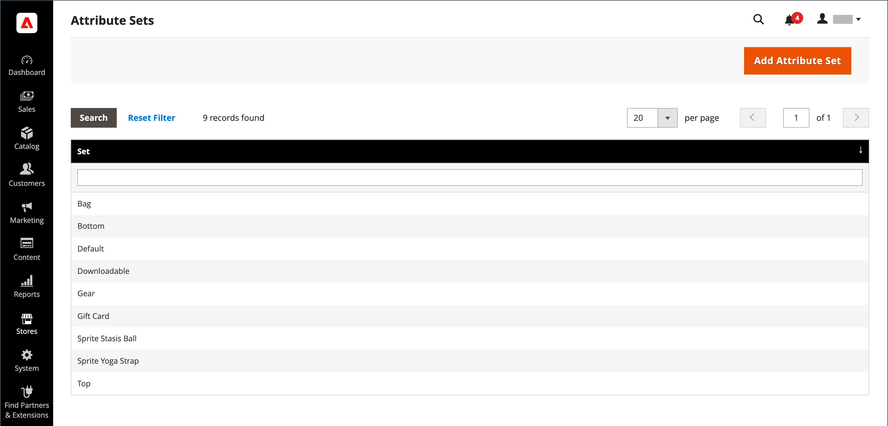
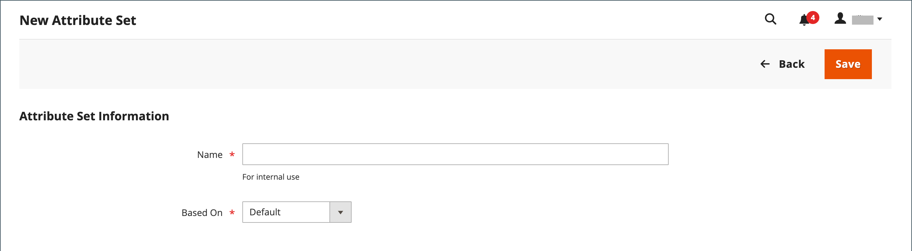
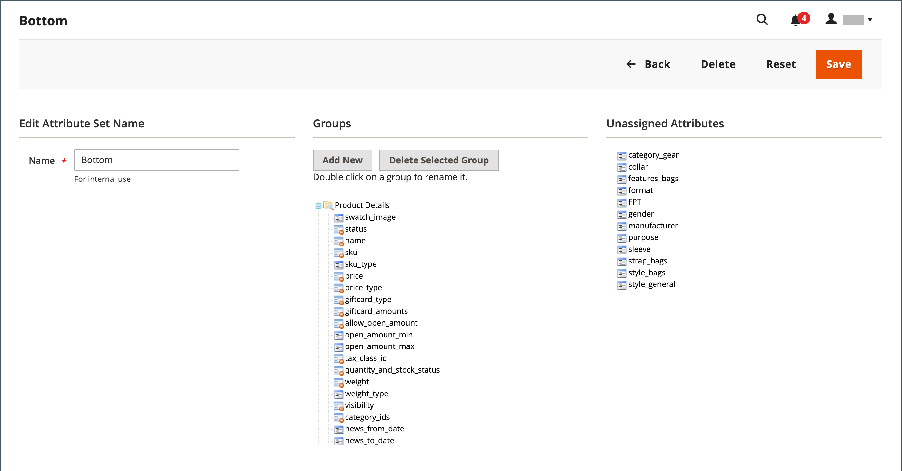

# Attribute sets

One of the first steps when creating a product is to choose the attribute set that is used as a template for the product record. The attribute set determines the fields that are available during data entry, and the values that appear to the customer.

The attributes are organized into groups that determine where they appear in the product record. Your store comes with an initial attribute set, called _default_, that includes a set of commonly used attributes. If you would like to add only a few attributes, you can add them to this default attribute set. If you sell products that require specific types of information, it might be better to create a dedicated attribute set that includes the specific attributes needed for the product.

<!-- zoom -->

## Create an attribute set

1. On the _Admin_ sidebar, go to **[!UICONTROL Stores]** > _[!UICONTROL Attributes]_ > **[!UICONTROL Attribute Set]**.

1. Click **[!UICONTROL Add New Set]**.

    <!-- zoom -->

1. Enter a **[!UICONTROL Name]** for the attribute set.

1. Set **[!UICONTROL Based On]** to an existing attribute set to be used as a template.

1. click **[!UICONTROL Save]**.

   The next page displays the following:

   - The left column shows the name of the attribute set. The name is for internal reference, and can be changed as needed.
   - The center of the page lists the current selection of attribute groups.
   - The right column lists the selection of attributes that are currently not assigned to the attribute set.

1. To add an attribute to the set, drag the attribute from the **[!UICONTROL Unassigned Attributes]** list to the appropriate folder in the **[!UICONTROL Groups]** column.

   >[!NOTE]
   >
   >System attributes are marked with a dot and cannot be removed from the _[!UICONTROL Groups]_ list. They can, however, be dragged to another group in the attribute set.

1. When complete, click **[!UICONTROL Save]**.

<!-- zoom -->

## Create an attribute group

1. In the _[!UICONTROL Groups]_ column the attribute set, click **[!UICONTROL Add New]**.

1. Enter a **[!UICONTROL Name]** for the new group, and click **[!UICONTROL OK]**.

1. Do either of the following:

   - Drag **[!UICONTROL Unassigned Attributes]** to the new group.
   - Drag attributes from any other group to the new group.

   The new group becomes a section of attributes in any product that is based on the attribute set.

## Delete an attribute set

1. On the _Admin_ sidebar, go to **[!UICONTROL Stores]** > _[!UICONTROL Attributes]_ > **[!UICONTROL Attribute Set]**.

1. Select the attribute set in the list, and open in edit mode.

1. Click **[!UICONTROL Delete]**.

1. When prompted to confirm, click **[!UICONTROL OK]**.
