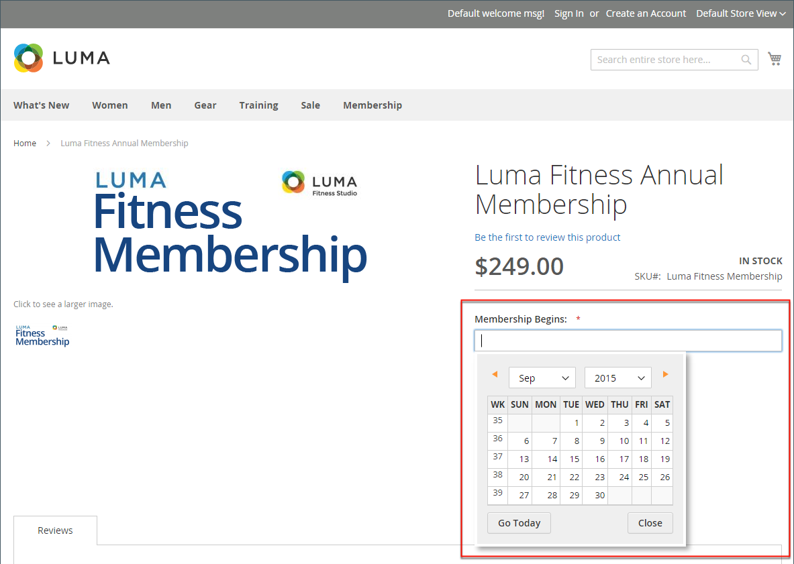

# Attribute input types

When viewed from the Admin, attributes are the fields that you complete when you create a product. The input type that is assigned to an attribute determines the type of data that can be entered and the format of the field or input control. From the standpoint of the customer, attributes provide information about the product, and are the options and data entry fields that must be completed to purchase a product.

## Input types

|Property|Description|
|--- |--- |
|Text Field|A single line input field for text.|
|Text Area|A multiple-line input field for entering paragraphs of text, such as a product description. You can use the WYSIWYG Editor to format the text with HTML tags, or enter the tags directly into the text.|
|Text Editor|A fully-functioning text editor at the attribute location.|
|Date|Displays a date value in the [preferred format](#date-and-time-options) and [time zone](https://docs.magento.com/user-guide/stores/locale-options.html). Date values can be selected from a list or a calendar (  ).   **_Note:_** Depending on your system configuration, _Admin_ users can enter dates directly into a field or select a date from the calendar or list. For information about specifying date and time values, see [Date and Time Custom Options](https://docs.magento.com/user-guide/stores/attribute-date-time-options.md).|
|Date and Time|Displays a date and time value in the [preferred format](https://docs.magento.com/user-guide/stores/attribute-date-time-options.html) and [time zone](https://docs.magento.com/user-guide/stores/locale-options.html). The date and time can be entered manually or selected from a calendar. Example format: MM/DD/YYYY HH:MM|
|Yes/No|Displays a drop-down list with pre-defined options of `Yes` and `No`.|
|Dropdown|Displays a drop-down list of values that accepts only a single selection. The Dropdown input type is a key component of [configurable products](https://docs.magento.com/user-guide/catalog/product-create-configurable.html).|
|Multiple Select|Displays a drop-down list of values that accepts multiple selections.|
|Price|This input type is used to create price fields that are in addition to the predefined attributes: Price, Special Price, Tier Price, and Cost. The currency used is determined by your system configuration.|
|Media Image|Associates an additional image with a product, such as a product logo, care instructions, or ingredients from a food label. When you add a media image attribute to the attribute set of a product, it becomes an additional image type, along with Base, Small, and Thumbnail. The media image attribute can be excluded from the [storefront media browser](catalog-images-video.md#storefront-media-browser).|
|Fixed Product Tax|Lets you define [FPT rates](https://docs.magento.com/user-guide/tax/fixed-product-tax.html) based on the requirements of your locale.|
|Visual Swatch|Displays a swatch that depicts the color, texture, or pattern of a configurable product. A [visual swatch](swatches.md) can be filled with a hexadecimal color value, or display an uploaded image that represents the color, material, texture, or pattern of the option.|
|Text Swatch|A text-based representation of a configurable product option that is frequently used for size. [Text swatches](swatches.md) can also include hexadecimal color values.|
|Page Builder|A fully-functioning [Page Builder](../page-builder/workspace.md) workspace at the attribute location that makes it easy to add engaging content to the product page.|

## Date and time options

You can customize the format of date and time fields, and select the input control that is used for data entry. Dates values can be selected from a drop-down list, or pop-up calendar.

<!-- zoom -->

To format date/time fields:

1. On the _Admin_ sidebar, go to **Stores** > _Settings_ > **Configuration**.

1. In the panel on the left, expand **Catalog** and click the **Catalog** subitem.

1. Expand the **Date & Time Custom Options** section.

1. To use a popup calendar as the input control for date fields, set **Use JavaScript Calendar** to `Yes`.

1. To establish the **Date Fields Order**, do the following:

   - Clear the **Use system value** checkbox.

   - Set the order of each part of the date field as needed:

      - Month
      - Day
      - Year

1. To set your preferred time format, do the following:

   - Clear the **Use system value** checkbox.

   - Set **Time Format** to one of the following:

      - `12h AM/PM`
      - `24h`

1. To establish the **Year Range** for the drop-down values, enter the year (YYYY) to set the **from** and **to** dates.

    If blank, the field defaults to the current year.

    <!-- zoom -->
   
   See also [_Date & Time Custom Options_](https://docs.magento.com/user-guide/configuration/catalog/catalog.html)

1. When complete, click **Save Config**.
