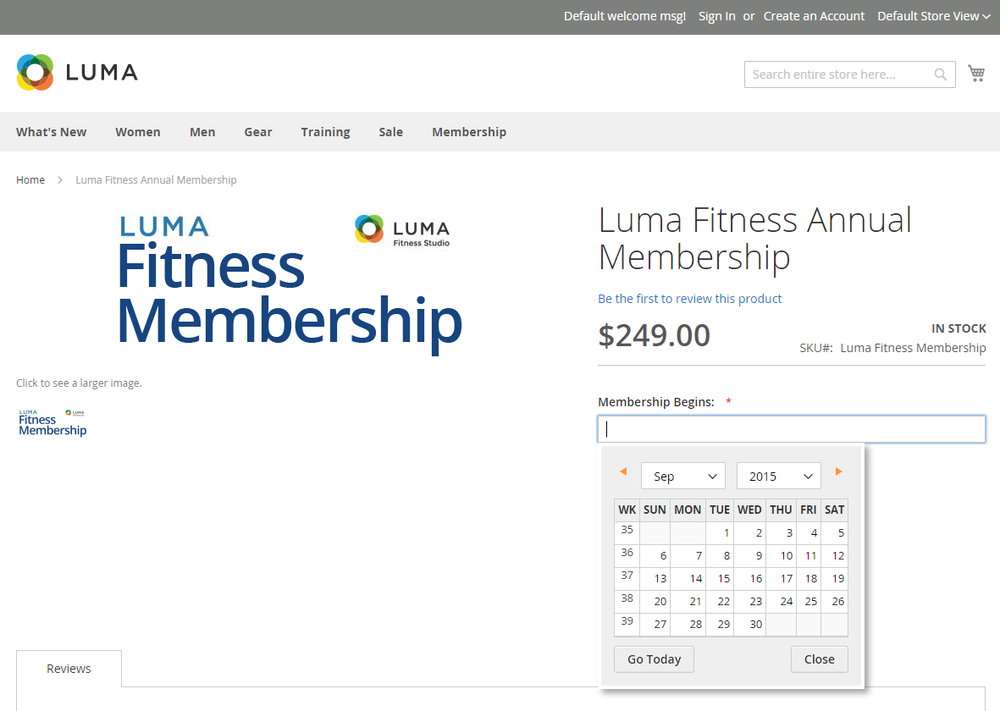
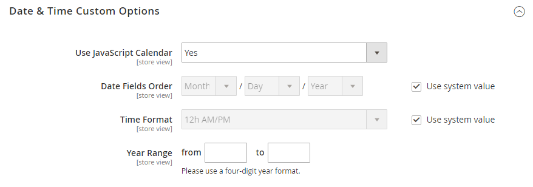

# Attribute input types

When viewed from the Admin, attributes are the fields that you complete when you create a product. The input type that is assigned to an attribute determines the type of data that can be entered and the format of the field or input control. From the standpoint of the customer, attributes provide information about the product, and are the options and data entry fields that must be completed to purchase a product.

## Input types

|Property|Description|
|--- |--- |
|[!UICONTROL Text Field]|A single-line input field for text.|
|[!UICONTROL Text Area]|A multiple-line input field for entering paragraphs of text, such as a product description. You can use the WYSIWYG Editor to format the text with HTML tags, or enter the tags directly into the text.|
|[!UICONTROL Text Editor]|A fully functioning text editor at the attribute location.|
|[!UICONTROL Date]|Displays a date value in the [preferred format](#date-and-time-options) and [time zone](../getting-started/store-details.md#locale-options). Date values can be selected from a list or a calendar (  ).   **_Note:_** Depending on your system configuration, _Admin_ users can enter dates directly into a field or select a date from the calendar or list. For information about specifying date and time values, see [Date and time options](#date-and-time-options).|
|[!UICONTROL Date and Time]|Displays a date and time value in the [preferred format](#date-and-time-options) and [time zone](../getting-started/store-details.md#locale-options). The date and time can be entered manually or selected from a calendar. Example format: MM/DD/YYYY HH:MM|
|[!UICONTROL Yes/No]|Displays a drop-down list with pre-defined options of `Yes` and `No`.|
|Dropdown|Displays a drop-down list of values that accepts only a single selection. The Dropdown input type is a key component of [configurable products](../catalog/product-create-configurable.md).|
|[!UICONTROL Multiple Select]|Displays a drop-down list of values that accepts multiple selections.|
|[!UICONTROL Number] [!BADGE SaaS only]{type=Positive url="https://experienceleague.adobe.com/en/docs/commerce/user-guides/product-solutions" tooltip="Applies to Adobe Commerce as a Cloud Service and Adobe Commerce Optimizer projects only (Adobe-managed SaaS infrastructure)."} |A numeric input field that stores decimal values. Unlike the **Price** input type, it does not apply currency formatting and accepts negative values. Use this input type for measurements, dimensions, or technical specifications such as temperature ranges.|
|[!UICONTROL Price]|This input type is used to create price fields that are in addition to the predefined attributes: `Price`, `Special Price`, `Tier Price`, and `Cost`. The currency used is determined by your system configuration.|
|[!UICONTROL Media Image]|Associates an extra image with a product, such as a product logo, care instructions, or ingredients from a food label. When you add a media image attribute to the attribute set of a product, it becomes an extra image type, along with Base, Small, and Thumbnail. The media image attribute can be excluded from the [storefront media browser](catalog-images-video.md#storefront-media-browser).|
|[!UICONTROL File] [!BADGE SaaS only]{type=Positive url="https://experienceleague.adobe.com/en/docs/commerce/user-guides/product-solutions" tooltip="Applies to Adobe Commerce as a Cloud Service and Adobe Commerce Optimizer projects only (Adobe-managed SaaS infrastructure)."} |Allows a file to be uploaded and associated with a product attribute. Supported file types and maximum file size are configured in [Product File Attributes](../configuration-reference/catalog/product-file-attributes.md). Use this input type for documents such as product manuals, specification sheets, or certificates.|
|[!UICONTROL Fixed Product Tax]|Lets you define [FPT rates](../stores-purchase/fixed-product-tax.md) based on the requirements of your locale.|
|[!UICONTROL Visual Swatch]|Displays a swatch that depicts the color, texture, or pattern of a configurable product. A [visual swatch](swatches.md) can be filled with a hexadecimal color value, or display an uploaded image that represents the color, material, texture, or pattern of the option.|
|[!UICONTROL Text Swatch]|A text-based representation of a configurable product option that is frequently used for size. [Text swatches](swatches.md) can also include hexadecimal color values.|
|[!UICONTROL Page Builder]|A [[!DNL Page Builder]](../page-builder/workspace.md) workspace at the attribute location that makes it easy to add engaging content to the product page.|

{style="table-layout:auto"}

## Date and time options

You can customize the format of date and time fields, and select the input control that is used for data entry. Dates values can be selected from a drop-down list, or pop-up calendar.

{width="700" zoomable="yes"}

**_To format date/time fields:_**

1. On the _Admin_ sidebar, go to **[!UICONTROL Stores]** > _[!UICONTROL Settings]_ > **[!UICONTROL Configuration]**.

1. In the panel on the left, expand **[!UICONTROL Catalog]** and click the **[!UICONTROL Catalog]** subitem.

1. Expand the **[!UICONTROL Date & Time Custom Options]** section.

   {width="600" zoomable="yes"}

   For a detailed listing of these options, see [_Date & Time Custom Options_](../configuration-reference/catalog/catalog.md) in the _Configuration Reference_.

1. To use a popup calendar as the input control for date fields, set **[!UICONTROL Use JavaScript Calendar]** to `Yes`.

1. To establish the **[!UICONTROL Date Fields Order]**, set the order of each part of the date field as needed:

   - Month
   - Day
   - Year

1. To set your preferred time format, set **Time Format** to one of the following:

   - `12h AM/PM`
   - `24h`

1. To establish the **[!UICONTROL Year Range]** for the drop-down values, enter the year (YYYY) to set the **[!UICONTROL from]** and **[!UICONTROL to]** dates.

   If blank, the field defaults to the current year.

1. When complete, click **[!UICONTROL Save Config]**.

