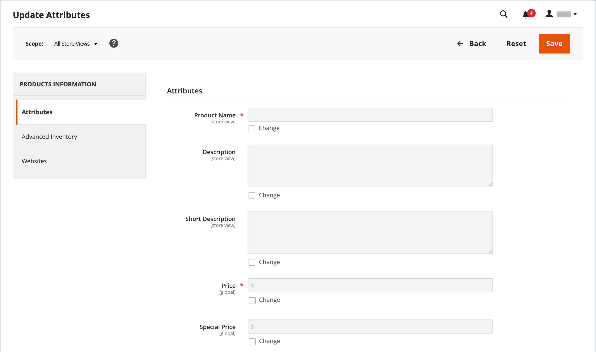

# Bulk updates for product attributes

Use the _[!UICONTROL Update Attributes]_ tool to change one or more attributes in your products. This tool allows you to apply significant changes across a large group of products.

1. On the _Admin_ sidebar, go to **[!UICONTROL Catalog]** > **[!UICONTROL Products]**.

1. Select the products for which you want to modify sources.

   Browse or search to find the products and select those checkboxes.

1. Click the **[!UICONTROL Actions]** menu at the top and choose **[!UICONTROL Update Attributes]**.

   {width="600" zoomable="yes"}

1. Update the attribute, advanced inventory, or website data for the selected products, according to your needs.

   {width="600" zoomable="yes"}

1. When finished, click **[!UICONTROL Save]**.
