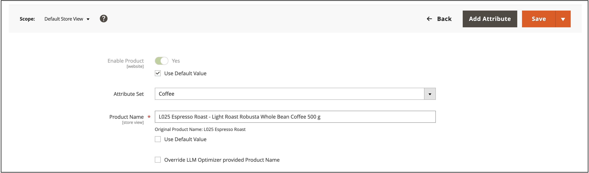
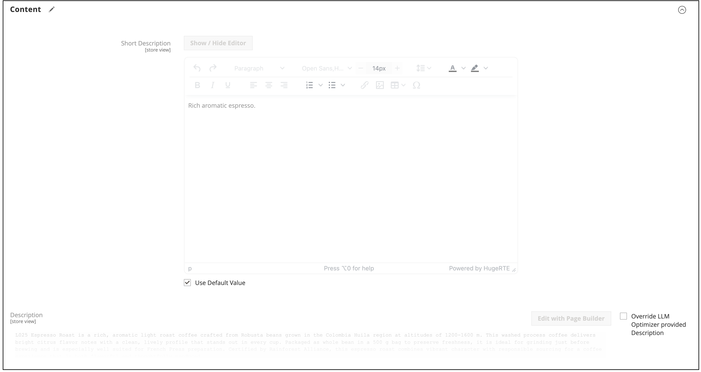

# Catalog enrichment

Catalog enrichment is a native [!DNL Adobe Commerce] capability that helps you improve product names and long descriptions so that your catalog is represented more accurately when shoppers use LLMs and AI assistants for product research and discovery.

>[!NOTE]
>
>Catalog enrichment is powered by [!DNL Adobe LLM Optimizer] behind the scenes. You use enrichment as part of your Commerce catalog workflow. You do not manage a separate LLM Optimizer integration to apply approved name and description updates. For broader LLM monitoring and optimization outside Commerce, see the [LLM Optimizer product documentation](https://experienceleague.adobe.com/en/docs/llm-optimizer/using/home).

## How it works {#how-it-works}

Your [!DNL Adobe Commerce] product catalog is the system of record for product data: names, descriptions, attributes, pricing, and inventory. Adobe Commerce Storefront MCP (Model Context Protocol) connects live catalog data to Adobe AI experiences. From there the Catalog Agent uses that interface so [!DNL Adobe LLM Optimizer] can identify gaps in product names and long descriptions, propose improvements, and write approved changes back to Commerce so you can review them in the Commerce Admin.

With catalog enrichment, you can:

- Identify gaps and inconsistencies in product names and long descriptions that affect how LLMs interpret your products.
- Review suggested improvements with supporting context, including justifications and before-and-after comparisons.
- Apply approved updates directly to the Commerce catalog so the Admin, storefront, and other channels that read those fields stay aligned.

Because product names and long descriptions live in Commerce, improving copy once can benefit every channel that consumes that product data. The benefit depends on how and when your systems refresh.

| Direction | Purpose |
| --- | --- |
| Commerce catalog -> analysis | Catalog and URL signals feed enrichment suggestions. |
| Enrichment -> Commerce catalog | After you approve an update, changes to product name and description are saved to the Commerce catalog so the Admin and storefront reflect the optimized values. |

## Who this is for {#who-this-is-for}

- Digital marketers and merchandisers who want product data to be accurate and consistent in LLM-driven answers.
- Digital marketers and merchandisers who need a controlled way to improve catalog copy at scale.
- Commerce administrators who own catalog integrity, Admin processes, and integrations (API, CSV, PIM) that feed product attributes.

## Prerequisites {#prerequisites}

The following prerequisites apply when you have access to catalog enrichment.

- Your storefront can be crawled by LLM-oriented and agentic bots where crawl coverage is required for catalog-aware suggestions.
- Required Commerce services and catalog connectivity are enabled and healthy. See [Enable catalog enrichment](#enable-catalog-enrichment) to learn more.
- [IMS is configured)](https://experienceleague.adobe.com/en/docs/core-services/interface/administration/organizations).
- You have access to the [Adobe Admin Console](https://helpx.adobe.com/business/enterprise/plan-your-deployment/basic-concepts/admin-console.html).

> If you do not have an IMS organization, contact your Adobe account team to provision one.

## Enable catalog enrichment {#enable-catalog-enrichment}

Work with your Commerce administrator or implementation partner to ensure the following before you review or apply suggestions:

### Install catalog enrichment and catalog services extensions

1. Install the catalog enrichment extension in your Commerce instance by running the following command:

    ```bash
    composer require magento/module-catalog-enrichment --no-update
    composer update magento/module-catalog-enrichment
    ```

1. If you have not already installed Catalog services, [do so](https://experienceleague.adobe.com/en/docs/commerce/catalog-service/installation#install-the-catalog-service-extension).

    **[!UICONTROL Catalog enrichment]** is now available in your Commerce instance.

### Access catalog enrichment

After you install the catalog enrichment and catalog services extensions, the catalog enrichment capability is available in the Admin under **[!UICONTROL Catalog]** > **[!UICONTROL Catalog Enrichment]**.


### Configure catalog enrichment

Configure catalog enrichment on the **[!UICONTROL Settings]** tab so Adobe LLM Optimizer can connect to your [!DNL Adobe Commerce] environment and surface suggestions in the Commerce Admin.

1. In the Admin, go to **[!UICONTROL Catalog]** > **[!UICONTROL Catalog Enrichment]**.
1. In the **[!UICONTROL Scope]** list at the top of the page, select the store view you want to configure, or leave **[!UICONTROL All Store Views]** to manage settings across store views.
1. Open the **[!UICONTROL Settings]** tab.
1. In **[!UICONTROL Commerce Configuration]**, expand the store view panel labeled with its URL.

   Provide your [!DNL Adobe Commerce] environment details to enable the Catalog LLM Optimizer Service and audit workflows.

   

1. Enter the required connection details for the store view.

    - **[!UICONTROL Store View URL]**: URL corresponding to the store view (for example, `https://brand.example.com/fr/`).
    - **[!UICONTROL Environment ID]**: Unique identifier for the Adobe Commerce environment that the connection accesses.
    - **[!UICONTROL Website Code]**, **[!UICONTROL Store Code]**, and **[!UICONTROL Store View Code]**: Website, store, and store view codes for the Commerce website. These values must match the codes in your Commerce Admin.

1. Optional: Enter **[!UICONTROL Host Name]** and **[!UICONTROL API Key]** if your environment requires them.

    - **[!UICONTROL Host Name]**: Host name of your Adobe Commerce instance.
    - **[!UICONTROL API Key]**: Authentication key used to securely access Adobe Commerce APIs. Click **[!UICONTROL Copy]** next to the field if you need to copy the key elsewhere.

1. Click **[!UICONTROL Save]**.

After you save, wait for any initial sync or validation job to complete before relying on catalog or audit results for that store view. It may take up to 24 hours for product suggestions to appear on the **[!UICONTROL Catalog Enrichment]** page.

To remove a store view configuration, expand that entry and click **[!UICONTROL Delete]**.

#### Field descriptions {#commerce-connection-fields}

Required fields are marked with an asterisk (*) on the **[!UICONTROL Commerce Configuration]** form.

| Field | Required | Description |
| --- | --- | --- |
| Store View URL | Yes | URL corresponding to the store view (for example, `https://brand.example.com/fr/`). |
| Environment ID | Yes | Unique identifier for the Adobe Commerce environment that the connection accesses. |
| Website Code | Yes | Website Code of the Commerce website. |
| Store Code | Yes | Store Code of the Commerce website. |
| Store View Code | Yes | Store View of the Commerce website. |
| Host Name | No | Host name of your Adobe Commerce instance. |
| API Key | No | Authentication key used to securely access Adobe Commerce APIs. Treat it like any production credential. |

### Review and apply catalog enrichment {#review-and-apply}

After catalog enrichment is enabled and configured, product suggestions display on the **[!UICONTROL Agentic Opportunities]** tab. From here, you can review suggestions and apply approved updates to product names and long descriptions in your Commerce catalog.

Catalog enrichment uses the following workflow views:

- **[!UICONTROL Current Suggestions]**: New or active items to review.
- **[!UICONTROL Fixed Suggestions]**: Items you already applied or resolved.
- **[!UICONTROL Ignored Suggestions]**: Items you intentionally excluded from action.


### Deploy approved suggestions {#review-deploy-catalog}

To deploy approved suggestions:

1. Select **[!UICONTROL Current Suggestions]**.
1. Click the expand control for the URL or SKU row to show the proposed product name and product description updates.
1. Review the suggestion and confirm it matches your merchandising and SEO strategy.

  You can edit a suggestion before you deploy it or move it to **[!UICONTROL Ignored Suggestions]** if it does not match your strategy.

1. Select the row for the URL or SKU to update.
1. Click **[!UICONTROL Deploy optimizations]** and confirm.

Approved name and description changes are saved to your [!DNL Adobe Commerce] catalog like other product updates.

>[!IMPORTANT]
>
>Treat each applied update as a production catalog change. Use your normal change-control, staging, and QA practices. Apply updates only after merchandising and SEO stakeholders agree on the final copy.

After you apply an update, suggestions move to **[!UICONTROL Fixed Suggestions]** with a **Marked as Fixed** status.

## Verify enrichment in the Admin {#verify-in-admin}

**To verify applied catalog enrichment:**

1. Go to **[!UICONTROL Catalog]** > **[!UICONTROL Products]** in the Commerce Admin.
1. Use filters and the **[!UICONTROL Store View]** selector as needed (for example, **[!UICONTROL Default Store View]**).
1. Search for the SKU.
1. Open the product in edit mode.

   The product form shows the enriched product name and/or description.

   

1. Optional: Select **[!UICONTROL Override LLM Optimizer provided Product Name]** if you want to keep a manually entered name instead.

   Manual overrides affect how suggestions stay in sync with the catalog. For more information, see [Manual override in the Admin](#manual-override-in-the-admin).

1. Expand the **[!UICONTROL Content]** section and locate the description field.

   The enriched description appears when you applied description changes.

   

1. Optional: Select **[!UICONTROL Override LLM Optimizer provided Description]** if you want to keep a manually entered description instead.

  Manual overrides affect how suggestions stay in sync with the catalog. For more information, see [Manual override in the Admin](#manual-override-in-the-admin).

## Verify enrichment on the storefront {#verify-storefront}

**To verify enrichment on the storefront:**

1. Search for the SKU on your storefront.
1. Open the product page.
1. Confirm that the product name and description matches what you approved.

   It may take some time before enrichments appear on your storefront.

1. Confirm that regions that show the long description match what you approved.
1. Optional: Confirm downstream channels that consume the same catalog attributes, where relevant to your rollout.

## Overrides, ingestion, and outdated suggestions {#overrides-ingestion}

After catalog enrichment updates a product's name or description, other ingestion systems may change the same fields. Examples include REST API calls, CSV imports, and PIM feeds.

### Original value re-ingested {#original-value-reingested}

If an external process writes the original name or description (the value that existed before enrichment was applied), Commerce continues to honor the enriched value for that field according to the catalog enrichment rules. The suggestion may not revert automatically based on that ingestion alone.

### New value re-ingested {#new-value-reingested}

If the external process sends a new value that is not a repeat of the pre-enrichment text, Commerce honors the new catalog value. For example, a rename from "Red Shoes" to "Iconic Red Shoes" replaces the enriched value. The related enrichment suggestion is typically marked as *Outdated* because the live catalog no longer matches the suggestion context.

### Manual override in the Admin {#manual-override-in-the-admin}

If you manually edit the product name or description in the [!DNL Adobe Commerce] Admin:

- The Admin value wins as the system of record for that manual change.
- The enrichment suggestion is marked *Outdated*.
- The suggestion workflow moves back toward the original state for that item so you can re-baseline or accept a new suggestion if analysis runs again.

These rules help you know whether catalog enrichment, ingestion feeds, or Admin edits are authoritative when multiple channels touch the same SKU.

## Limits and considerations {#limits}

- Enrichment applies to product names and long descriptions only. It does not change PDP layout, widgets, or other page-level storefront content.
- Large catalogs and high URL counts can affect how quickly analysis completes and how many suggestions appear at once.
- Meaningful suggestions assume that LLM-relevant bots can access the product URLs you care about. Robots rules, authentication, geo-blocking, and heavy personalization can reduce coverage.

## Best practices {#best-practices}

- Document system ownership for product name and description so that PIM or feed jobs do not unintentionally conflict with catalog enrichment.
- Coordinate with SEO and brand teams before bulk applying titles or descriptions.
- Re-sync or re-analyze after major catalog imports so that suggestions reflect the current catalog state.

<!--## Examples This section will provide examples of what enrichment before/after looks like:-->
