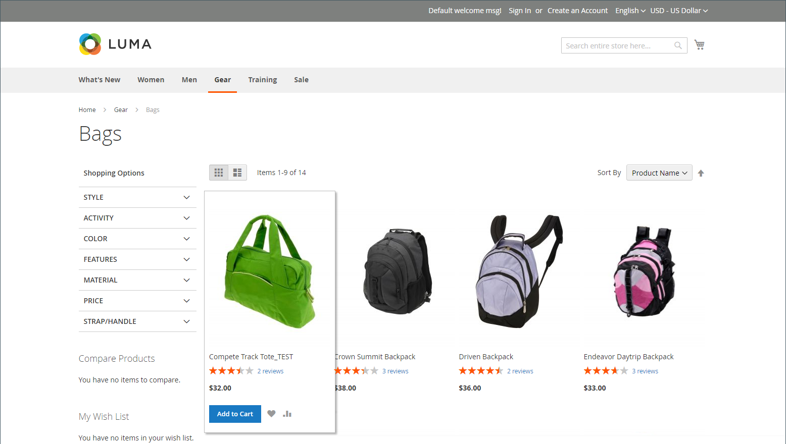
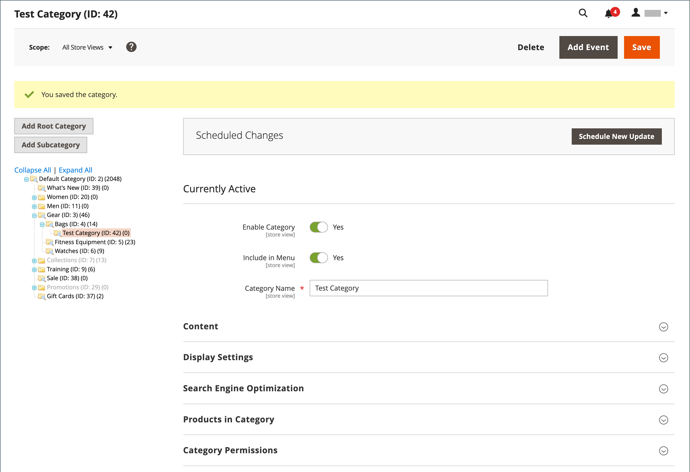
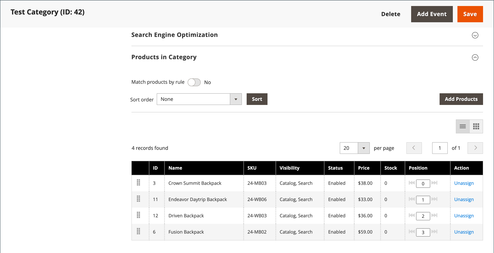

# Flat catalogs

>[!IMPORTANT]
>
>Use of a flat catalog is no longer recommended as a best practice. Continued use of this feature is known to cause performance degradation and other indexing issues. A detailed description and solution is available in the [Help Center](https://support.magento.com/hc/en-us/articles/360034631192){:target="_blank"}.  Affected versions include:  - Adobe Commerce on cloud infrastructure, 2.3.x and above - Adobe Commerce (On-Premise), 2.3.x and above - Magento Open Source, 2.3.x and above   On any release version, some extensions only work with flat tables, thus creating a risk if you disable flat tables. If you know that you have some extensions that use Flat Catalog indexers, you need to be aware of this risk when setting those values to `No`.

Commerce typically stores catalog data in multiple tables, based on the Entity-Attribute-Value (EAV) model. Because product attributes are stored in many tables, SQL queries are sometimes long and complex.

In contrast, a flat catalog creates tables on the fly, where each row contains all the necessary data about a product or category. A flat catalog is updated automatically—either every minute, or according to your cron job. Flat catalog indexing can also speed up the processing of catalog and cart price rules. A catalog with as many as 500,000 SKUs can be indexed quickly as a flat catalog.

>[!NOTE]
>
>Before you enable a flat catalog for a live store, make sure to test the configuration in a development environment.

## Step 1: Enable the Flat Catalog

1. On the _Admin_ sidebar, go to **[!UICONTROL Stores]** > _[!UICONTROL Settings]_ > **[!UICONTROL Configuration]**.

1. In the left panel, expand **[!UICONTROL Catalog]** and choose **[!UICONTROL Catalog]** underneath.

1. Expand the _Storefront_ section and do the following:

   - Set **[!UICONTROL Use Flat Catalog Category]** to `Yes`. (If necessary, deselect the **[!UICONTROL Use system value]** checkbox.)

   - Set **[!UICONTROL Use Flat Catalog Product]** to `Yes`.

   <!-- zoom -->

1. When complete, click **[!UICONTROL Save Config]**.

1. When prompted to update the cache, click **[!UICONTROL Cache Management]** in the system message and follow the instructions to refresh the cache.

## Step 2: Verify the results

There are two methods that you can use to verify the results.

### Method 1: Verify the results for a single product

1. On the _Admin_ sidebar, go to **[!UICONTROL Catalog]** > **[!UICONTROL Products]**.

1. Open a product in edit mode.

1. For **[!UICONTROL Name]**, add the text `_TEST` to the end of the product name.

1. click **[!UICONTROL Save]**.

1. On a new browser tab, navigate to the home page of your store and do the following:

   - Search for the product you edited.

   - Use the navigation to browse to the product under its assigned category.

      If necessary, refresh the page to see the results. The change appears within the minute or according to your [Cron](https://docs.magento.com/user-guide/system/cron.html) schedule.

   <!-- zoom -->

### Method 2: Verify the results for a category

1. On the _Admin_ sidebar, go to **[!UICONTROL Catalog]** > **[!UICONTROL Categories]**.

1. In the upper-left corner, verify that **[!UICONTROL Store View]** is set to `All Store Views`.

   If prompted, click **[!UICONTROL OK]** to confirm.

1. In the category tree, select an existing category, click **[!UICONTROL Add Subcategory]**, and do the following:

   - For **[!UICONTROL Category Name]**, enter `Test Category`.

   - When complete, click **[!UICONTROL Save]**.

      <!-- zoom -->

   - Expand  the **[!UICONTROL Products in Category]** section and click **[!UICONTROL Reset Filter]** to display all products.

   - Select the checkbox of several products to add them to the new category.

   - click **[!UICONTROL Save]**.

   <!-- zoom -->

1. On a new browser tab, navigate to the home page of your store and use the store navigation to browse to the category you created.

   If necessary, refresh the page to see the results. The change appears within the minute or according to your cron schedule.

## Step 3: Remove the test data

Do the following to remove the test data and restore the original product name and catalog configuration.

### Remove the test category

1. On the _Admin_ sidebar, go to **[!UICONTROL Catalog]** > **[!UICONTROL Categories]**.

1. In the category tree, select the test subcategory that you created.

1. In the upper-right corner, click **[!UICONTROL Delete]**.

1. When prompted to confirm, click **[!UICONTROL OK]**.

   This does not remove the products that are assigned to the category.

### Restore the original product name

1. On the _Admin_ sidebar, go to **[!UICONTROL Catalog]** > **[!UICONTROL Categories]**.

1. Open the test product in edit mode.

1. Remove the `_TEST` text that you added to the **[!UICONTROL Product Name]**.

1. In the upper-right corner, click **[!UICONTROL Save]**.

### Restore the original catalog configuration

1. On the _Admin_ sidebar, go to **[!UICONTROL Stores]** > _[!UICONTROL Settings]_ > **[!UICONTROL Configuration]**.

1. In the left panel, expand **[!UICONTROL Catalog]** and choose **[!UICONTROL Catalog]** underneath.

1. Expand the _Storefront_ section and do the following:

   - Set **[!UICONTROL Use Flat Catalog Category]** to `No`.

   - Set **[!UICONTROL Use Flat Catalog Product]** to `No`.

1. When complete, click **[!UICONTROL Save Config]**.

1. When prompted, refresh the cache.
