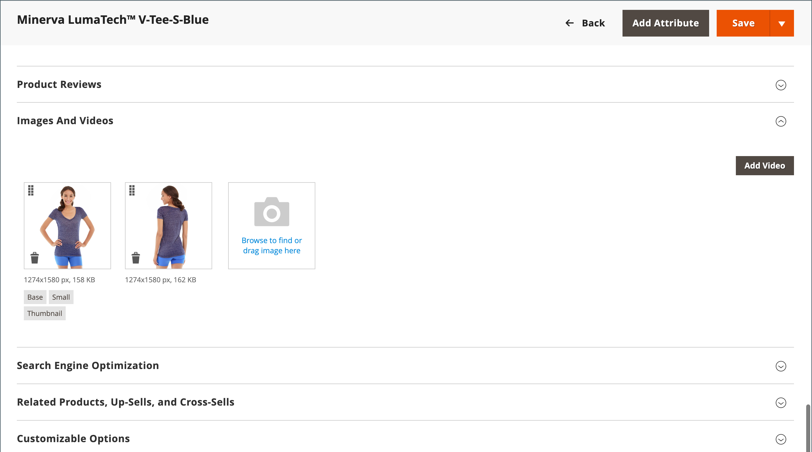
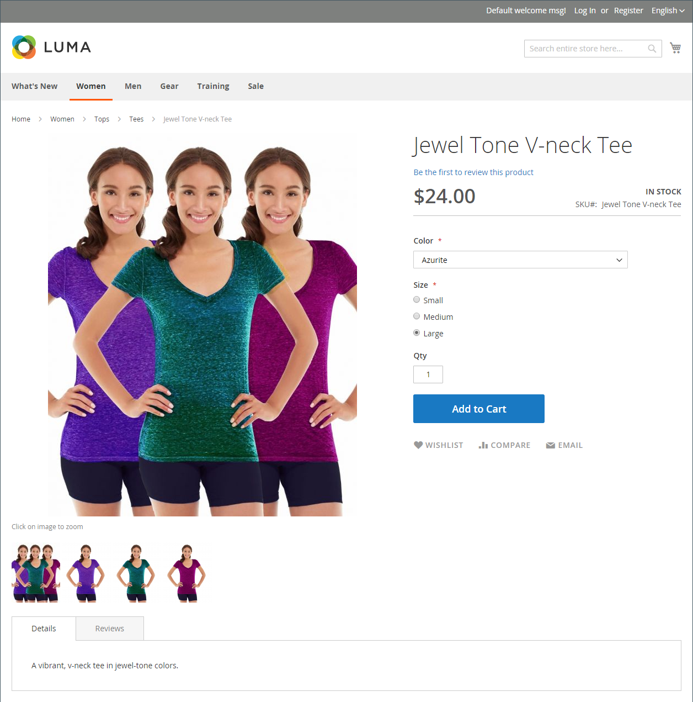
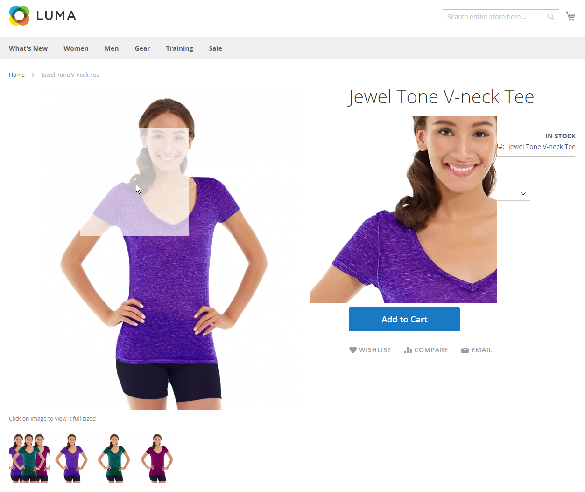

# Catalog images and video

Using high-quality images of consistent proportion gives your catalog a professional look with commercial appeal. If you have a large catalog with several images per product, you can easily have hundreds, if not thousands of product images to manage. Before you get started, establish a naming convention for your image files, and organize them so you can find the originals if you ever need them.

<!-- zoom -->

A single product image is rendered in different sizes throughout the catalog. The display size of the image container on the page is defined in the style sheet of your theme. However, where the image appears in your store is determined by the role that is assigned to the image. The main product image, or _base_ image, must be large enough to produce the magnification that is needed for zoom. In addition to the main image, a smaller version of the same image might appear in product listings, or as a thumbnail in the shopping cart. You can upload an image in the largest size that is needed or use an [Adobe Stock](../content-design/adobe-stock.md) image, and let Commerce render the sizes needed for each use. The same image can be used for all roles, or a different image can be assigned to each role. By default, the first image that is uploaded is assigned to all three roles.

## Storefront media browser

The media browser on the product page displays multiple images, video, or swatches related to the product. Each thumbnail can show a different view or variation of the product. Click a thumbnail to browse through the media assets. Although the position of the media browser varies by theme, the default position is just below the main image on the product page. For accessibility controls, see [Navigation accessibility](../getting-started/navigation-accessibility.md).

<!-- zoom -->

### Image zoom

If the [base image](product-image.md) is large enough to create the zoom effect, customers can view a magnified portion of the image on mouseover. When zoom is activated, customers can click the main image and move the cursor around to magnify different parts of the image. The magnified selection appears to the right of the image.

<!-- zoom -->

### Light boxes and sliders

There are many third-party light boxes and sliders that you can use to enhance the presentation of your product images. Look for extensions in [Commerce Marketplace](../getting-started/commerce-marketplace.md).

## Troubleshooting resources

For help with troubleshooting image and video issues, see the following Commerce Support knowledge base articles:

- [After installing, images and stylesheets do not load; only text displays, no graphics](https://experienceleague.adobe.com/docs/commerce-knowledge-base/kb/troubleshooting/storefront/after-installing-images-and-stylesheets-do-not-load-only-text-displays-no-graphics.html)
- [Issues with managing product images via REST API](https://experienceleague.adobe.com/docs/commerce-knowledge-base/kb/support-tools/patches/v1-0-5/mdva-28763-magento-patch-issues-with-managing-product-images-via-rest-api.html)
- [Import products .csv images duplicated](https://experienceleague.adobe.com/docs/commerce-knowledge-base/kb/support-tools/patches/v1-0-14/mdva-31969-magento-patch-import-products-.csv-images-duplicated.html)
- [Product images do not display despite Product Edit image roles](https://experienceleague.adobe.com/docs/commerce-knowledge-base/kb/troubleshooting/storefront/product-images-do-not-display-despite-product-edit-image-roles.html)
- [Store images not displayed after deployment](https://experienceleague.adobe.com/docs/commerce-knowledge-base/kb/troubleshooting/storefront/store-images-not-displayed-after-deployment.html)
