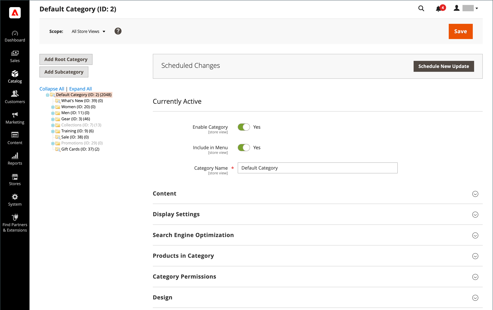
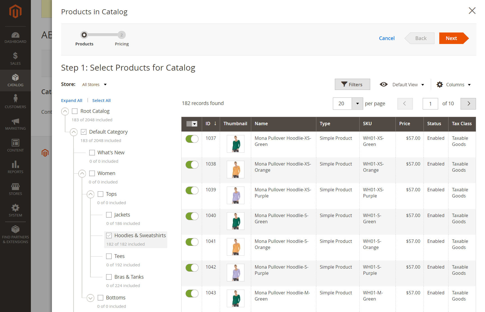

# Catalog menu

The Catalog menu provides easy access to product creation, category, and inventory management tools, as well as shared catalogs for custom pricing in [B2B stores](https://experienceleague.adobe.com/docs/commerce-admin/b2b/introduction.html).

<!-- zoom -->

On the _Admin_ sidebar, click **Catalog**.

## Products

Create new [products](products-list.md) of every type and manage your inventory.

<!-- zoom -->

## Categories

Create the [category](categories.md) structure that is the foundation of your store’s navigation.

<!-- zoom -->

## Shared Catalogs

For stores with B2B for Adobe Commerce installed and enabled, [shared catalogs](https://experienceleague.adobe.com/docs/commerce-admin/b2b/shared-catalogs/catalog-shared.html) give you the ability to make custom pricing available to different companies.

<!-- zoom -->
