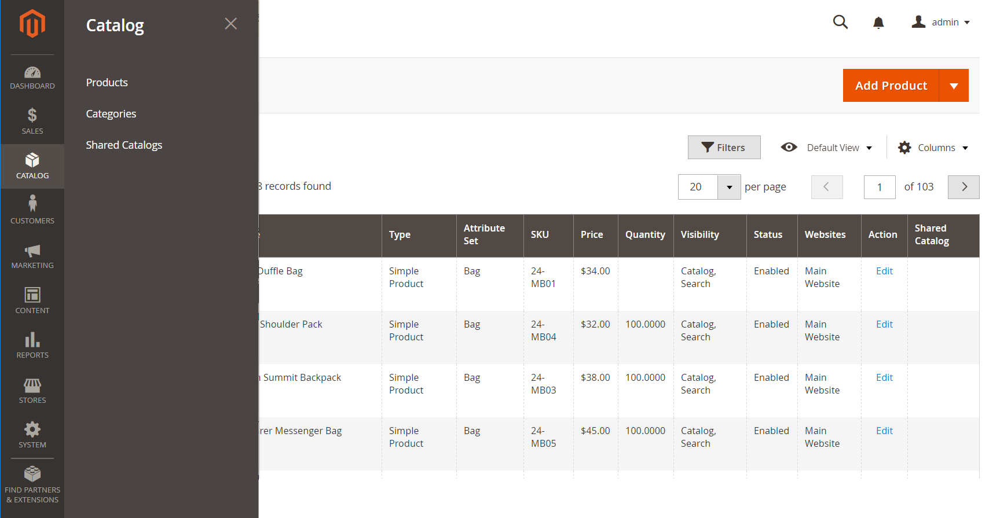
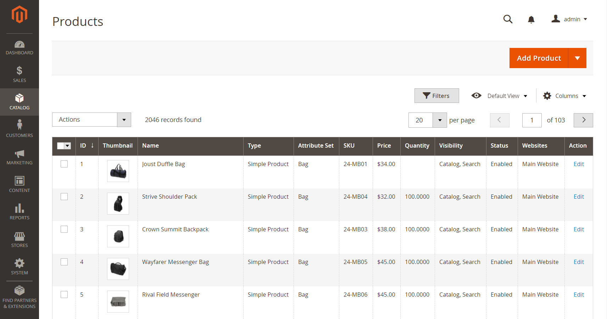
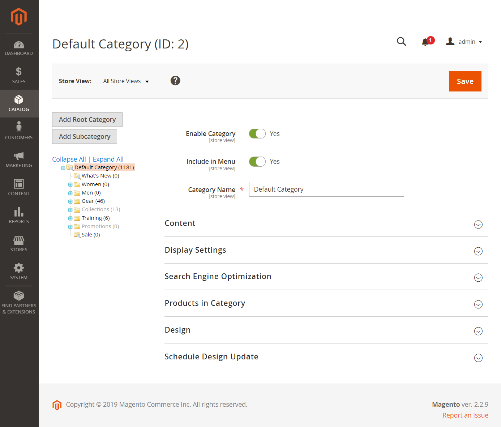

# [!UICONTROL Catalog] menu

The [!UICONTROL Catalog] menu provides easy access to product creation, category, and inventory management tools, shared catalogs for custom pricing in [B2B stores](https://experienceleague.adobe.com/docs/commerce-admin/b2b/introduction.html), and catalog enrichment for AI-assisted discovery.

>[!BEGINTABS]

>[!TAB Adobe Commerce]

[!BADGE PaaS only]{type=Informative url="https://experienceleague.adobe.com/en/docs/commerce/user-guides/product-solutions" tooltip="Applies to Adobe Commerce on Cloud projects (Adobe-managed PaaS infrastructure) and on-premises projects only."}

{width="300" zoomable="yes"}

>[!TAB Adobe Commerce as a Cloud Service]

[!BADGE SaaS only]{type=Positive url="https://experienceleague.adobe.com/en/docs/commerce/user-guides/product-solutions" tooltip="Applies to Adobe Commerce as a Cloud Service and Adobe Commerce Optimizer projects only (Adobe-managed SaaS infrastructure)."}

{width="300" zoomable="yes"}

>[!ENDTABS]

On the _Admin_ sidebar, click **[!UICONTROL Catalog]**.

## [!UICONTROL Products]

Create [products](products-list.md) of every type and manage your inventory.

{width="700" zoomable="yes"}

## [!UICONTROL Categories]

Create the [category](categories.md) structure that is the foundation of your store's navigation.

{width="700" zoomable="yes"}

## [!UICONTROL Shared Catalogs]

For stores with Adobe Commerce B2B installed and enabled, [shared catalogs](https://experienceleague.adobe.com/docs/commerce-admin/b2b/shared-catalogs/catalog-shared.html) give you the ability to make custom pricing available to different companies.

{width="700" zoomable="yes"}

## [!UICONTROL Catalog enrichment]

[!BADGE PaaS only]{type=Informative url="https://experienceleague.adobe.com/en/docs/commerce/user-guides/product-solutions" tooltip="Applies to Adobe Commerce on Cloud projects (Adobe-managed PaaS infrastructure) and on-premises projects only."}

Use [catalog enrichment](catalog-enrichment.md) to review and apply AI-suggested improvements to product names and short descriptions so your catalog is represented accurately in LLM and AI-assisted discovery.

