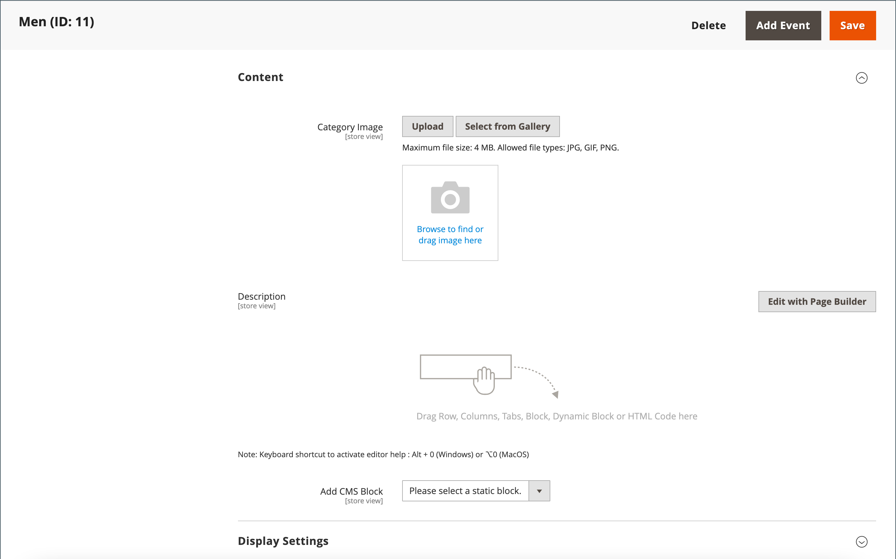
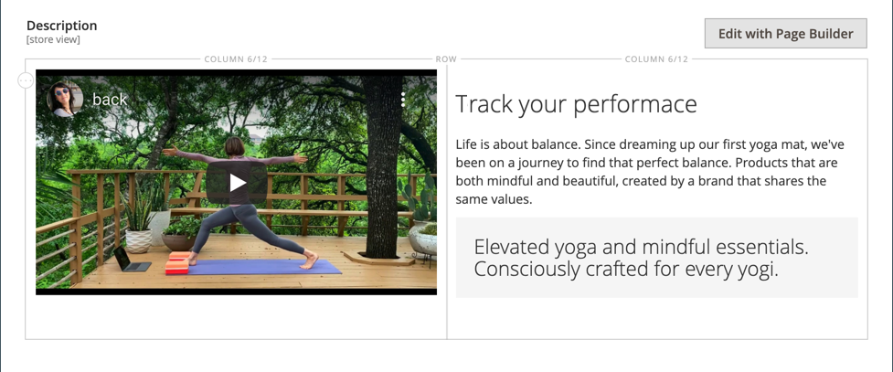
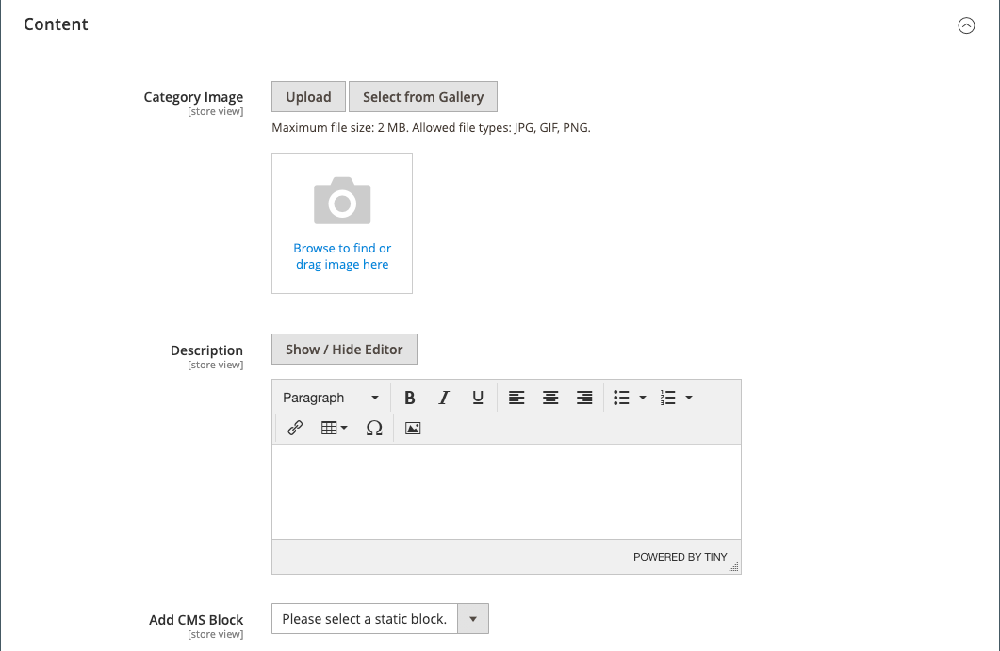

# Categories - Content settings

The _[!UICONTROL Content]_ settings determine any additional content appears on the category page. In addition to the list of category products, the page can include an image, description, and CMS block. You can use the [[!DNL Page Builder]](../page-builder/introduction.md) content tools to define the category description.

## Add the category description in [!DNL Page Builder]

1. Open the category in edit mode.

1. Scroll down and expand  the **[!UICONTROL Content]** section.

   {width="600" zoomable="yes"}

1. At the top right of the **[!UICONTROL Description]** area, click **[!UICONTROL Edit with Page Builder]**.

1. Use the [[!DNL Page Builder]](../page-builder/introduction.md) content tools to [edit any existing text](../page-builder/text.md) and add other content (if needed).

## [!DNL Page Builder] preview

When you expand the _Content_ section for an existing category where there is content created with [!DNL Page Builder], it displays a preview of the **[!UICONTROL Description]** content as it would appear in the category page. Clicking the content area opens the [!DNL Page Builder] workspace, where you can make any needed updates.

{width="500" zoomable="yes"}

This content preview is enabled for the product and category forms by default. If performance suffers due to loading the preview, you can disable the preview in the [Content Management configuration](../configuration-reference/general/content-management.md#advanced-content-tools) settings.

## Add the category description in the editor

Enter only plain ASCII characters into the text box. If pasting text from a word processor, save it first as a plain .TXT file to remove any invisible control characters.

For more information, see [WYSIWYG editor](../content-design/editor.md).

1. Open the category in edit mode.

1. Scroll down and expand  the **[!UICONTROL Content]** section.

   {width="500" zoomable="yes"}

1. Enter the category **[!UICONTROL Description]** and use the [editor toolbar](../content-design/editor.md) to format as needed.

   You can drag the lower-right corner to change the height of the text box.

## Add a CMS block to the category page

1. On the _Admin_ sidebar, go to **[!UICONTROL Catalog]** > **[!UICONTROL Categories]**.

1. In the category tree, select the category that you want to edit.

1. Expand  the **[!UICONTROL Content]** section.

1. For **[!UICONTROL Add the CMS block]**, select a block you want to add.

1. Expand  the **[!UICONTROL Display Settings]** section.

1. Set the **[!UICONTROL Display Mode]** to one of the following:

   - `Static block only`
   - `Static block and products`

1. When complete, click **[!UICONTROL Save]** and review the block display on the storefront (requires cache refresh).

## Content settings reference

|Setting|[Scope](../getting-started/websites-stores-views.md#scope-settings)|Description|
|--- |--- |--- |
|[!UICONTROL Category Image]|Store View|Specifies an image for the top of the category page. Methods:   **[!UICONTROL Upload]** - Uploads an image file from your local computer to the gallery and uses it as the category image.   **[!UICONTROL Select from Gallery]** - Prompts you to choose an existing image from the gallery.    - Either drag an image file to the camera tile or browse to the image and select it from your local file system.|
|[!UICONTROL Description]|Store View|Specifies a description that appears on the category page.   **[!UICONTROL Edit with Page Builder]** - Opens the [[!DNL Page Builder] workspace](../page-builder/workspace.md), where you can edit the description.   **[!UICONTROL Show / Hide Editor]** - Toggles the display between WYSIWYG editor and HTML modes.|
|[!UICONTROL Add CMS Block]|Store View|Adds an existing [CMS block](../content-design/blocks.md) to the category page.|

{style="table-layout:auto"}
