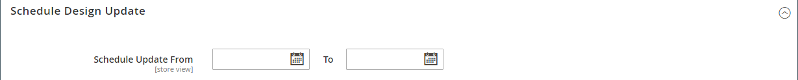

# Categories - Design settings

The _[!UICONTROL Design]_ section gives you control over the look and feel of a category, all associated product pages, and page layout. You can customize a category page and its associated products for a promotion, or to differentiate the category. For example, you might develop a distinctive design for a brand or special line of products, or apply an update for a specific time period.

<!-- zoom -->

>[!NOTE]
>
>When the same product is assigned to several categories with different design settings for each category, it is recommended to set **Use Categories Path for Product URLs** = `Yes` in the [Search Engine Optimization configuration options](https://docs.magento.com/user-guide/configuration/catalog/catalog.html#search-engine-optimization). To access this setting, go to  **[!UICONTROL Stores]** > _[!UICONTROL Settings]_ > **[!UICONTROL Configuration]**, expand **[!UICONTROL Catalog]** and choose **Catalog** underneath in the left panel, and then expand the **Search Engine Optimization** section on the page.

|Field|Description|
|--- |--- |
|[!UICONTROL Use Parent Category Settings]|Allows the current category to inherit the design settings from the parent category. If used, all other fields in the Design section become unavailable. Options: `Yes` / ` No`|
|[!UICONTROL Theme]|Applies a custom theme to the category.|
|[!UICONTROL Layout]|Applies a different layout to the category page. Options:  **[!UICONTROL No layout updates]** - By default, layout updates are not available for category pages.  **[!UICONTROL Empty]** - Use to define your own page layout. (Requires an understanding of XML.)  **[!UICONTROL 1 column]** - Applies a one-column layout to the category page.  **[!UICONTROL 2 columns with left bar]** - Applies a two-column layout with a left sidebar to the category page.  **[!UICONTROL 2 columns with right bar]** - Applies a two-column layout with a right sidebar to the category page.  **[!UICONTROL 3 columns]** - Applies a three-column layout to the category page. **[!UICONTROL Page -- Full Width]** - (Requires [Page Builder](../page-builder/introduction.md)) Applies the full-width layout for CMS pages to the category page.  **[!UICONTROL Category -- Full Width]** - (Requires Page Builder) Applies the full-width layout for category pages to the category page.  **[!UICONTROL Product -- Full Width]** - (Requires Page Builder) Applies the full-width layout for product pages to the category page.|
|[!UICONTROL Custom Layout Update]|Lists the available custom layout update files on the server. Choose the custom layout update that you want to apply to the category.|
|[!UICONTROL Apply Design to Products]|When selected, applies the custom settings to all products in the category.|

{style="table-layout:auto"}

## Scheduled Design Update

{{ce-feature}}

The _[!UICONTROL Scheduled Design Update]_ section determines the range of dates when a custom design is applied to category pages.

|Field|Description|
|--- |--- |
|[!UICONTROL Schedule Update From/To]|Determines the range of dates when a custom layout is applied to the category.|

<!-- zoom -->
