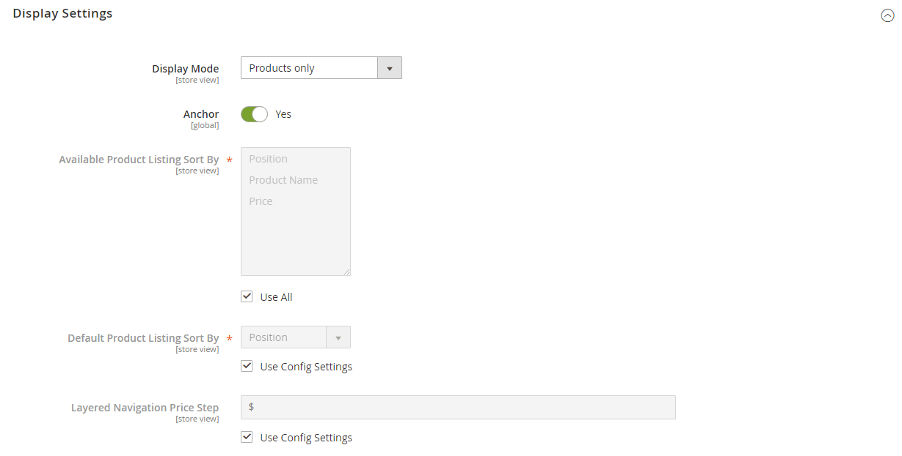

# Categories - Display settings

Display settings determine which content elements appear on a category page and the order in which products appear. You can enable CMS blocks, set the anchor status of the category, and manage sorting options from the _[!UICONTROL Display Settings]_ tab. For examples of how categories are reflected in the storefront, see [Catalog Navigation](navigation.md).

{width="600" zoomable="yes"}

|Field|Description|
|--- |--- |
|[!UICONTROL Display Mode]|Determines the content elements displayed on the category page. Options: `Products Only` / `Static Block Only` / `Static Block and Products`|
|[!UICONTROL Anchor]|When set to `Yes`, displays products from the sub-categories in the category even if they haven't been explicitly added to the category, and enables the display of the _[!UICONTROL filter by attribute]_ section in the layered navigation. Options: `Yes` / `No`|
|[!UICONTROL Available Product Listing Sort By]|(Required) The default values are `Position`, `Name`, and `Price`. To customize the sorting option, deselect the **[!UICONTROL Use All Available Attributes]** checkbox and select the attributes you want to use. You can define and add attributes as needed. This setting does not apply to the [!DNL Live Search] [Product Listing Page Widget](https://experienceleague.adobe.com/en/docs/commerce/live-search/live-search-storefront/plp-styling).|
|[!UICONTROL Default Product Listing Sort By]|(Required) To define the default _[!UICONTROL Sort By]_ option, deselect the **[!UICONTROL Use Config Settings]** checkbox and select an attribute. This setting does not apply to the [!DNL Live Search] [Product Listing Page Widget](https://experienceleague.adobe.com/en/docs/commerce/live-search/live-search-storefront/plp-styling).|
|[!UICONTROL Layered Navigation Price Step]|By default, Commerce displays the price range in increments of 10, 100, and 1000, depending on the products in the list. To change the Price Step range, deselect the **[!UICONTROL Use Config Settings]** checkbox.|

{style="table-layout:auto"}
