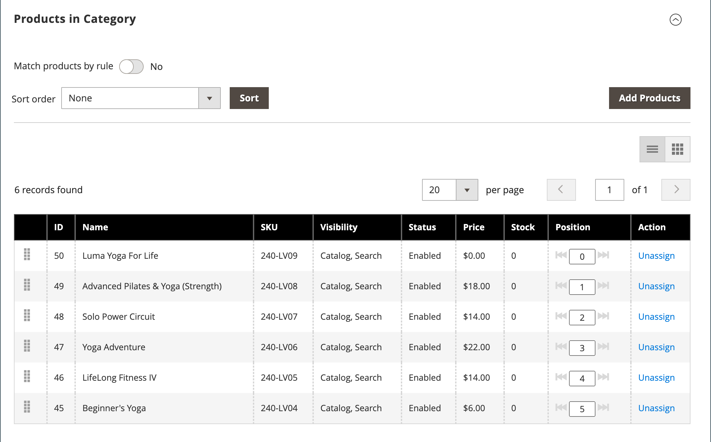
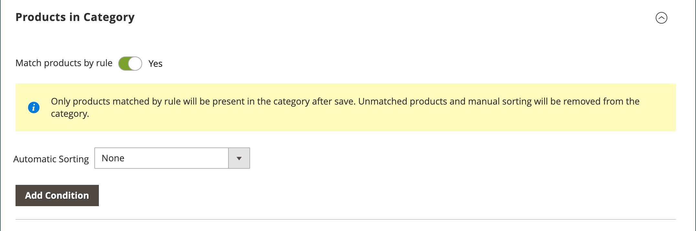

# Category product assignments

For a category, use the _[!UICONTROL Products in Category]_ section to review the products that are currently assigned to the category. The search filters at the top of each column are used to add and remove products from the category. You can also use [category rules](https://docs.magento.com/user-guide/catalog/category-product-rules.html) (  Adobe Commerce only) to dynamically change the product selection when a set of conditions is met. To learn more, see [Visual Merchandiser](../merchandising-promotions/visual-merchandiser.md)).

>[!TIP]
>
>During category rule setup, the products are _sorted_, _matched_, _assigned_, and _unassigned_ according to that rule **_only_** when this category is saved. For example, if you add a product to the catalog and want to assign it according to the rule, you **must resave each category** that is set to match products by rule to ensure that the new product is assigned. Also, if any product stock status is changed to `In Stock` or `Out of Stock` and products in the category are _sorted_ according to the **Automatic Sorting** rule, you must click **[!UICONTROL Save Category]**.

<!-- zoom -->

>[!NOTE]
>
>The _Stock_ column displays salable product quantity for _**selected category scope**_ only. When multiple stocks are managed for products, you should switch between the corresponding scopes to display other _Stock_ column values in the _Category Products_ grid.

## Apply a category rule

{{ee-feature}}

1. Set **[!UICONTROL Match products by rule]** to `Yes`.

   The automatic sorting and condition options appear.

   <!-- zoom -->

1. Set the **[!UICONTROL Automatic Sorting]** order.

   This automatic sorting is based on current conditions.

   - `Stock level` - Move to top or bottom.
   - `Special price` - Move to top or bottom.
   - `New Products` - List newest products first.
   - `Color` - Sort alphabetically by color.
   - `Name` - Sort in ascending or descending order by Name.
   - `SKU` - Sort in ascending or descending order by SKU
   - `Price` - Sort in ascending or descending order by Price.

1. Click **[!UICONTROL Add Condition]** and do the following:

   - Choose the **[!UICONTROL Attribute]** that is the basis of the condition.
   - Choose the **[!UICONTROL Operator]** that is needed to form the expression.
   - Enter the **[!UICONTROL Value]** that is to be matched.

   <!-- zoom -->

   Repeat this process for each attribute that is needed to describe the conditions to be met. For example, to match products that were created from 7 through 30 days ago, do the following:

   - Set **[!UICONTROL Date Created]** to `Less than 30`.
   - Set **[!UICONTROL Logic]** to `AND`.
   - Set **[!UICONTROL Date Modified]** to `Greater than 7`.

1. When complete, click **[!UICONTROL Save Category]**.

### Page options

|Option|Description|
|--- |--- |
|[!UICONTROL Match products by rule]|Determines if the list of products in the category is dynamically generated by a category rule. Options: `Yes` / `No`|
|[!UICONTROL Automatic Sorting]|Automatically applies a sorting order to the list of category products. Options:  `None` `Move low stock to top` `Move low stock to bottom` `Special price to top` `Special price to bottom` `Newest products first` `Sort by color` `Name: A - Z` `Name: Z - A` `SKU: Ascending` `SKU: Descending` `Price: High to Low` `Price: Low to High`|
|[!UICONTROL Add Condition]|Adds another condition to the rule.|

{style="table-layout:auto"}

### Page conditions

|Option|Description|
|--- |--- |
|[!UICONTROL Attribute]|Determines the attribute that is used as the basis of the condition. Options:  **[!UICONTROL Clone Category ID(s)]** - Dynamically clones products, without their sorting and order, from multiple categories based on Category ID.  **[!UICONTROL Color]** - Includes products based on color.  **[!UICONTROL Date Created (days ago)]** - Includes products based on the number of days since the products were added to the catalog.  **[!UICONTROL Date Modified (days ago)]** - Includes products based on the number of days since the products were last modified.  **[!UICONTROL Name]** - Includes products based on the product name.  **[!UICONTROL Price]** - Includes products based on price.  **[!UICONTROL Quantity]** - Includes products based on the quantity in stock.  **SKU** - Includes products based on SKU.|
|[!UICONTROL Operator]|Specifies the operator that is applied to the attribute value to meet the condition. Unless an operator is specified, `Equal` is used as the default. Options: `Equal` / `Not equal` / `Greater than` / `Greater than or equal to` / `Less than` / `Less than or equal to` / `Contains`|
|[!UICONTROL Value]|Specifies the value that the attribute must have to meet the condition.|
|[!UICONTROL Logic]|Used to define multiple conditions, and appears only when another condition is added. Options: `OR` / `AND`|

{style="table-layout:auto"}

>[!NOTE]
>
>The quantity of a configurable product with child options is calculated by combining all the salable child product quantities. For example, if you have a configurable product _Endurance Fitness Tank_ with purple, red, and yellow color options with different quantities of each, the parent product quantity is the combined salable quantity of the purple, red, and yellow color child products.

## Controls

## Page controls

{{ee-feature}}

| Control  | Description  |
|----------|--------------|
|  | View as List |
|  | View as Tiles |
|  | Match by Rule - No|
| | Match by Rule - Yes|
|  | The drag and drop control allows you to grab a product and move it to another position in the current page of the grid. To learn more, see [Visual Merchandiser](../merchandising-promotions/visual-merchandiser.md). |
|  | Determines the position of the product in the list. |

{style="table-layout:auto"}

## Page controls

{{ce-feature}}

| Control  | Description  |
|----------|--------------|
|  | Use the checkbox in the header of the first column to select all products or clear all selections. The control in the first row determines the type of search and can be set to include any record, or include only those that are either assigned or not assigned to the category. The checkbox in the first column of each row identifies products to be added to the category. Options: `Yes` / `No` / `Any` |
| [!UICONTROL Search Filters] | The filter controls at the top of each column can be used to enter specific values you want to either include or omit from the list, depending on the Select All setting. |
| [!UICONTROL Reset Filter] | Clears all search filters. |
| [!UICONTROL Search] | Searches the catalog based on the filter criteria and displays the result. |

{style="table-layout:auto"}
