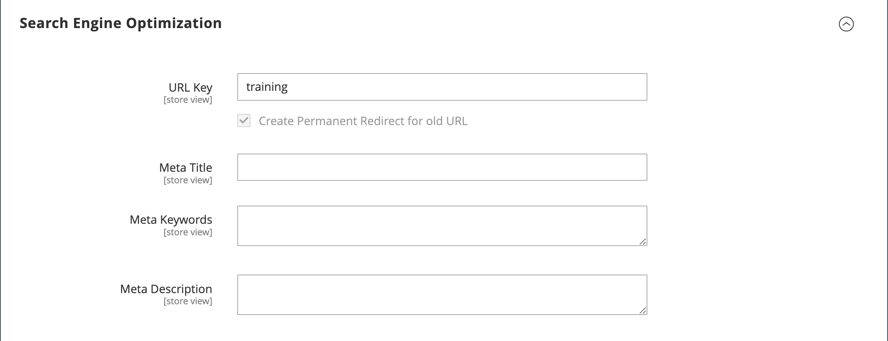

# Categories - Search Engine Optimization settings

The _[!UICONTROL Search Engine Optimization]_ section specifies the [URL Key](catalog-urls.md) and [meta data](../merchandising-promotions/meta-data.md) fields that are used by search engines to index the category. Although some search engines ignore meta keywords, others continue to use them. The current SEO best practice is to incorporate high-value keywords in both the meta title and meta description.

{width="600" zoomable="yes"}

|Field|[Scope](../getting-started/websites-stores-views.md#scope-settings)| Description |
|--- |--- |----------------------------------------------------|
|[!UICONTROL URL Key]|Store View| Determines the online address of the category page. The URL key is added to the base URL of the store, and appears in the address bar of a browser. In the configuration, you can either include or exclude the category URL key in the product URL. The URL Key should be all lowercase characters, with non-trailing hyphens between these characters instead of spaces. Do not include a suffix such as .html, because it is managed in the configuration. |
|[!UICONTROL Meta Title]|Store View| The title appears in the title bar and tab of your browser, and is also the title on a search engine results page (SERP). The meta title should be unique to the page and s in length. |
|[!UICONTROL Meta Keywords]|Store View| Relevant keywords for the category. Consider using keywords that customers might use to find products in the category. |
|[!UICONTROL Meta Description]|Store View| The meta description provides a brief overview of the page for search results listings. An ideal length is between 150-160 characters in length, with a maximum of 255 characters. Although not visible to the customer, some search engines include the meta description on the search results page. |

{style="table-layout:auto"}
