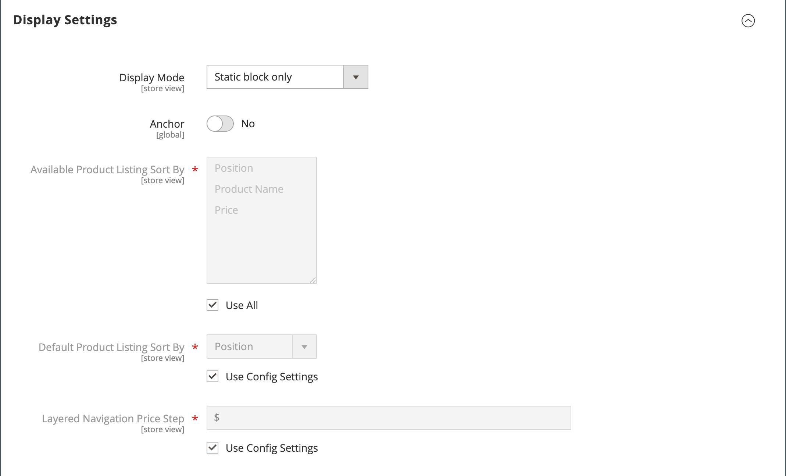
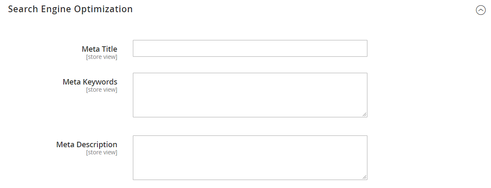
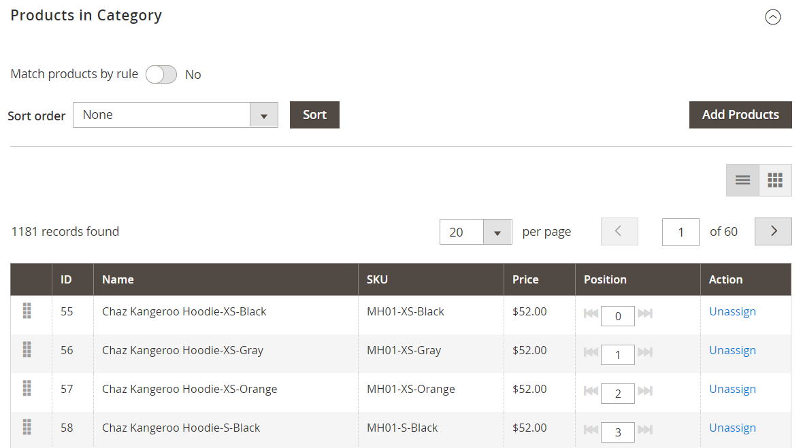
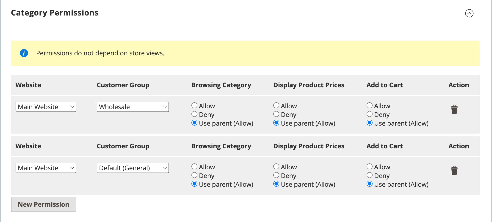

# Create categories

The category structure of your catalog is like an upside-down tree, with the root at the top. Each section of the tree can be expanded and collapsed. Any disabled or hidden categories are grayed out. The categories at the first level (below the [root](category-root.md)) typically appear as options in the [main menu](navigation-top.md). You can create as many additional subcategories as needed, according to the maximum menu depth that is set in the configuration. Categories can be dragged and dropped to other locations in the tree. The category ID number appears in parentheses after the category name at the top of the page.

For a website with multiple [stores](https://docs.magento.com/user-guide/stores/stores-all-create-store.html), you can create a different root category for each store that defines the set of categories that is used for the [top navigation](navigation-top.md).

<!-- zoom -->

## Best practices

Use these best practices when you plan and create categories.

### Category structure

The structure of the categories in the main menu can impact customer experience and performance. As a best practice, you should identify one over-arching top-level category, and avoid having other categories with the same name. For example, rather than having multiple categories for "Kids" organized under different departments, such as `Clothing/Kids`, `Shoes/Kids`, `Accessories/Kids`. It can be more efficient to make the top-level parent category `Kids`, and then create subcategories as needed below. Be consistent with the category structure, and use the same approach for all product types in your catalog.

### Business rules and automation

Consider the category structure and available attribute values when using business logic to show similar items on a catalog page, or to set up a personalized promotion, automated process,  or search criteria. For example, if you specify  "polo" as a parent category, the results might include  mixed gender and age-inappropriate products. However, if you match a specific subcategory of polo shirts, the results are more narrow and likely to appeal to a specific customer. The results can be even more specific when combined with other attribute values that target a specific customer. Consider the number of products that must be filtered through and retrieved when referencing a specific category path. The difference in results can be dramatic. Consider the different results returned by the following category paths:

- `[Category:  All Products/Shirts/Father's Day/Polos/Sale]`
- `[Category Path: Men/Shirts/Polos]`
- `[Child Category: Polos]`

It is important to clearly define categorical relationships, such as:

- parent category
- sub category
- category path

Also define any associated keywords and attributes, such as:

- availability
- sale price
- brand
- size
- color

## Step 1: Create a category

1. On the _Admin_ sidebar, go to **[!UICONTROL Catalog]** > **[!UICONTROL Categories]**.

1. Set **[!UICONTROL Store View]** to determine where the new category is to be available.

1. In the category tree, select the parent category of the new category.

   The parent is one level above the new category.

   If you're starting from the beginning without any data, there might be only two categories in the list: _Default Category_, which is the root, and an _Example category_

1. Click **[!UICONTROL Add Subcategory]**.

## Step 2: Complete the basic information

1. If you want the category to be immediately available in the store, set **[!UICONTROL Enable Category]** to `Yes`.

1. To include the category in the [top navigation](navigation-top.md), set **[!UICONTROL Include in Menu]** to `Yes`.

1. Enter the **[!UICONTROL Category Name]**.

   <!-- zoom -->

1. click **[!UICONTROL Save]** and continue.

## Step 3: Complete the category content

1. Expand  the **[!UICONTROL Content]** section.

   <!-- zoom -->

1. To display a **[!UICONTROL Category Image]** at the top of the page, you can either upload your own image or use an image that exists in the [Media Storage](../content-design/media-storage.md).

   - To upload your own image, click **[!UICONTROL Upload]** and choose the image that you want to represent the category.

   - To use images from the Media Storage, click **[!UICONTROL Select from Gallery]** and select the image you want to represent the category.

   >[!NOTE]
   >
   >Inside the Media Gallery, you can also use the [Adobe Stock Integration](../content-design/adobe-stock.md) to find an appropriate image by clicking **[!UICONTROL Search Adobe Stock]**.

1. For **[!UICONTROL Description]**, enter the text or other content that you want to appear on the category landing page.

   For more information, see [Category Content](categories-content-settings.md).

1. To include a content block on the category landing page, choose the **[!UICONTROL CMS Block]** that you want to appear.

1. click **[!UICONTROL Save]** and continue.

## Step 4: Complete the display settings

1. Expand  the **[!UICONTROL Display Setting]** section.

   <!-- zoom -->
   
   For more information about these options, see For more information about these options, see  [Display settings](categories-display-settings.md).

1. Set **[!UICONTROL Display Mode]** to one of the following:

   - `Products Only`
   - `Static Block Only`
   - `Static Block and Products`

1. If you want the category page to include the _`Filter by Attribute`_ section of layered navigation, set **[!UICONTROL Anchor]** to `Yes`.

1. For the **[!UICONTROL Available Product Listing Sort By]** options, select one or more of the available values to be available for customers to sort the list.

   By default, all available values are included. Deselect the **[!UICONTROL Use All]** checkbox to change the selections. For example, the values might include:

   - `Position`
   - `Product Name`
   - `Price`

1. To set the default sort order for the category, choose the **[!UICONTROL Default Product Listing Sort By]** value.

1. To change the default layered navigation [price step](navigation-layered.md#configure-price-navigation) setting, do the following:

   - Deselect the **[!UICONTROL Use Config Settings]** checkbox.

   - Enter the value to be used as an incremental price step for layered navigation.

1. Click **[!UICONTROL Save]** and continue.

## Step 5: Complete the search engine optimization settings

1. Expand  the **[!UICONTROL Search Engine Optimization Settings]** section.

   <!-- zoom -->
   
   For more information about these options, see [Search engine optimization](categories-search-engine-optimization.md).

1. Complete the following [meta data](../merchandising-promotions/meta-data.md) for the category:

   - [!UICONTROL Meta Title]
   - [!UICONTROL Meta Keywords]
   - [!UICONTROL Meta Description]

1. Click **[!UICONTROL Save]** and continue.

## Step 6: Choose the products in category

1. Expand  the **[!UICONTROL Products in Category]** section.

   <!-- zoom -->

   For more information about these options, see [Products in category](categories-product-assignments.md).

1. Use the [filters](../getting-started/admin-grid-controls.md) as needed to find the products.

   To display all records that are not yet included in the category, set the record chooser in the first column to `No` and click **[!UICONTROL Search]**.

1. In the first column, select the checkbox for each product to include in the category.

1. Click **[!UICONTROL Save]** and continue.

## Step 7: Set the category permissions

{{ee-feature}}

1. Expand  the **[!UICONTROL Category Permissions]** section.

1. For a multi-site installation, choose the **[!UICONTROL Website]** where the category permissions apply.

1. Choose the **[!UICONTROL Customer Group]** where the category permissions apply.

    ([B2B for Adobe Commerce](../b2b/introduction.md) only) If needed, you can choose a **[!UICONTROL Shared Catalog]** instead.

1. Set the following permissions as needed:

   - [!UICONTROL Browsing Category]
   - [!UICONTROL Display Product Prices]
   - [!UICONTROL Add to Cart]

1. To add another permission rule, click **[!UICONTROL New Permission]** and repeat the process.

   <!-- zoom -->

## Step 8: Complete the design settings

1. Expand  the **[!UICONTROL Design]** section.

1. Set the design settings as needed:

   - ([B2B for Adobe Commerce](../b2b/introduction.md) only) To apply the parent category design settings to this category, set **[!UICONTROL Use Parent Category Settings]** to `Yes`.

   - To change the design of the category pages, choose the **[!UICONTROL Theme]** that you want to apply.

   - To change the column layout of the category pages, choose the **[!UICONTROL Layout]** that you want to apply.

   - To enter custom code, enter valid XML code in the **[!UICONTROL Layout Update XML]** box.

   - To use the same design for product pages, set **[!UICONTROL Apply Design to Products]** to `Yes`.

   <!-- zoom -->

1.  (Magento Open Source only) To schedule the design update for a specific time period, do the following:

   - Expand the _[!UICONTROL Schedule Design Update]_ section.

   - Use the calendar () to choose the Schedule Update **[!UICONTROL from]** and **[!UICONTROL to]** dates.

   <!-- zoom -->

1. When complete, click **[!UICONTROL Save]**.
