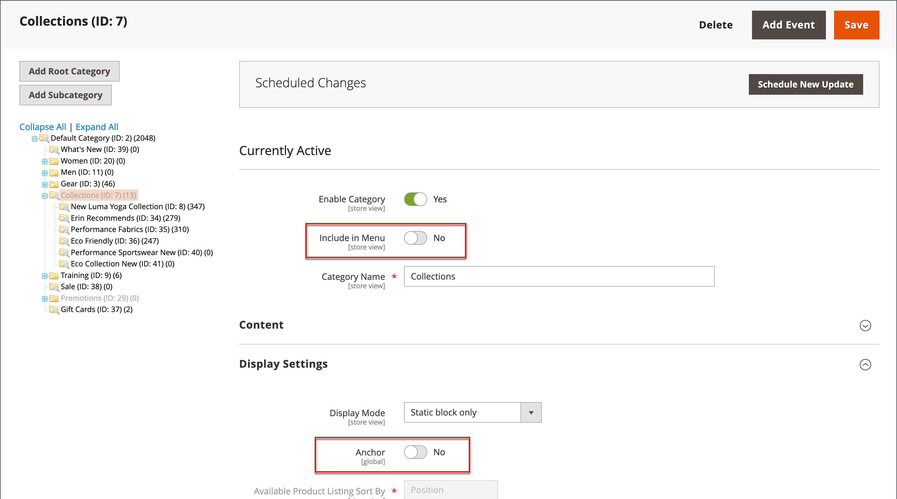

# Hidden categories

There are many ways to use hidden categories. You might want to create additional category levels for your own internal purposes, but show only the higher-level categories to your customers. Or, you might want to link to a category that is not included in the navigation menu.

## Create hidden categories

1. On the _Admin_ sidebar, go to **[!UICONTROL Catalog]** > **[!UICONTROL Categories]**.

1. In the category tree, select the category you want to hide and do the following:

   - Set **[!UICONTROL Is Active]** to `Yes`.
   - Set **[!UICONTROL Include in Menu]** to `No`.

1. In the **[!UICONTROL Display Settings]** section, set **[!UICONTROL Anchor]** to `No`.

   {width="600" zoomable="yes"}

   The hidden category is active, but does not appear in the top menu, or in layered navigation.

1. Complete the following settings for each hidden subcategory to create subcategories:

   >[!NOTE]
   >
   >Although the category is hidden, you can create subcategories beneath it and make them active.

   - Set **[!UICONTROL Enable Category]** to `Yes`.
   - In the **[!UICONTROL Display Settings]** section, set **[!UICONTROL Anchor]** to `Yes`.

   As active categories, you can now link to them from other places in your store, but they do not appear in the menu.

1. When complete, click **[!UICONTROL Save]**.
