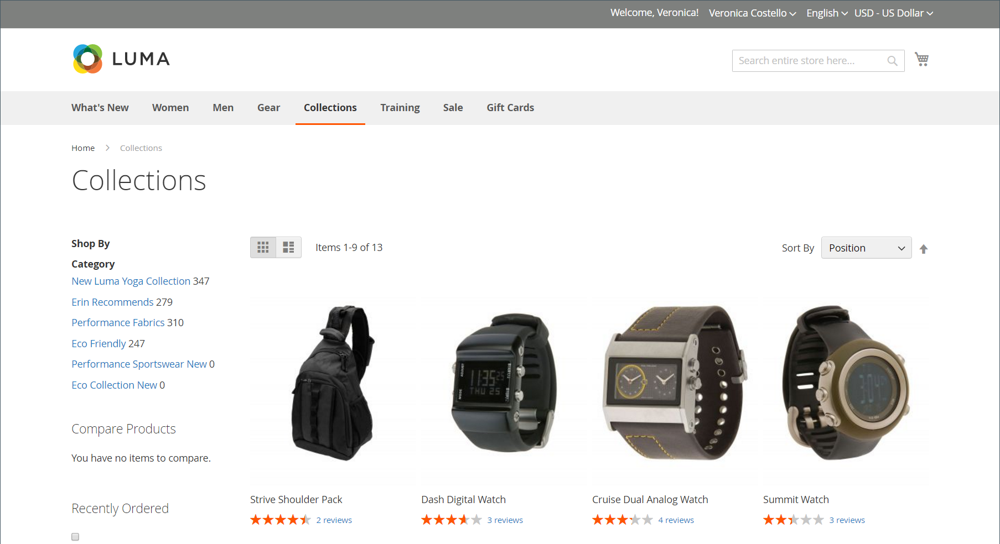

# Category permissions

{{ee-feature}}

Category access can be limited to specific customer groups, or restricted entirely. You can control the display of product prices, and determine which customer groups can add products to the cart, and specify the landing page.

>[!NOTE]
>
>Category Permissions has a global scope and when enabled, restricts access to each category according to its individual permissions. By default, Category Permissions is not enabled.

For example, if you sell only to wholesale customers, you can allow anyone to browse the catalog, but display prices and allow purchases only to those in the Wholesale customer group. In the following example, only logged in users have access to the "Collections" category. For guests, the "Collections" option doesn't appear in the main menu.

<!-- zoom -->

When enabled, a new _[!UICONTROL Category Permissions]_ section appears on the Category page that allows you to apply the needed access for each category. You can add multiple permission rules to each category for different websites and customer groups.

## Step 1: Configure category permissions

1. On the _Admin_ sidebar, go to **[!UICONTROL Stores]** > _[!UICONTROL Settings]_ > **[!UICONTROL Configuration]**.

1. In the left panel, expand **[!UICONTROL Catalog]** and choose **[!UICONTROL Catalog]** underneath.

1. Expand  the **[!UICONTROL Category Permissions]** section.

   <!-- zoom -->

   For more information about these options, see [Category Permissions](https://docs.magento.com/user-guide/configuration/catalog/catalog.html#category-permissions) in the _Configuration Reference_.

1. Set **[!UICONTROL Enable]** to `Yes`.

1. Complete the other options according to what you want to allow or restrict on your store (see following sections).

1. When complete, click **[!UICONTROL Save Config]**.

1. When prompted to update the cache, click the **[!UICONTROL Cache Management]** link in the system message and follow the instructions to refresh the cache.

### [!UICONTROL Allow Browsing Category]

This option applies to all categories in the [website](../getting-started/websites-stores-views.md).

To allow members of a **_specific customer group_** to browse through category products, do the following:

1. Set **[!UICONTROL Allow Browsing Category]** to `Specified Customer Groups`.

1. In the **[!UICONTROL Customer Groups]** box, select each group that is allowed to browse through products in the category.

   To select multiple groups, hold down the Ctrl key (PC) or the Command key (Mac) as you click each group.

   <!-- zoom -->

To **_restrict access and redirect to a landing page_**, do the following:

1. Set **[!UICONTROL Allow Browsing Category]** to `No, Redirect to Landing Page`.

1. Choose the **[!UICONTROL Landing Page]** where visitors are redirected.

   <!-- zoom -->

   >[!NOTE]
   >
   >Although the _[!UICONTROL Allow Browsing Category]_ setting applies to all categories in the website, you can configure a different landing page for each store view.

### [!UICONTROL Display Product Prices]

This option applies to all categories in the [website](../getting-started/websites-stores-views.md).

To allow only members of **_specific customer groups_** to see the price of products in the category, do the following:

1. Set **[!UICONTROL Display Product Prices]** to `Yes, for Specified Customer Groups`.

1. In the **[!UICONTROL Customer Groups]** box, select each group that is allowed to see the price of products in the category.

   To select multiple groups, hold down the Ctrl key (PC) or the Command key (Mac) as you click each group.)

   <!-- zoom -->

### [!UICONTROL Allow Adding to Cart]

This option applies to all categories in the [website](../getting-started/websites-stores-views.md).

To allow only members of **_specific customer groups_** to put category products into the shopping cart, do the following:

1. Set **[!UICONTROL Allow Adding to Cart]** to `Yes, for Specified Customer Groups`.

1. In the **[!UICONTROL Customer Groups]** box, select each group that is allowed to add products from the category to the cart.

   To select multiple groups, hold down the Ctrl key (PC) or the Command key (Mac) as you click each group.

   <!-- zoom -->

### [!UICONTROL Disallow Catalog Search]

Set this option to prevent members of a specific customer group from using Catalog Search. It applies to all categories in the [website](../getting-started/websites-stores-views.md).

- To allow **_only logged in customers_** to use Catalog Search, select `NOT LOGGED IN`.

- To allow **_only specific customer groups_** to use Catalog Search, select each group to be excluded from using Category Search.

   To select multiple groups, hold down the Ctrl key (PC) or the Command key (Mac) as you click each group.

   <!-- zoom -->

## Step 2: Apply category permissions

1. On the _Admin_ sidebar, go to **[!UICONTROL Catalog]** > **[!UICONTROL Categories]**.

1. In the category tree, select the target category.

1. Expand  **[!UICONTROL Category Permissions]** on the page and do the following:

   - To create a permissions rule, click **[!UICONTROL New Permission]**.

      <!-- zoom -->

   - Choose the applicable **[!UICONTROL Website]** and **[!UICONTROL Customer Group]**.

   - Set the individual permissions as needed.

   >[!NOTE]
   >
   >When `Browsing Category` = `Deny` permission is set for any parent category, it is not displayed on the [Breadcrumb Trail](navigation-breadcrumb-trail.md) on the child category page.

1. When complete, click **[!UICONTROL Save]**.

>[!NOTE]
>
>If any **_Allow_** permissions are set for the `Root Category`, then these permissions are automatically applied to all subcategories and all products within the `Catalog`. If any product is assigned to multiple categories, and it has any **_Allow_** permissions for at least one category, it automatically has the same **_Allow_** permissions for all assigned categories.
