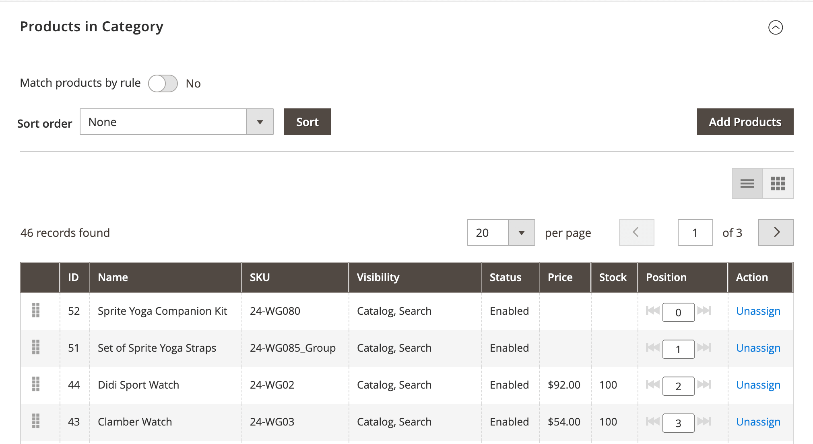
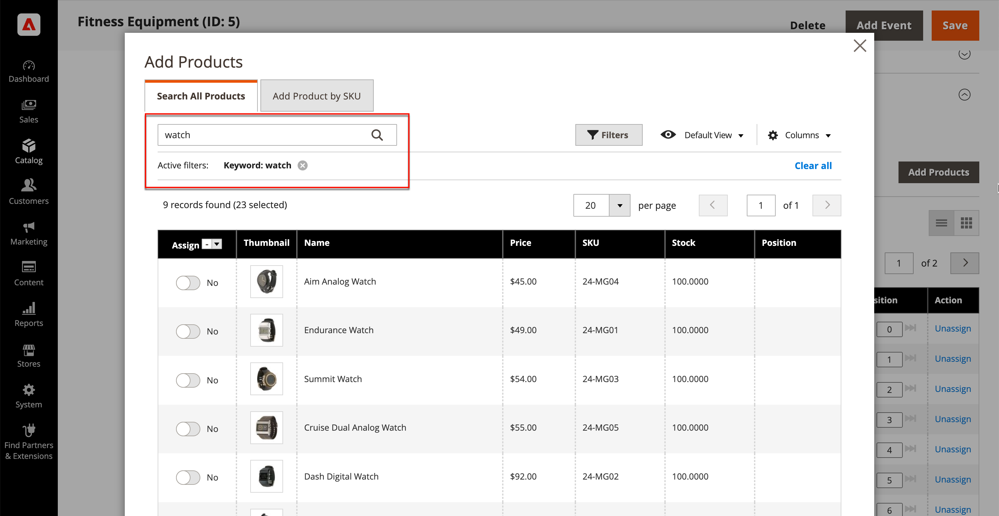
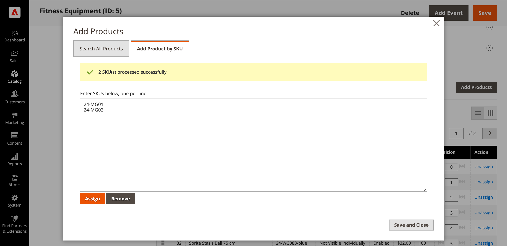

# Add and remove category products

From the [Products in Category](categories-product-assignments.md) section, a store administrator can add products to the category. This section lists all the products that are assigned to the category and displays **[!UICONTROL Add Product]** when **[!UICONTROL Match products by rule]** is set to `No`.

<!-- zoom -->

## Search for products to add

1. On the _Admin_ sidebar, go to **[!UICONTROL Catalog]** > **[!UICONTROL Categories]**.

1. In the category tree on the left, choose the category where you want to add a product.

1. Expand  the _Products in Category_ section.

1. Click **[!UICONTROL Add Products]**.

1. Use _Search by keyword_ or filters to find the products you want to add.

   <!-- zoom -->

1. In the _[!UICONTROL Assign]_ column, toggle the option to `Yes` for each product that you want to add.

   If you want to include all displayed products, you can click the menu arrow in the column header and choose **[!UICONTROL Select All]**.

1. To apply your changes, click **[!UICONTROL Save and Close]**.

### Actions

|Action|Description|
|--- |--- |
|[!UICONTROL Select All]|Selects the checkbox of all records in the list.|
|[!UICONTROL Unselect All]|Clears the checkbox of all records in the list.|
|[!UICONTROL Select All on This Page]|Selects the checkbox of records on the current page.|
|[!UICONTROL Deselect All on This Page]|Clears the checkbox of records on the current page.|

{style="table-layout:auto"}

## Add products by SKU

1. Click **[!UICONTROL Add Products]**

1. Select the **[!UICONTROL Add Products by SKU]** tab.

1. Enter SKUs (one per line) and click **[!UICONTROL Assign]**.

   To discard the changes, click **[!UICONTROL Remove]**.

   <!-- zoom -->

1. To apply your changes, click **[!UICONTROL Save and Close]**.

## Remove products from a category

1. On the _Admin_ sidebar, go to **[!UICONTROL Catalog]** > **[!UICONTROL Categories]**.

1. In the category tree on the left, choose the category that you want to edit.

1. Expand  the _[!UICONTROL Products in Category]_ section.

1. Find the products to be removed.

1. In the _[!UICONTROL Actions]_ column, click **[!UICONTROL Unassign]**.

1. To apply your changes, click **[!UICONTROL Save]**.
