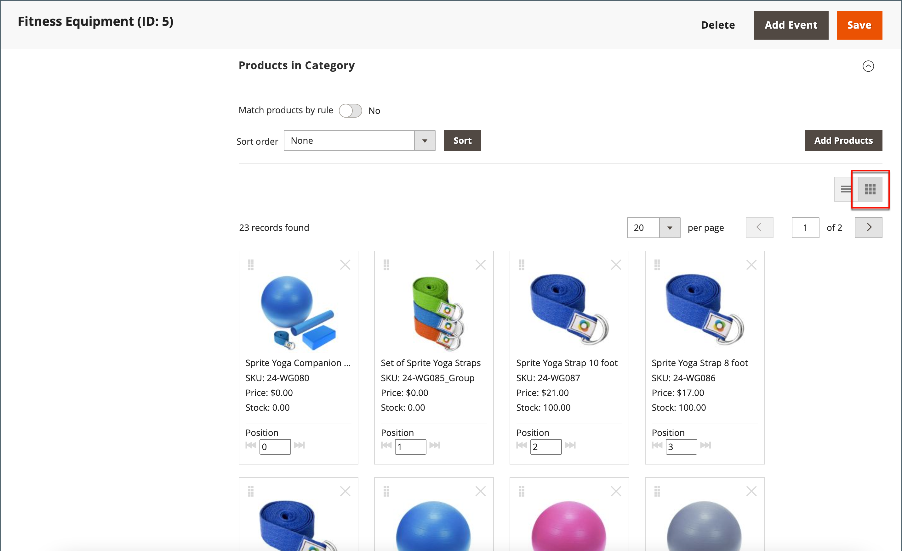
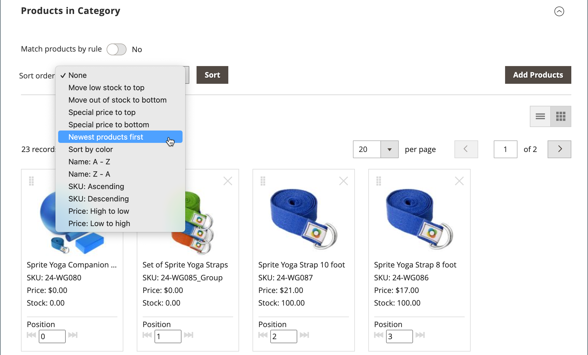

# Sort category products

{{ee-feature}}

The position of products in a category can be specified manually by dragging and dropping products into position or by applying a predefined sort order. By default, products can be sorted by stock level, age, color, name, SKU, and price. Automatic sort overrides the current sort order and resets any drag-and-drop positions that were set manually. The sort order of colors and the minimum stock level that can be required for products to be included in the list are set in the [Visual Merchandiser](../configuration-reference/catalog/visual-merchandiser.md) configuration.

>[!NOTE]
>
>On the category pages, `Out of stock` products are always displayed **_after_** `In Stock` products on the product listing with all sorting types.

You can set up the category options separately for each [store](../stores-purchase/stores.md#add-stores) to determine the selection of products, their relative position in the list, and the attributes that are available for category rules. However, there is a single, **_global_** sort order and product position in the catalog and they are shared across all [store views](../stores-purchase/store-views.md), stores, and websites.

## Step 1: Set the scope of the configuration

1. On the _Admin_ sidebar, go to **[!UICONTROL Catalog]** > **[!UICONTROL Categories]**.

1. If necessary, choose the **[!UICONTROL Store View]** where the settings apply.

   For a multi-store installation, the _[!UICONTROL Store View]_ setting applies the sort order to all available views within the store.

1. In the category tree on the left, choose the category that you want to edit.

   {width="700" zoomable="yes"}

## Step 2: Sort the products

In the _[!UICONTROL Products in Category]_ section, click the tiles (  ) icon to show the product tiles in a grid. Use either the manual or automatic method to sort the products.

{width="600" zoomable="yes"}

### Method 1: Manual sort

1. Set **[!UICONTROL Sort Order]** to your preference.

   {width="600" zoomable="yes"}

1. To apply the new sort order, click **[!UICONTROL Sort]**.

1. To save the sort order, click **[!UICONTROL Save Category]**.

1. When prompted, update any invalid indexers.

### Method 2: Automatic sort

1. Set **[!UICONTROL Match products by rule]** () to `Yes`.

1. Set **[!UICONTROL Automatic Sorting]** to your preference.

1. To create a category rule, follow the instructions in the next step.

## Step 3: Create a category rule

1. Set **[!UICONTROL Match products by rule]** () to `Yes`.

1. Click **[!UICONTROL Add Condition]**.

1. Choose the **[!UICONTROL Attribute]** that is the basis of the condition.

1. Set **[!UICONTROL Operator]** to one of the following:

   - `Equal`
   - `Not equal`
   - `Greater than`
   - `Greater than or equal to`
   - `Less than`
   - `Less than or equal to`
   - `Contains`

1. Enter the appropriate **[!UICONTROL Value]**.

   {width="600" zoomable="yes"}

1. To add another condition, click **[!UICONTROL Add Condition]** and repeat the process.

## Step 4: Save, refresh, and verify

1. When complete, click **[!UICONTROL Save Category]**.

1. When prompted to refresh the cache, click **[!UICONTROL Cache Management]** and refresh each invalid cache.

1. In the storefront, verify that the product selection, sorting, and category rules work correctly.

   If you must make adjustments, change the settings and try again.
