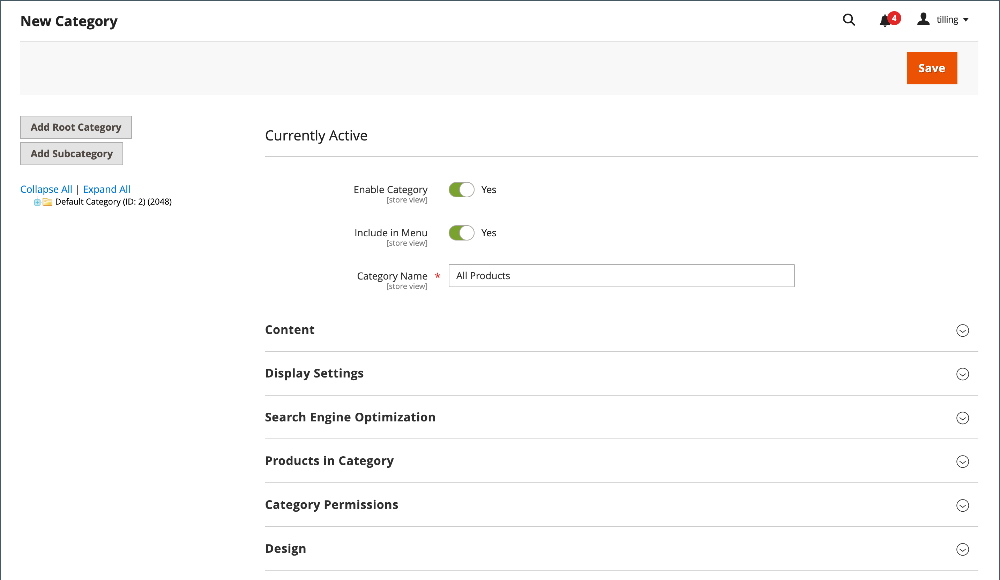

# Root category and hierarchy

The products in the main menu are determined by the root category that is assigned to the [store](../stores-purchase/stores.md#add-stores). The root category is basically a container for the main menu in the category tree. You can create a root category with an entirely new set of products or copy products from an existing root category. The root category can be assigned to the current store or to any other store in the same website.

{width="550"}

From the Admin, the category structure is like an upside-down tree, with the root on top. The root has a name, but no URL key, and does not appear in the [top navigation](navigation-top.md) of the store. All other categories in the menu are nested below the root. Because the root category is the highest level of the catalog, your store can have only one root category active at a time. You can, however, create additional root categories for alternate catalog structures and different stores.

The following example shows how to create a root category and assign it to a different store.

## Step 1: Create a root category

1. On the _Admin_ sidebar, go to **[!UICONTROL Catalog]** > **[!UICONTROL Categories]**.

1. On the left, click **[!UICONTROL Add Root Category]**.

   {width="600" zoomable="yes"}

1. Enter a **[!UICONTROL Category Name]**.

   The name you choose is initially assigned to all store views.

1. If you want to add products to the catalog from the current catalog, do the following:

   - Expand  the _Products in Category_ section.

   - Use the [search filters](../getting-started/admin-grid-controls.md) to find the products you want and select the checkbox for each product that you want to copy into the new catalog.

1. When complete, click **[!UICONTROL Save]**.

## Step 2: Build out the main menu

1. On the left, select the new root category that you created in the previous step.

1. To create the [category structure](category-create.md) for the main menu, click **[!UICONTROL Add Subcategory]** and follow the instructions.

## Step 3: Assign the root category to the store

1. On the _Admin_ sidebar, go to **[!UICONTROL Stores]** > _[!UICONTROL Settings]_ > **[!UICONTROL All Stores]**.

1. In the _Stores_ column of the grid, click the store that you want to assign the new catalog.

1. Set **[!UICONTROL Root Category]** to the new root category that you created.

1. Make sure that the store has a **[!UICONTROL Default Store View]** assigned.

   The store must have at least one [store view](../stores-purchase/store-views.md).

1. When complete, click **[!UICONTROL Save Store]**.

1. To verify that the store has a new catalog, do the following:

   - On the _Admin_ sidebar, go to **[!UICONTROL Catalog]** > **[!UICONTROL Products]**.

      Any products that were copied to the new catalog appear in the grid.

   - To verify that the new catalog and main menu are working correctly, visit the storefront.
