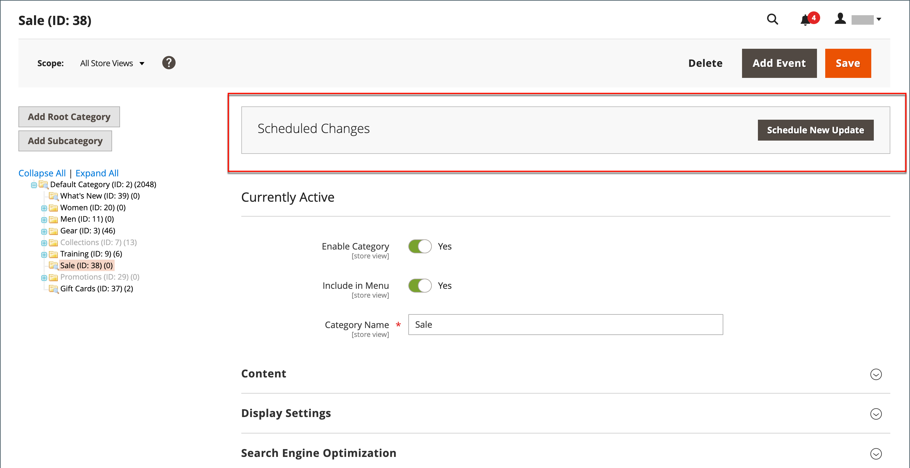
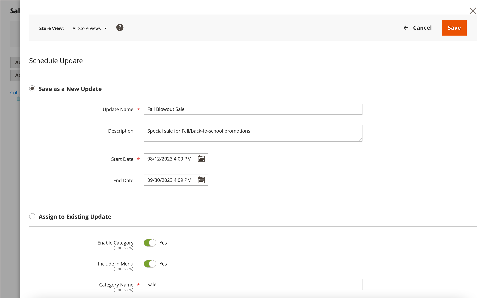

# Scheduled changes for categories

{{ee-feature}}

Category updates can be applied on schedule, and grouped with other content changes. You can create a campaign based on scheduled changes to the category, or apply the changes to an existing campaign. To learn more, see [Content Staging](../content-design/content-staging.md).

>[!NOTE]
>
>[!UICONTROL Schedule Design Update] tab for category is available in  Magento Open Source only. In  Adobe Commerce scheduled contend staging updates with [!UICONTROL Start Date] and [!UICONTROL Start Date] fields must be used instead of listed  Magento Open Source tab.

>[!NOTE]
>
>All scheduled updates are applied consecutively, which means that any entity can have only one scheduled update at one time. Any scheduled update is applied to all store views within its time frame. As a result, an entity cannot have multiple scheduled updates for different store views at the same time. All entity attribute values within all store views, which are not affected by the current scheduled update, are taken from the default values, and not from the previous scheduled update.

## Schedule an update to a category

1. On the _Admin_ sidebar, go to **[!UICONTROL Catalog]** > **[!UICONTROL Categories]**.

1. In the category tree on the left, choose the category to be modified.

1. In the _Scheduled Changes_ box at the top of the page, click **[!UICONTROL Schedule New Update]**.

   {width="600" zoomable="yes"}

1. With the **[!UICONTROL Save as a New Update]** option selected, set the basic parameters for the update:

   - For **[!UICONTROL Update Name]**, enter a name for the new content staging campaign.

   - Enter a brief **[!UICONTROL Description]** of the update and how it is to be used.

   - Use the Calendar (  ) tool to choose the **[!UICONTROL Start Date]** and **[!UICONTROL End Date]** for the campaign.

   >[!IMPORTANT]
   >
   >Campaign **[!UICONTROL Start Date]** and **[!UICONTROL End Date]** must be defined by using the **_default_** Admin time zone, which is converted from the local time zone of each website. For example, with multiple websites in different time zones where you want to start a campaign based on a US time zone, you must schedule a separate update for each local time zone. You set the **[!UICONTROL Start Date]** and **[!UICONTROL End Date]** for each, which is converted from the local website time zone to the default Admin time zone.

   {width="600" zoomable="yes"}

1. Make any changes necessary to the scheduled update.

1. To preview the changes, click **[!UICONTROL Preview]** in the top-right button bar.

1. When complete, click **[!UICONTROL Save]**.

## Assign to an existing update

1. On the _Admin_ sidebar, go to **[!UICONTROL Catalog]** > **[!UICONTROL Categories]**.

1. In the category tree on the left, choose the category to be modified.

1. In the _Scheduled Changes_ box at the top of the page, click **[!UICONTROL Schedule New Update]**.

1. Select **[!UICONTROL Assign to Existing Campaign]**.

1. In the list, find the needed campaign and click **[!UICONTROL Select]**.

1. Make the necessary changes to the scheduled update.

1. When complete, click **[!UICONTROL Save]**.
