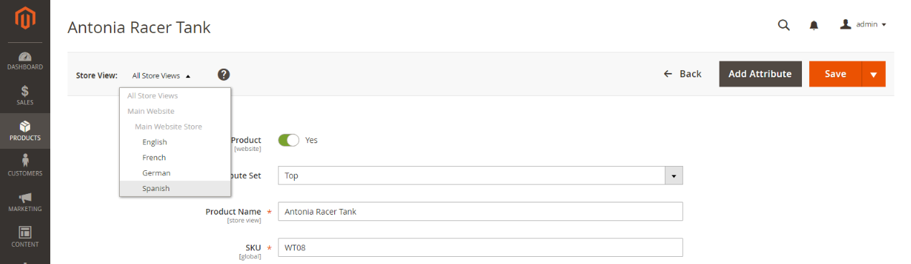
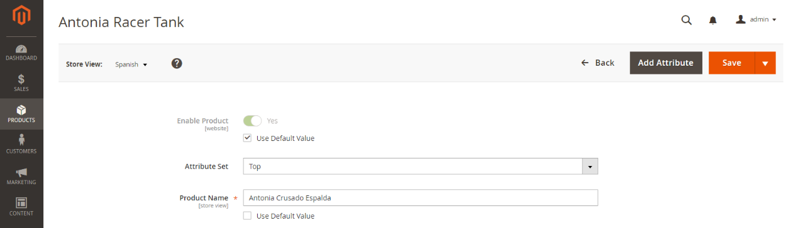
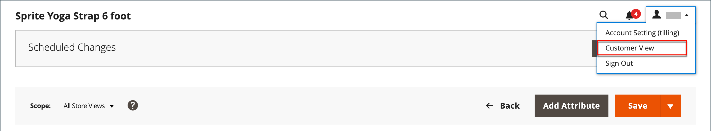
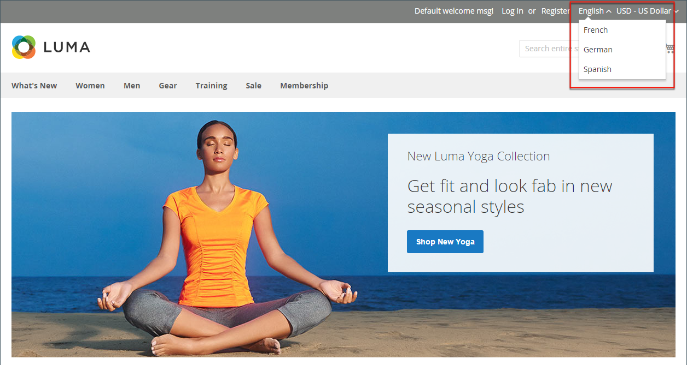

# Introduction to catalog management

Adobe Commerce and Magento Open Source use the term _catalog_ to refer to the product database as a whole. 

One of the most important areas in creating and managing your store is product creation and categories. The Admin provides a number of tools you will use for the initial setup for your store, as well as maintaining your store and optimizing your business.

## Catalog scope

Access to catalog data is determined by several factors, including the [scope](../getting-started/websites-stores-views.md#scope-settings) setting, the catalog configuration, and the [root category](category-root.md) that is assigned to the store. The catalog includes products that are enabled and available for sale, as well as those that are currently not offered for sale.

In sales, the term _catalog_ usually refers to a curated selection of products that is available for sale. For example, a store might have a "Spring Catalog" and a "Fall Catalog".

Like the table of contents of a printed catalog, the main menu of your store — or _top navigation_ — organizes products by category to make it easy for customers to find what they want. The main menu is based on a _root category_, which is a container for the menu that is assigned to the store. Because the specific menu options are defined at the store view level, each view can have a different main menu based on the same root category. Within each menu, you can offer a curated selection of products that is suitable for the store.

<!-- {: "width=550px"} -->

## Product scope

For installations with multiple websites, stores, and views, the [scope](../getting-started/websites-stores-views.md#scope-settings) setting determines where products are available for sale, and the product information that is available for each store view. Initially, all products that you create are published to the default website, store, and store view.

<!-- {:width="550px"} -->

If you have only a single store with the default view, you can run your store in [Single Store Mode](https://docs.magento.com/user-guide/stores/store-mode-single.html) to hide the scope settings. However, if your store has multiple views, a scope indicator appears below the name of each field.

- To edit product information for a specific view, use the _Store View_ control in the upper-left corner to choose the view. Additional controls become available for any field that can be edited at the store view level.

- To define the scope of a product in a multisite installation, see the [Product in Websites](settings-basic-websites.md) section of product information.

The process of editing a product for a store view is like adding a layer of product information that is specific to the view.

You can only edit or assign products for the site you have permissions for, not for all sites where the product is assigned.

Although the _Spanish_ store view is selected in the following example, the product information still appears in the original language of the default store view. To translate the product information, you must switch to the _Spanish_ store view and translate the text fields — such as product title, description, and the meta data. For more information, see [Translating Products](https://docs.magento.com/user-guide/catalog/product-translate.html).

## Edit a product for a different view

1. In the upper-left corner, set **[!UICONTROL Store View]** to the specific view to be edited.

1. click **[!UICONTROL OK]** to confirm the scope change.

   <!-- zoom -->

1. Update the field with the new value for the store view.

   A checkbox appears below any field that can be edited for the store view. To override the default value, deselect the **Use Default Value** checkbox.

   <!-- zoom -->

1. When complete, click **[!UICONTROL Save]**.

1. In the upper-left corner, set the **[!UICONTROL Store View]** chooser back to the default.

1. To verify the change in your store, do the following:

   - In the upper-right corner, click the _Admin_ menu arrow and choose **Customer View**.

      <!-- zoom -->

   - In the upper-right corner of the store, set the **Language Chooser** to the store view of the product that you edited and find the product that you edited for the view.

      <!-- zoom -->
