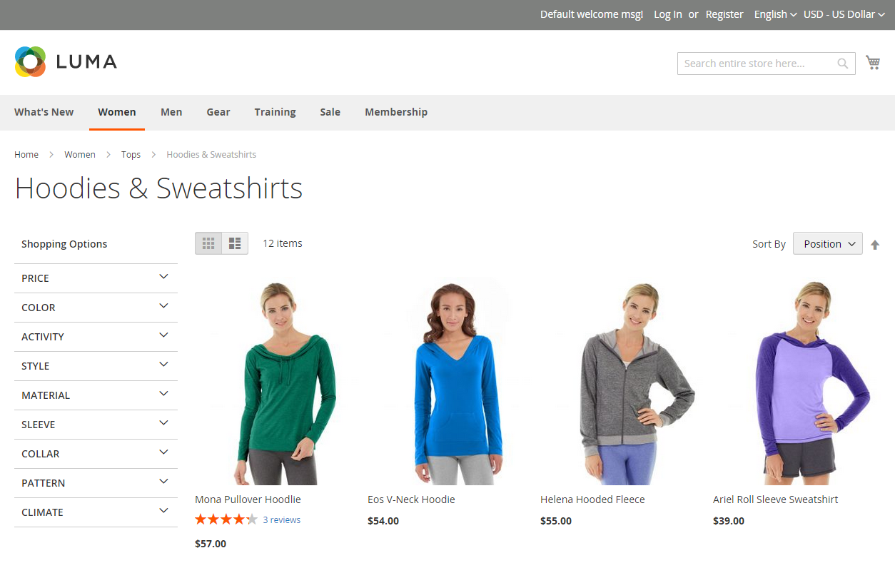
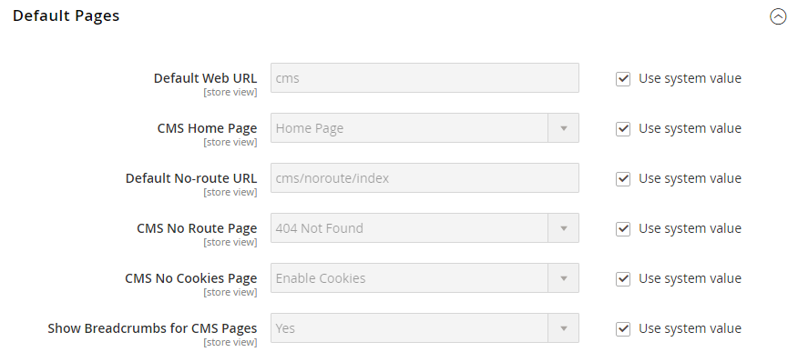

# Breadcrumb trails

A _breadcrumb trail_ is a set of links that shows the customer where they are in relation to other pages in the store. They can click any link in the breadcrumb trail to return to the previous page.

The breadcrumb trail can be configured to appear on content pages and on catalog pages. The format and position of the breadcrumb trail varies by theme, but it is typically located just below the header. By default, the breadcrumb trail appears on CMS pages.

{width="700" zoomable="yes"}

## General types of bread crumbs

Breadcrumbs can be divided into three main types, which differ in their purpose. The essence and main principles of the implementation of each type of bread crumbs are described below.

### Hierarchy-based breadcrumbs

This type of breadcrumb is based on the category hierarchy set up on the site. The chains presented tell the user where in the structure they are. In this case, each text link is intended for a page that is one level higher than the previous one.

Example: `Men > Tops > Hoodies & Sweatshirts`

The advantage of this type is that users can easily see which category level they are in and have easy access to navigation between catalog pages.

### History-based breadcrumbs

History- (or path-) based navigation is similar to the back button in a browser. This type of navigation allows users to quickly return to the previous pages they have visited without changes.

The advantage of this type is that it is most helpful when customers want to return to a previous page after selecting multiple filters on a category page.

Example: `Home > What's New > Gear > Bags`

### Attribute-based breadcrumbs

This type of breadcrumb displays the attributes selected on the category page. The main difference from the other types is that the attribute-based breadcrumbs represent the filters and options the customer has selected in the navigation layer for certain products (such as price, quality, and color).

Example: `Home > Suits > All Suits > Refined by > Slim Fit`

## Add/Remove the breadcrumbs from CMS pages

1. On the _Admin_ sidebar, go to **[!UICONTROL Stores]** > _[!UICONTROL Settings]_ > **[!UICONTROL Configuration]**.

1. In the left panel under _[!UICONTROL General]_, choose **[!UICONTROL Web]**.

   {width="600" zoomable="yes"}

1. Expand the _[!UICONTROL Default Pages]_ section.

1. Deselect the **[!UICONTROL Use system value]** checkbox.

1. Set **[!UICONTROL Show Breadcrumbs for CMS Pages]** to `No` or `Yes`.

1. When complete, click **[!UICONTROL Save Config]**.

>[!NOTE]
>
>Parent category is not displayed on the Breadcrumb Trail, on the child category page, when it has `Browsing Category`= `Deny` [category permission](category-permissions.md) settings.
