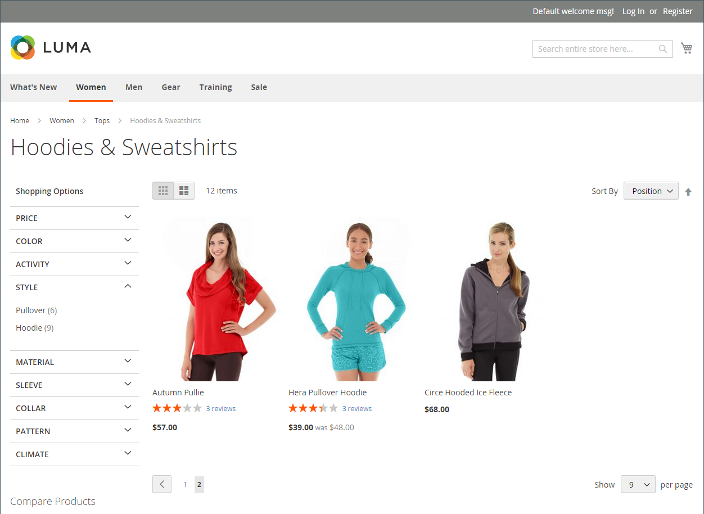
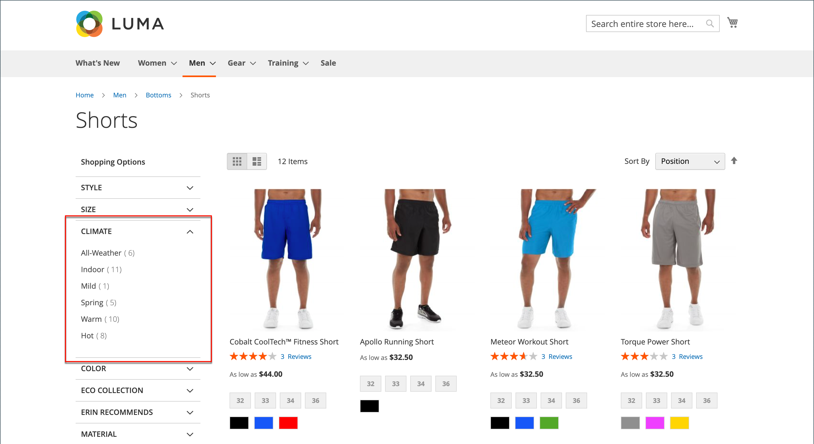
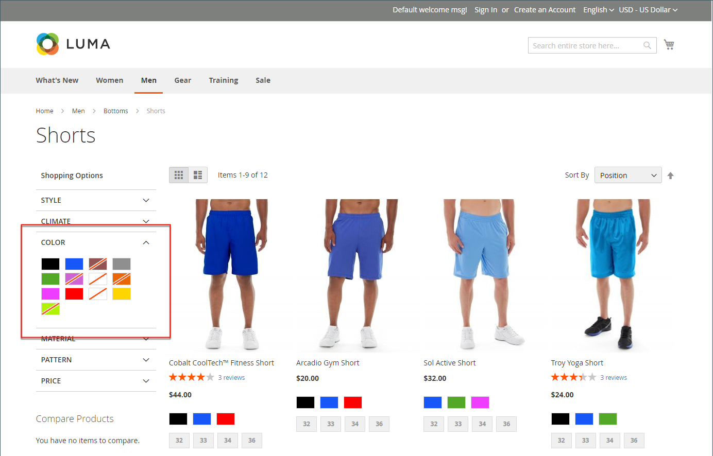
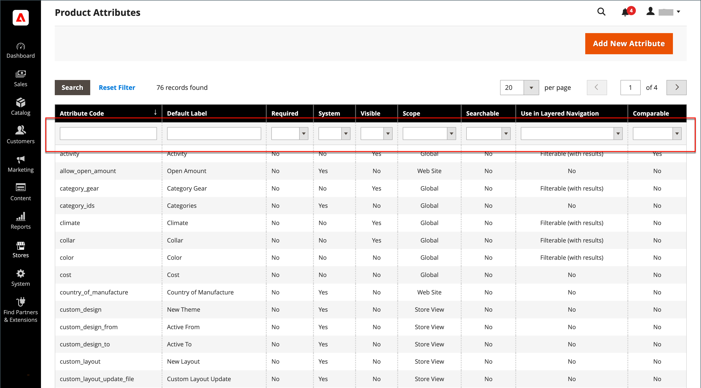
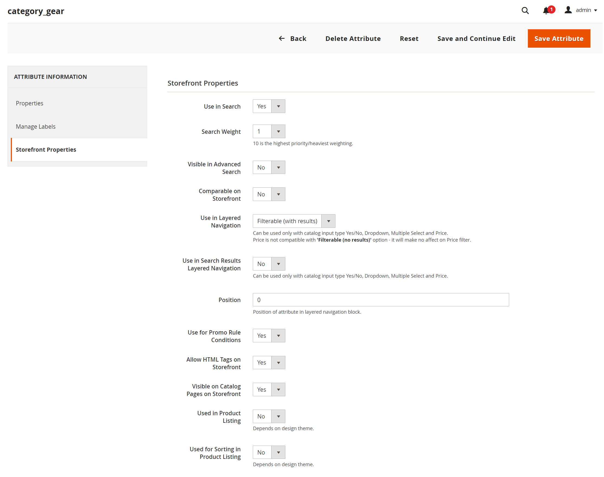
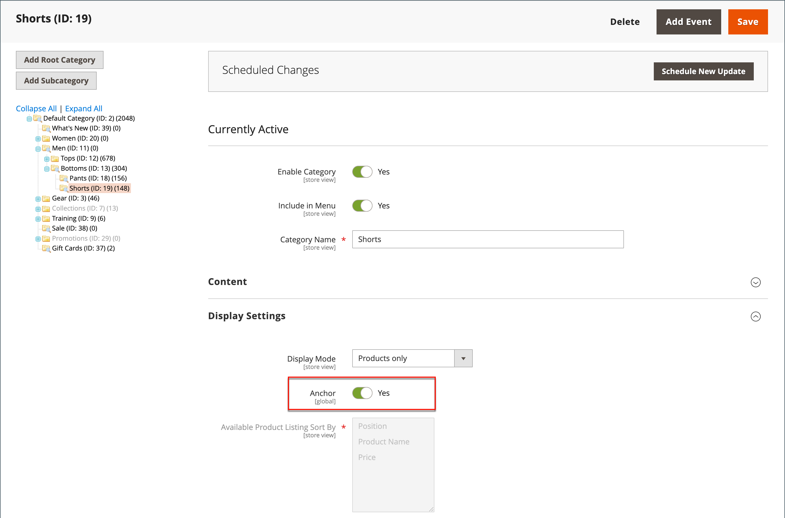
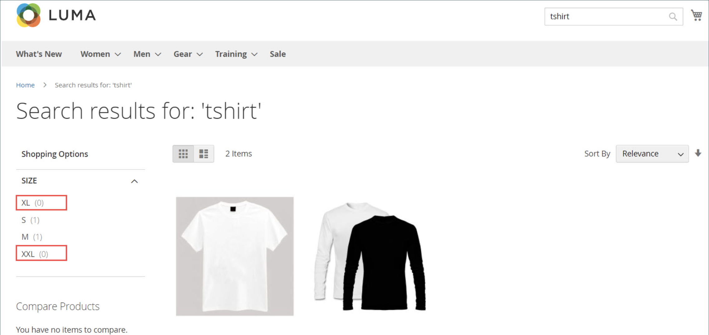
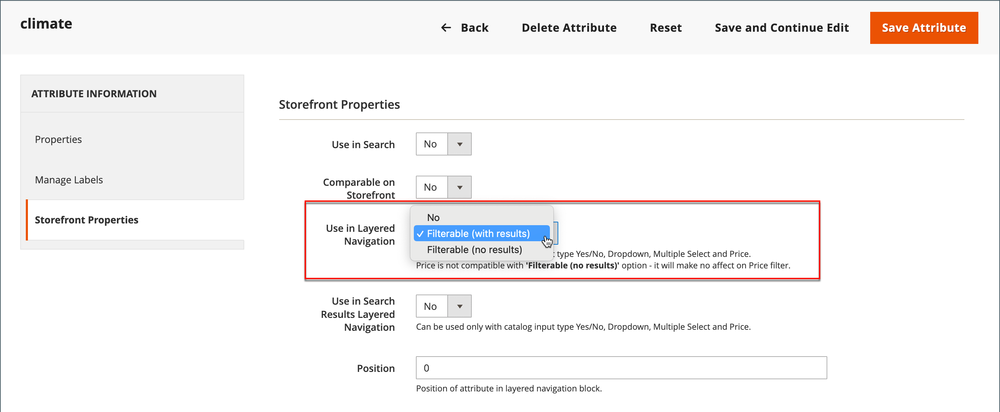

# Layered navigation

>[!NOTE]
>
>The standard layered navigation described in this section differs from Live Search filtered navigation with [facets](https://experienceleague.adobe.com/docs/commerce-merchant-services/live-search/live-search-admin/facets/facets.html).

Layered navigation makes it easy to find products based on category, price range, or any other available attribute. Layered navigation usually appears in the left column of search results and category pages and sometimes on the home page. The standard navigation includes a _Shop By_ list of categories and price range. You can configure the display of layered navigation, including product count and price range.

{width="700" zoomable="yes"}

## Filterable attributes

>[!NOTE]
>
>The filterable attribute requirements described in this topic differ for [Live Search](https://experienceleague.adobe.com/docs/commerce-merchant-services/live-search/overview.html). To learn more, see [Facets](https://experienceleague.adobe.com/docs/commerce-merchant-services/live-search/live-search-admin/facets/facets.html).

Layered navigation can be used to search for products by category or by attribute. For example, when a shopper chooses the Mens/Shorts category from the top navigation, the initial results include all products in the category. The list can be filtered further by choosing a specific style, climate, color, material, pattern, or price—or a combination of values. Filterable attributes appear in an expanding section that lists each attribute value. As an option, the list of products with matching results can be configured to include products with, or without, a match.

The attribute properties, combined with the product input type, determine which attributes can be used for layered navigation. Layered navigation is available only for [_anchor_](categories-display-settings.md) categories, but can also be added to search results pages. The **Catalog Input Type for Store Owner** property of each attribute must be set to `Yes/No`, `Dropdown`, `Multiple Select`, or `Price`. To make the attributes filterable, the **Use in Layered Navigation** property of each must be set to either `Filterable (with results)` or `Filterable (no results)`.

_Example: Filterable attributes with results_

{width="700" zoomable="yes"}

_Example: Filterable swatch values displayed with no result_

{width="700" zoomable="yes"}

The following instructions show how to set up basic layered navigation with filterable attributes. For advanced layered navigation with price steps, see [Price Navigation](navigation-layered.md#configure-price-navigation).

## Step 1: Set up the attribute properties

1. On the _Admin_ sidebar, go to **[!UICONTROL Stores]** > _[!UICONTROL Attributes]_ > **[!UICONTROL Product]**.

1. Browse or use filtered search to find an attribute in the list and open it in edit mode.

   {width="700" zoomable="yes"}

1. In the left panel, choose **[!UICONTROL Storefront Properties]** and set **[!UICONTROL Use In Layered Navigation]** to one of the following:

   - `Filterable (with results)` - Layered navigation includes only those filters for which matching products can be found. Any attribute value that already applies to all products shown in the list should still appear as an available filter. Attribute values with a count of zero (0) product matches are omitted from the list of available filters. The filtered list includes only the products that match the filter. The products list is updated only if the selected filters change what is shown.

   - `Filterable (no results)` - Layered navigation includes filters for all available attribute values and their product counts, including products with zero (0) product matches. If the attribute value is a swatch, the value appears as a filter, but is crossed out. Price-layered filtering is not supported by this option, and does not affect Price filters.

1. Set **[!UICONTROL Use In Search Results Layered Navigation]** to `Yes`.

   {width="600" zoomable="yes"}

1. Repeat these steps for each attribute that you want to include in layered navigation.

>[!NOTE]
>
>The [!UICONTROL Position] field is dimmed by default, so you must save the attribute before you can modify this setting.

## Step 2: Make the category an anchor

1. On the _Admin_ sidebar, go to **[!UICONTROL Catalog]** > **[!UICONTROL Categories]**.

1. In the categories tree, select the category where you want to use layered navigation.

1. Expand  the **[!UICONTROL Display Settings]** section and set **[!UICONTROL Anchor]** to `Yes`.

   {width="600" zoomable="yes"}

1. Click **[!UICONTROL Save]**.

## Step 3: Test the results

To test the setting, visit your store and navigate to the category from the main menu. The selection of filterable attributes appears in the layered navigation of the category page.

Search, filter, and review the displayed products.

## Remove filterable attribute values from layered navigation

Layered navigation includes filters for all available attribute values and their product counts, including products with zero (0) product matches (as shown in the following image).

   {width="700" zoomable="yes"}

This result can make it difficult for customers to select a preferred product, and there is no need to display attribute values ​​with 0 products in the front end.

You can use the following steps to remove filterable attribute values with 0 Products from the layered navigation:

1. On the _Admin_ sidebar, go to **[!UICONTROL Stores]** > _[!UICONTROL Attributes]_ > **[!UICONTROL Product]**.

1. Browse or use filtered search to find an attribute in the list and open it in edit mode.

1. Under _[!UICONTROL Attribute Information]_ , click **[!UICONTROL Storefront Properties]**.

1. For **[!UICONTROL Layered Navigation]**, choose `Filterable (with results)`.

   {width="600" zoomable="yes"}

1. Click **[!UICONTROL Save Attribute]**.

## Price navigation

>[!NOTE]
>
>The price navigation configuration described in this topic differs for [Live Search](https://experienceleague.adobe.com/docs/commerce-merchant-services/live-search/overview.html).

Price navigation can be used to distribute products by price range in layered navigation. You can also split each range in intervals. There are a few ways to calculate price navigation:

- Automatic (Equalize Price Ranges)
- Automatic (Equalize Product Counts)
- Manual

With the first two methods, the navigation steps are calculated automatically. The manual method lets you specify a division limit for price intervals. The following example shows the difference between price navigation steps of 10 and 100.

Iterative splitting provides the best distribution of products among price ranges. With iterative splitting, after choosing the $0.00-$99 range, the customer can drill down through several subranges of prices. Price-range splitting stops when the number of products reaches the threshold set by the Interval Division Limit.

## Example: Price navigation steps

| Price Step by 10 | Price Step by 100 |
|----------|--------|
| $20.00 - $29.99 (1) | $0.00 - $99.99 (4) |
| $30.00 - $39.99 (2) | $100 - $199.99 (5) |
| $70.00 - $79.99 (1) | $400.00 - $499.99 (2) |
| $100.00 - $109.99 (1) | $700.00 and above (1) |
| $120.00 - $129.99 (2) |   |
| $150.00 - $159.99 (1) |   |
| $180.00 - $189.99 (1) |   |
| $420.00 - $429.99 (1) |   |
| $440.00 - $449.99 (1) |   |
| $710.00 and above (1) |   |

{style="table-layout:auto"}

## Configure price navigation

>[!IMPORTANT]
>
>To correctly display products and their prices according to _price filters_ in the layered navigation, make sure that the settings for the price display in the [Sales Tax configuration](../configuration-reference/sales/tax.md) have the same value (`Excluding Tax` **or** `Including Tax`). For the _[!UICONTROL Calculation Settings]_, check the **[!UICONTROL Catalog Prices]** value. And for _[!UICONTROL Price Display Settings]_, check the **[!UICONTROL Display Product Prices in Catalog]** value. If these have different values, price filters in the layered navigation may not properly filter and sort products by price.

1. On the _Admin_ sidebar, go to **[!UICONTROL Stores]** > _[!UICONTROL Settings]_ > **[!UICONTROL Configuration]**.

1. In the left panel, expand **[!UICONTROL Catalog]** and choose **[!UICONTROL Catalog]** underneath.

1. Expand  the _Layered Navigation_ section.

   By default, **[!UICONTROL Display Product Count]** is set to `Yes`. If necessary, deselect the **[!UICONTROL Use system value]** checkbox to change this setting.

   {width="600" zoomable="yes"}

   For a detailed list of these configuration options, see [Layered Navigation](../configuration-reference/catalog/catalog.md#layered-navigation) in the _Configuration Reference_.

1. Set **[!UICONTROL Price Navigation Steps Calculation]** for one of the methods in the following sections.

1. When complete, click **[!UICONTROL Save Config]**.

### Method 1: Automatic (equalize price ranges)

Leave **[!UICONTROL Price Navigation Steps Calculation]** set to `Automatic (Equalize Price Ranges)` (default). This setting uses the standard algorithm for price navigation.

### Method 2: Automatic (equalize product counts)

>[!TIP]
>
>If necessary, first deselect the **[!UICONTROL Use system value]** checkbox to change these settings.

1. Set **[!UICONTROL Price Navigation Steps Calculation]** to `Automatic (equalize product counts)`.

1. To display a single price when multiple products with the same price, set **[!UICONTROL Display Price Interval as One Price]** to `Yes`.

1. For **[!UICONTROL Interval Division Limit]**, enter the threshold for the number of products within a price range.

   The range cannot be further split beyond this limit. The default value is `9`.

   {width="600" zoomable="yes"}

### Method 3: Manual

>[!NOTE]
>
>If necessary, first deselect the **[!UICONTROL Use system value]** checkbox to change these settings.

1. Set **[!UICONTROL Price Navigation Steps Calculation]** to `Manual`.

1. Enter a value that determines the **[!UICONTROL Default Price Navigation Step]**.

1. Enter the **[!UICONTROL Maximum Number of Price Intervals]** allowed, up to `100`.

   {width="600" zoomable="yes"}

## Configure layered navigation

>[!NOTE]
>
>The standard configuration described in this page differs for [Live Search](https://experienceleague.adobe.com/docs/commerce-merchant-services/live-search/overview.html).

The layered navigation configuration determines if a product count appears in parentheses after each attribute, and the size of the step calculation that is used in price navigation.

1. On the _Admin_ sidebar, go to **[!UICONTROL Stores]** > _[!UICONTROL Settings]_ > **[!UICONTROL Configuration]**.

1. In the left panel, expand the _[!UICONTROL Catalog]_ section and choose **[!UICONTROL Catalog]** underneath.

1. Expand the _[!UICONTROL Layered Navigation]_ section.

   >[!NOTE]
   >
   >If necessary, first deselect the **[!UICONTROL Use system value]** checkbox to change these settings.

1. To display the number of products found for each attribute, set **[!UICONTROL Display Product Count]** to `Yes`.

1. Set **[!UICONTROL Price Navigation Step Calculation]** to `Automatic (equalize price ranges)`.

1. When complete, click **[!UICONTROL Save Config]**.
