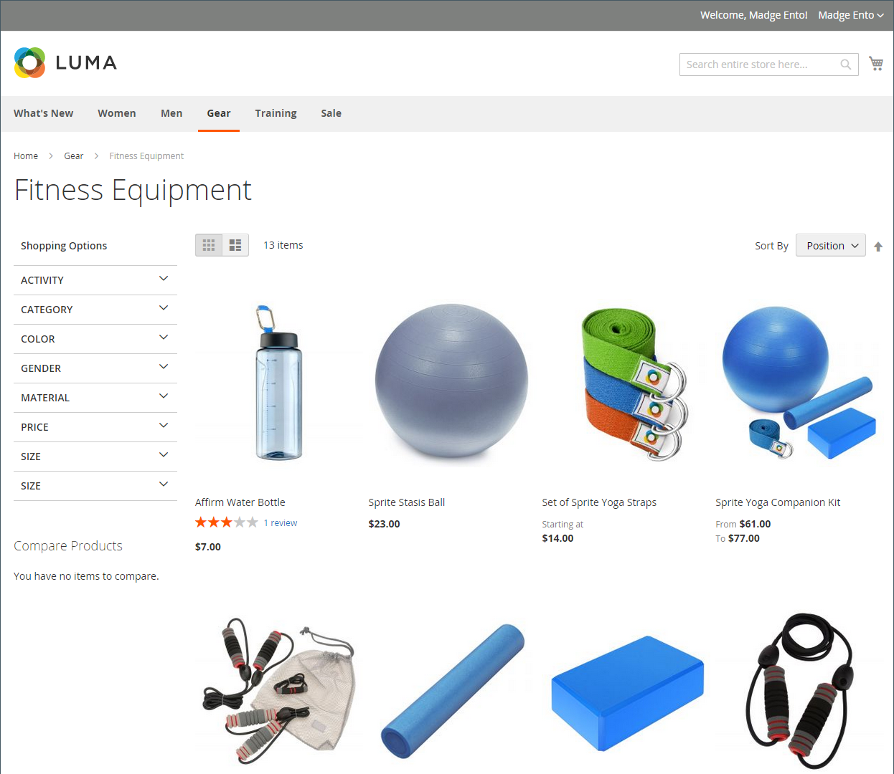
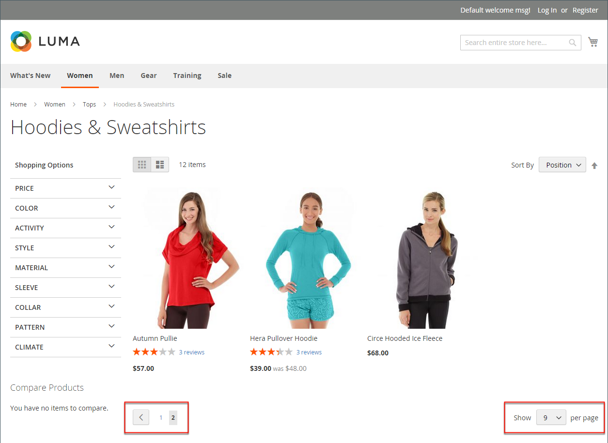
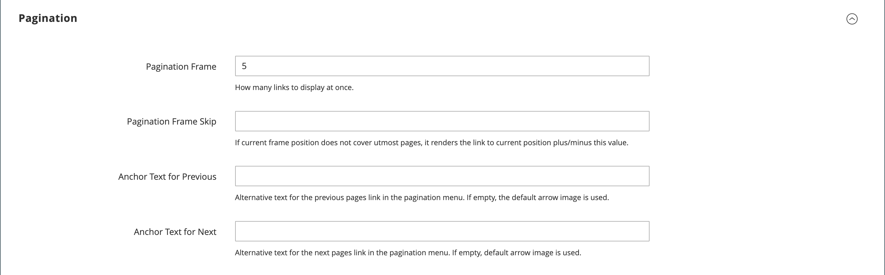

# Product listings

Product listings can be set to appear by default as either a list or grid. You can also determine how many products appear per page, and which attribute is used to sort the list. The product list includes a set of controls that can be used to sort the products, change the format of the list, sort by attribute, and advance from one page to the next.

<!-- zoom -->

## Configure product listings

1. On the _Admin_ sidebar, go to **[!UICONTROL Stores]** > _[!UICONTROL Settings]_ > **[!UICONTROL Configuration]**.

1. In the left panel, expand **[!UICONTROL Catalog]** and choose **[!UICONTROL Catalog]** underneath.

1. Expand  the **[!UICONTROL Storefront]** section.

   <!-- zoom -->

   For more information about these options, see [Storefront](https://docs.magento.com/user-guide/configuration/catalog/catalog.html#storefront) in the _Configuration Reference_.

   >[!NOTE]
   >
   >To correctly display products and their prices according to _product sorting by price_, make sure that the settings for the price display in the [Sales Tax configuration](https://docs.magento.com/user-guide/configuration/sales/tax.html) have the same value (`Excluding Tax` **or** `Including Tax`). For the _[!UICONTROL Calculation Settings]_, check the **[!UICONTROL Catalog Prices]** value. And for _[!UICONTROL Price Display Settings]_, check the **[!UICONTROL Display Product Prices in Catalog]** value. If these have different values, price filters in the layered navigation may not properly filter and sort products by price.

1. Set the default **[!UICONTROL List Mode]** to one of the following:

   - `Grid Only`
   - `List Only`
   - `Grid (default) / List`
   - `List (default / Grid`

1. For **[!UICONTROL Products per Page on Grid Allowed Values]**, enter the number of products that you want to appear per page when shown in grid format.

   To enter a selection of values, separate each number by a comma.

1. For **[!UICONTROL Products per Page on Grid Default Value]**, enter the default number of products to appear in the grid per page.

1. For **[!UICONTROL Products per Page on List Allowed Values]**, enter the number of products that you want to appear per page when shown in list format.

   To enter a selection of values, separate each number by a comma.

1. For **[!UICONTROL Products per page on List Default Value]**, enter the default number of products that appear in the list, per page.

1. Set **[!UICONTROL Product Listing Sorted by]** to the default attribute that is initially used to sort the list.

1. To give customers the option to list all products, set **[!UICONTROL Allow All Products on Page]** to `Yes`.

1. If you want to retain all pagination settings as customers browse through catalog listings, set **[!UICONTROL Remember Category Pagination]** to `Yes`.

   Enabling this setting ensures that the number of products displayed in a list or grid is retained as shoppers browse from one category to another. By default, this field is set to `No` because it uses more cache storage and can impact the way pages are indexed by search engines.

1. If using a [flat catalog](catalog-flat.md) (**not recommended**), do the following:

   - To display a flat category listing of products, set **[!UICONTROL Use Flat Catalog Category]** to `Yes`.

   - To display a flat product listing, set **[!UICONTROL Use Flat Catalog Product]** to `Yes`.

1. If you want to allow dynamic references for media assets in category and product URLs, set **[!UICONTROL Allow Dynamic Media URLs in Products and Categories]** to `Yes`.

1. When complete, click **[!UICONTROL Save Config]**.

## Page controls

|Control|Description|
|--- |--- |
|[!UICONTROL View As]|Displays the products in either a grid or list format.|
|[!UICONTROL Sort By]|Changes the sort order of the list.|
|[!UICONTROL Show Per Page]|Determines how many products appear per page.|
|Pagination links|Navigation links to other pages.|

{style="table-layout:auto"}

## Pagination controls

The Pagination settings appear at the top and bottom of the list, and control the format of the pagination links for product listings. You can set the number of links that appear in the control, and configure the Next and Previous links. For the pagination links to appear, there must be more products in the list than are allowed per page in the product list configuration.

<!-- zoom -->

### Storefront pagination controls

|Control|Description|
|--- |--- |
||[!UICONTROL View As] - Displays the list in either a Grid or List format.|
||[!UICONTROL Sort By] - Changes the sort order of the list. The _[!UICONTROL Used for Sorting in Product Listing]_ storefront property determines which [product attributes](../catalog/product-attributes.md) can be used to sort the list.|
||[!UICONTROL Show Per Page] - Determines how many products appear per page.|
||Pagination links - Navigation links to other pages.|

{:style="table-layout:auto"}

### Configure the pagination controls

1. On the _Admin_ sidebar, go to **[!UICONTROL Content]** > _[!UICONTROL Design]_ > **[!UICONTROL Configuration]**.

1. Find the store view that you want to configure and, in the **[!UICONTROL Action]** column, click **[!UICONTROL Edit]**.

1. Under **[!UICONTROL Other Settings]**, expand  the **[!UICONTROL Pagination]** section.

   <!-- zoom -->
   
   For more information about these settings, see [Design Configuration](../content-design/configuration.md).

1. For **[!UICONTROL Pagination Frame]**, enter the number of links that you want to appear in the pagination control.

1. For **[!UICONTROL Pagination Frame Skip]**, enter the number of links that you want to skip ahead before displaying the next set of links in the pagination control.

   For example, if the pagination frame has five links, and you want to jump to the next five links, how many links do you want to skip ahead? If you set this to four, then the last link from the previous set will be the first link in the next set.

1. For **[!UICONTROL Anchor Text for Previous]**, enter the text that you want to appear for the Previous link.

   Leave blank to use the default arrow.

1. For **[!UICONTROL Anchor Text for Next]**, enter the text that you want to appear for the Next link. Leave blank to use the default arrow.

1. When complete, click **[!UICONTROL Save Configuration]**.
