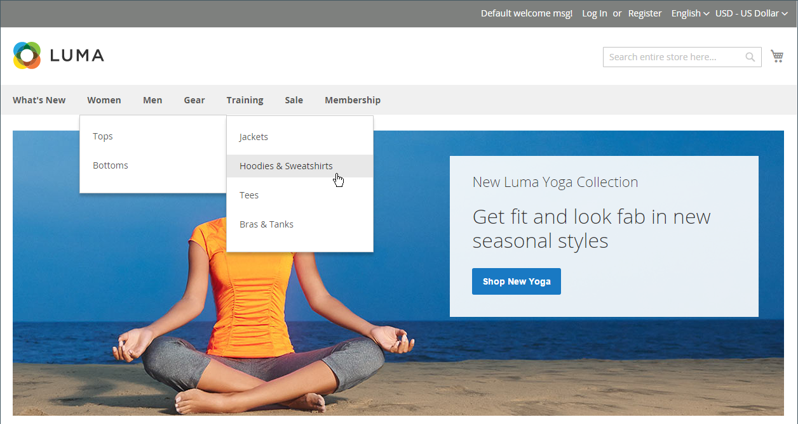

# Top navigation

The main menu of your store is like a directory to the different departments in your store. Each option represents a different category of products. The position and presentation of the top navigation might vary by theme, but the way it works is essentially the same.

{width="700" zoomable="yes"}

The category structure of your catalog can influence how well your site is indexed by search engines. The more deeply nested a category, the less likely it is to be thoroughly indexed. Generally, using between one and three visible levels is the most effective. The [root category](category-root.md) counts as the first level, although it doesn't appear in the menu. The maximum number of levels that are available in the top navigation is determined by the configuration. In addition, there might be a limit to the number of menu levels that are supported by your store theme. For example, the sample Luma theme supports up to five levels, including the root.

## Counting menu levels

|Item |Description |
|--- |--- |
|Level 1|The first level is the root category, which in the sample data  is named "Default Category." The root is a container for the menu, and its name does not appear as an option in the menu.|
|Level 2|On a desktop display, the top navigation is the main menu that appears across the top of the page. On a mobile device, the main menu typically appears as a fly-out menu of options. The second-level options in the Luma  store are _What's New_, _Women_, _Men_, _Gear_, _Training_, and _Sale_.|
|Level 3|The third level appears below each  main menu option. For example, under _Women_, the third-level options are _Tops_ and _Bottoms_.|
|Level 4|The fourth-level options are subcategories that fly out from a third-level option. For example, under _Tops_, the fourth level menu options are _Jackets_, _Hoodies & Sweatshirts_, _Tees_, and _Bras & Tanks_.|

{style="table-layout:auto"}

## Set the top navigation

For a category to appear in the top navigation of a store, complete the following steps:

### Step 1: Create a category

1. On the _Admin_ sidebar, go to **[!UICONTROL Catalog]** > **[!UICONTROL Categories]**.

1. Set a **[!UICONTROL Store View]** to determine where the new category is to be available.

1. In the category tree, select the parent category of the new category.

   If you're starting from the beginning without any data, there might be only two categories in the list: _Default Category_, which is the root, and an _Example category_.

1. Click **[!UICONTROL Add Subcategory]**.

1. Complete the basic information with following settings:

   - **[!UICONTROL Enable Category]** set to `Yes`
   - **[!UICONTROL Include in Menu]** set to `Yes`

1. In Display Setting set **[!UICONTROL Anchor]** to `Yes`.

1. Complete any other required [category settings](category-create.md).

1. When complete, click **[!UICONTROL Save]**.

For a multistore installation, a different main menu can be assigned as the [root category](category-root.md) for each [store](../stores-purchase/stores.md#add-stores).

### Step 2: Set the depth of the top navigation

1. On the _Admin_ sidebar, go to **[!UICONTROL Stores]** > _[!UICONTROL Settings]_ > **[!UICONTROL Configuration]**.

1. In the left panel, expand **[!UICONTROL Catalog]** and choose **[!UICONTROL Catalog]** underneath.

1. Expand the **[!UICONTROL Category Top Navigation]** section.

   {width="600" zoomable="yes"}

   Because the depth of the top navigation has a global [configuration scope](../getting-started/websites-stores-views.md#scope-settings), the setting applies to all websites, stores, and store views in the Commerce installation. The _[!UICONTROL Category Top Navigation]_ configuration section is available only when _[!UICONTROL Store View]_ in the upper-left corner is set to `Default Config`.

   For a detailed list of these options, see [Category Top Navigation](../configuration-reference/catalog/catalog.md#layered-navigation) in the _Configuration Reference_.
      
1. To limit the number of subcategories that appear in the top navigation, enter the number for **[!UICONTROL Maximal Depth]**.

   The default value is `0`, which does not place a limit on the number of subcategory levels.

1. When complete, click **[!UICONTROL Save Config]**.
