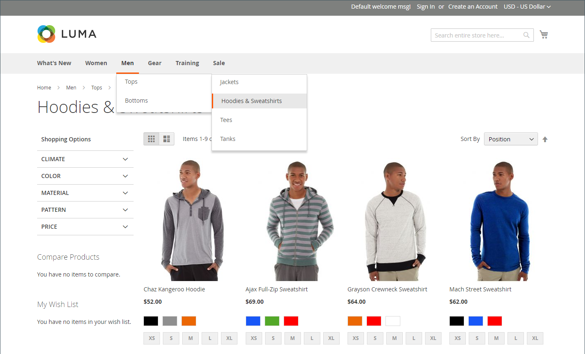

# Catalog navigation

The term _navigation_ refers to the methods shoppers use to move from page to page throughout your store. The main menu, or top navigation, of your store is actually a list of category links and provides easy access to the products in your catalog. There are also categories in the breadcrumb trail that appears across the top of most pages and in the layered navigation that appears on the left side of some two- or three-column pages. For more information about category display options, see [Display Settings](categories-display-settings.md).

For a product to be visible in your store, it must be assigned to at least one category (see [Set the top navigation](navigation-top.md)). Each category can have a dedicated landing page with an image, static block, a description, and a list of products in the category. You can also create special designs for category pages that are active only for a specific time period, such as for a holiday or promotion.

<!-- zoom -->
