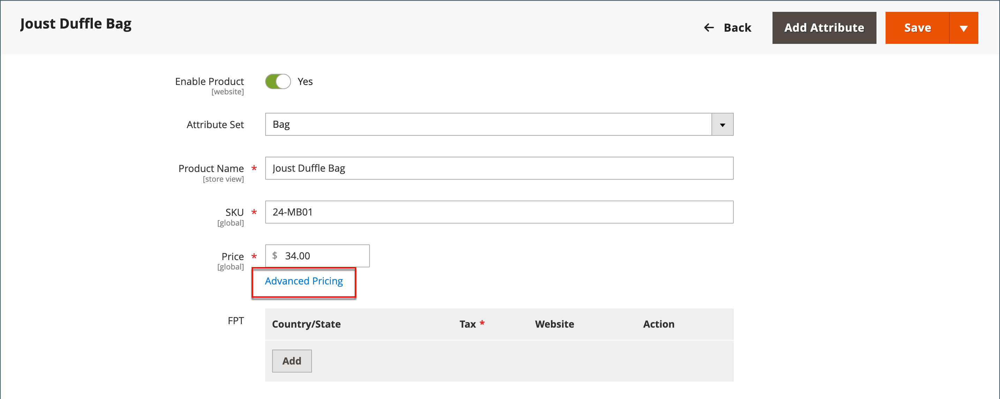
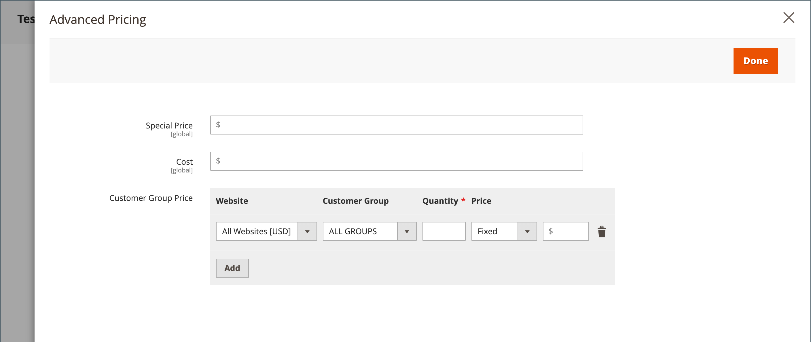
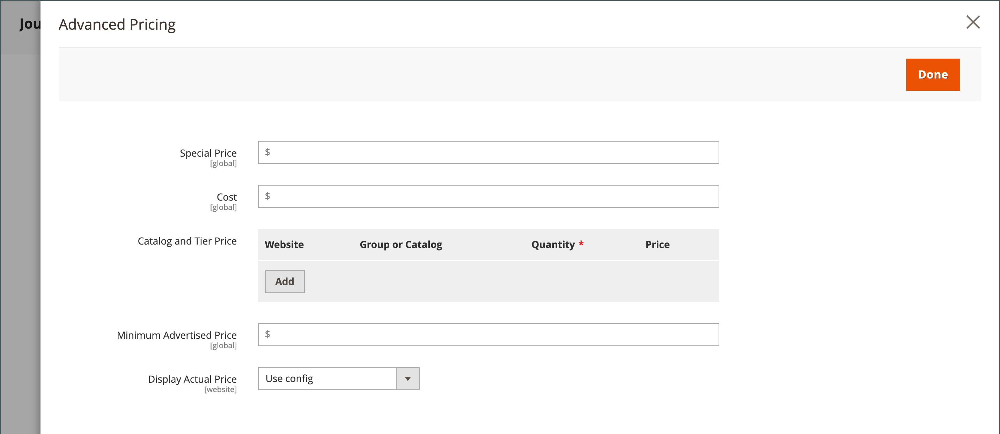

# Advanced pricing

Adobe Commerce and Magento Open Source support various pricing options that you can use for promotions, or to meet the minimum advertised pricing requirements of the manufacturer. Changes to product pricing can be made on schedule, or by price rule that is applied at the product level or in the shopping cart.

Manage prices for your products with advanced pricing to offer customers better rates that encourage consumers to spend more, drive the traffic to your site, and clear old stock.

The _[!UICONTROL Advanced Pricing]_ settings define the conditions required for special pricing that is available for a specific customer group or shared catalog. Advanced pricing can be applied to simple, virtual, downloadable, and bundle products. To apply discounted pricing to other product types, use a [catalog price rule](../merchandising-promotions/price-rules-catalog.md). For more information, see [Price Scope](catalog-price-scope.md).

Advanced pricing data is synchronized with product pages. For example, if you update a tier price quantity, the system updates the value on the product page.

 (Available with [B2B for Adobe Commerce](./b2b/../introduction.md) only) If you are using shared catalogs, advanced pricing data is synchronized with both product pages and shared catalogs. For example, if you update a tier price quantity, the system updates the value in the shared catalog and on the product page. Any custom pricing that is indicated in the shared catalog has priority over customer group pricing. Also refer to [Set shared catalog pricing and structure](https://experienceleague.adobe.com/docs/commerce-admin/b2b/shared-catalogs/define/catalog-shared-pricing-structure.html) in the _B2B for Adobe Commerce Guide_.

{width="600" zoomable="yes"}

## Access the advanced pricing options

1. Open the product in edit mode.

1. Under **[!UICONTROL Price]**, click **[!UICONTROL Advanced Pricing]**.

1. Follow the instructions for the type of advanced pricing that is needed.

   - [Group Price](product-price-group.md)

   - [Special Price](product-price-special.md)

   - [Tier Price](product-price-tier.md)

   - [Minimum Advertised Price](product-price-minimum-advertised.md)

## Page reference

### [!UICONTROL Special Price]

To offer a discounted price during a specified time period or scheduled campaign, enter the special price. When a special price is available, the retail price is crossed out and the special price appears below in large, bold text.

#### [!UICONTROL Special Price From] dates

{{ce-feature}}

| Field | Description |
| ---- | ----------- |
|[!UICONTROL From]|Sets the first date that the special price is available. You can either enter the date or select it from the calendar.|
|[!UICONTROL To]|Sets the last date that the special price is available. You can either enter the date or select it from the calendar.|

{style="table-layout:auto"}

### [!UICONTROL Cost]

Enter the actual cost of the item.

### [!UICONTROL Customer Group Price]

{width="600" zoomable="yes"}

Sets up promotional and tier prices for specific customer groups.

| Item | Description |
| ---- | ----------- |
|[!UICONTROL Website]|Identifies the website where the group price rule applies. This option appears only if the installation has multiple websites.|
|[!UICONTROL Customer Group]|(Required) Identifies the customer group that qualifies to receive the discount price. When a value in a group or catalog field is changed, the corresponding custom price row that matched the previous setting is deleted from the shared catalog.  **[!UICONTROL ALL GROUPS]** - Applies the rule to all customer groups.  **[!UICONTROL NOT LOGGED IN]** - Applies the rule guests and customers who are not logged in to their accounts.|
|[!UICONTROL Quantity]|Specifies the quantity that is required to receive a tier price.|
|[!UICONTROL Price]|(Required) Specifies a fixed or discount product price for members of the customer group, within the specific website. Options:  **[!UICONTROL Fixed]** - (Default) The discount price is entered as a fixed decimal value. For example, enter `9.99` as the discount price.  **[!UICONTROL Discount]** - The discount price is entered as a percentage (%) of the base product price. For example, enter `10` for a 10% discount.|
| |Deletes the current rule.|
|**[!UICONTROL Add]**|Inserts another row for a new rule.|

{style="table-layout:auto"}

### [!UICONTROL Catalog and Tier Price]

Sets up promotional and tier prices for specific shared catalogs and customer groups.

{{b2b-feature}}

{width="600" zoomable="yes"}

|Item|Description|
|----|-----------|
|[!UICONTROL Website]|Identifies the website where the group price rule applies. This option appears only if the installation has multiple websites.  **_Important:_** ALso select _Website_ in the [Catalog Price Scope](catalog-price-scope.md) configuration, otherwise the set advanced prices are displayed for **all** websites.|
|[!UICONTROL Group or Catalog]|(Required) Identifies the customer group or shared catalog that qualifies to receive the discount price. When a value in a group or catalog field is changed, the corresponding custom price row that matched the previous setting is deleted from the shared catalog.  **[!UICONTROL ALL GROUPS]** - Applies the rule to all customer groups. The value is not applied to the shared catalog and changes in advanced pricing data are not synchronized with the shared catalog. **[!UICONTROL NOT LOGGED IN]** - Applies the rule guests and customers who are not logged in to their accounts. **[!UICONTROL Shared Catalogs]** - Applies the rule to a specific shared catalog.|
|Quantity|Specifies the quantity that is required to receive a tier price.|
|[!UICONTROL Price]|(Required) Specifies a fixed or discount product price for members of the customer group, within the specific website. Options:  **[!UICONTROL Fixed]** - (Default) The discount price is entered as a fixed decimal value. For example, enter `9.99` as the discount price.  **[!UICONTROL Discount]** - The discount price is entered as a percentage (%) of the base product price. For example, enter `10` for a 10% discount.|
| |Deletes the current rule.|
|**[!UICONTROL Add]**|Inserts another row for a new rule.|

{style="table-layout:auto"}

### [!UICONTROL Minimum Advertised Price]

The minimum advertised price (MAP) for the product.

### [!UICONTROL Display Actual Price]

Determines where the actual price of the product is visible to the customer.

|Item|Description|
|----|-----------|
|[!UICONTROL Use Config]|Uses the current configuration setting for the price display.|
|[!UICONTROL On Gesture]|Displays the actual product price in a popup, in response to the _Click for price_ or _What's this?_ link.|
|[!UICONTROL In Cart]|Displays the actual product price in the shopping cart.|
|[!UICONTROL Before Order Confirmation]|Displays the actual product price at the end of the checkout process, just before the order is submitted.|

{style="table-layout:auto"}
