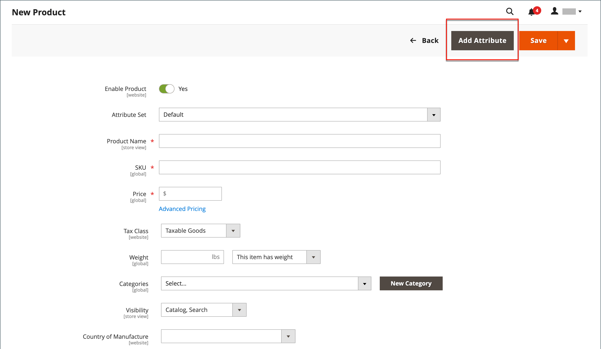
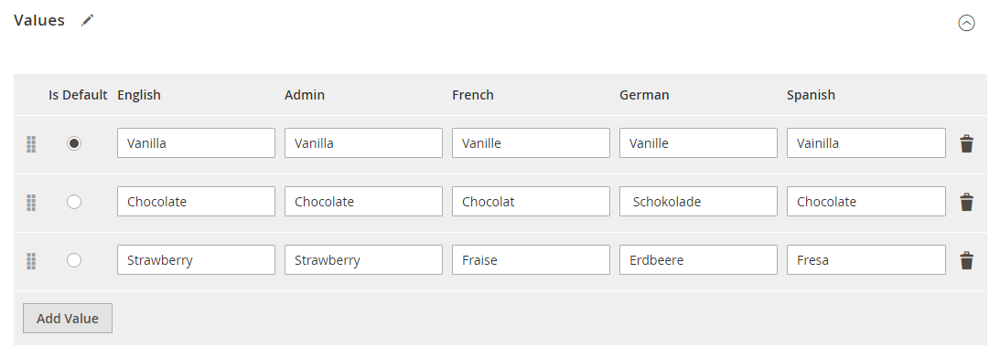
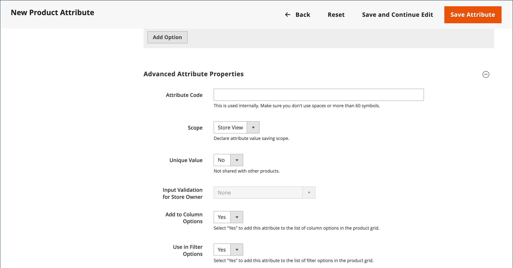
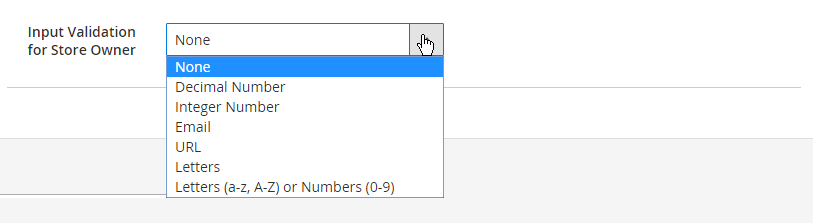
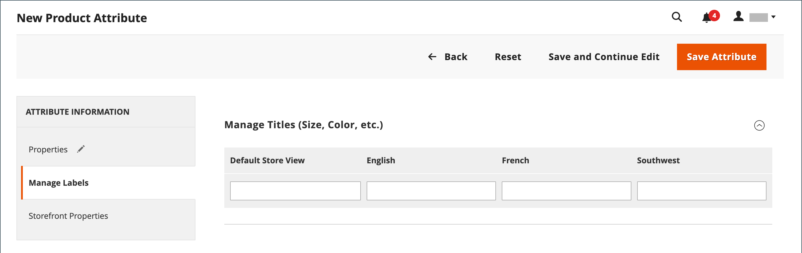
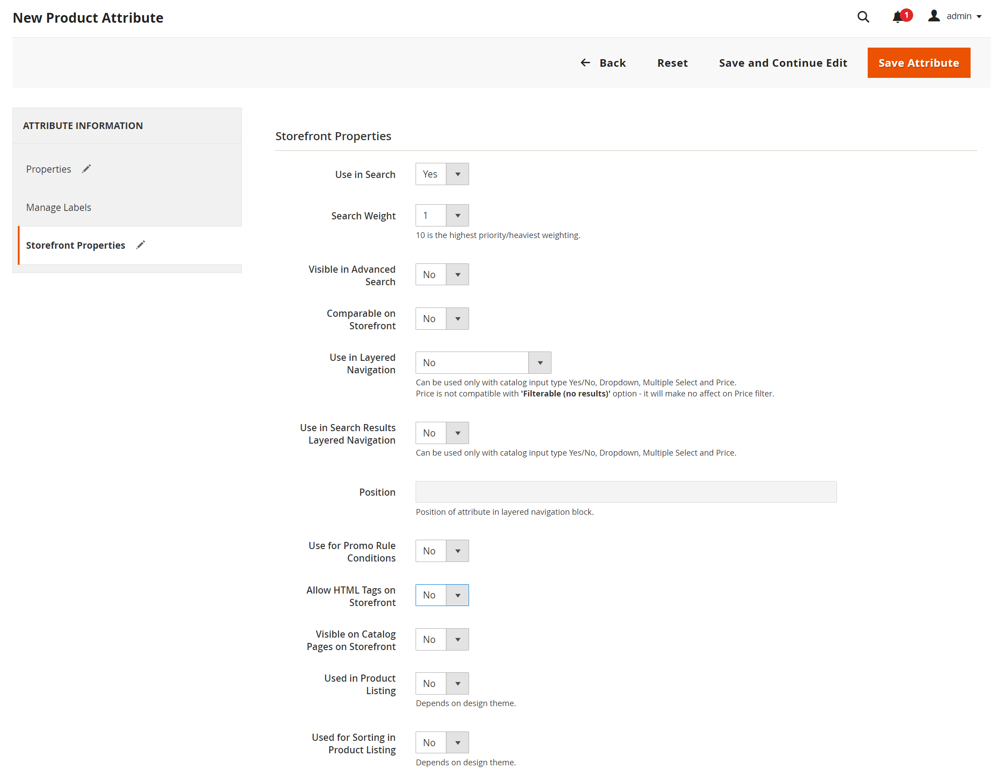

# Add attributes to a product

Although attributes are managed primarily from the [Stores](https://docs.magento.com/user-guide/stores/stores-menu.html) menu, you can also add new attributes _on the fly_ while working on a product. You can choose from the list of existing attributes or create an attribute. The new attribute is added to the [attribute set](https://docs.magento.com/user-guide/stores/attribute-sets.html) upon which the product is based.

<!-- zoom -->

## Step 1: Add an attribute

1. Open the product in edit mode.

1. In the upper-right corner, click **[!UICONTROL Add Attribute]**.

1. To add an existing attribute to the product, use the [filter controls](https://docs.magento.com/user-guide/stores/admin-grid-controls.html) to find the attribute in the grid and do the following:

   - Select the checkbox in the first column of each attribute to be added.

   - Click **[!UICONTROL Add Selected]**.

   <!-- zoom -->

1. To define a new attribute, click **[!UICONTROL Create New Attribute]** and the next set of steps.

## Step 2: Describe the basic properties

<!-- zoom -->

1. Under _[!UICONTROL Attribute Properties]_, enter an **[!UICONTROL Attribute Label]** to identify the attribute.

1. Set **[!UICONTROL Catalog Input Type for Store Owner]** to the type of [input control](attributes-input-types.md) to be used for data entry.

   If the attribute is used for a [configurable product](product-create-configurable.md), choose `Dropdown`. Then, set **[!UICONTROL Required]** to `Yes`.

1. For `Dropdown` and `Multiple Select` input types, do the following:

   - Under **[!UICONTROL Values]**, click **[!UICONTROL Add Value]**.

   - Enter the first value that you want to appear in the list.

      You can enter one value for the Admin and a translation of the value for each store view. If you have only one store view, you can enter only the Admin value, and it is used for the storefront as well.

   - Click **[!UICONTROL Add Value]** and repeat the previous step for each option that you want to include in the list.

   - Select **[!UICONTROL Is Default]** to use the option as the default value.

   <!-- zoom -->

1. If you want to require the customer to choose an option before the product can be purchased, set **[!UICONTROL Required]** to `Yes`.

## Step 3: Describe the advanced properties (optional)

<!-- zoom -->

1. Enter a unique **[!UICONTROL Attribute Code]** in lowercase characters and without spaces.

1. Set **[!UICONTROL Scope]** to indicate where in your store hierarchy that the attribute can be used.

   If the attribute is used for a [configurable product](product-create-configurable.md), choose `Global`.

1. If this attribute applies only to this product, set **[!UICONTROL Unique Value]** to `Yes`.

1. To run a validity test of any data entered into a text field, set **[!UICONTROL Input Validation for Store Owner]** to the type of data that the field should contain.

   This field is not available for input types with values that are selected. Input validation can be used for any of the following:

   - `Decimal Number`
   - `Integer Number`
   - `Email`
   - `URL`
   - `Letters`
   - `Letters (a-z, A-Z) or Numbers (0-9)`

   <!-- zoom -->

1. If you want to be able to include the attribute as a column in the Products grid, set **[!UICONTROL Add to Column Options]** to `Yes`.

1. If you want to be able to filter the _[!UICONTROL Products]_ grid by this column, set **[!UICONTROL Use in Filter Options]** to `Yes`.

## Step 4: Enter the field label

1. Expand  the **[!UICONTROL Manage titles]** section.

1. Enter a **[!UICONTROL Title]** to be used as a label for the field.

   If your store is available in different languages, you can enter a translated title for each view.

   <!-- zoom -->

## Step 5: Describe the storefront properties

1. Expand  the **[!UICONTROL Storefront Properties]** section.

   <!-- zoom -->

1. To make the attribute available for search, set **[!UICONTROL Use in Search]** to `Yes`.

1. To include the attribute in Product Compare, set **[!UICONTROL Comparable on Storefront]** to `Yes`.

1. To include dropdown, multiple select, or price attributes in layered navigation, set **[!UICONTROL Use in Search Results Layered Navigation]** to one of the following:

   - `Filterable (with results)` - Layered navigation includes only those filters for which matching products can be found. Any attribute value that already applies to all products shown in the list does not appear as an available filter. Attribute values with a count of zero (0) product matches are also omitted from the list of available filters.  The filtered list of products includes only those that match the filter. The products list is updated only if the selected filters change what is shown.

   - `Filterable (no results)` - Layered navigation includes filters for all available attribute values and their product counts, including those with zero (0) product matches. If the attribute value is a swatch, the value appears as a filter, but is crossed out.

1. To use in layered navigation on search results pages, set **[!UICONTROL Use in Search Results Navigation]** to `Yes` and enter a number in the **[!UICONTROL Position]** field.

   The position number indicates the relative position of the attribute within the layered navigation block.

1. To use the attribute in price rules, set **[!UICONTROL Use for Promo Rule Conditions]** to `Yes`.

1. To allow the text to be formatted with HTML, set **[!UICONTROL Allow HTML Tags on Storefront]** to `Yes`.

   This setting makes the WYSIWYG editor available when editing the field.

1. To include the attribute on the product page, set **[!UICONTROL Visible on Catalog Pages on Storefront]** to `Yes`.

1. Complete the following settings as supported by your theme:

   - To include the attribute in product listings, set **[!UICONTROL Used in Product Listing]** to `Yes`.

   - To use attribute as a sort parameter for product listings, set **[!UICONTROL Used for Sorting in Product Listing]** to `Yes`.

1. When complete, click **[!UICONTROL Save Attribute]**.
