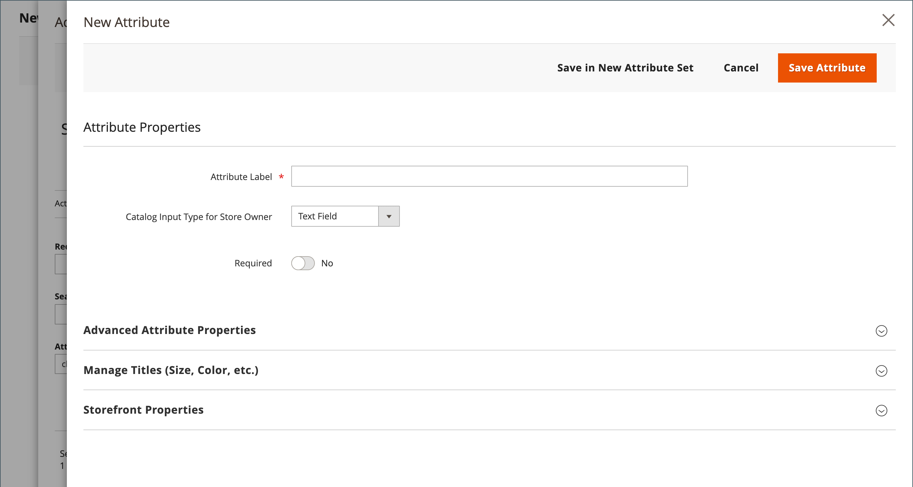

# Product attributes overview

Attributes are the building blocks of your product catalog, and describe specific characteristics of a product. Product attributes can be organized into [attribute sets](attribute-sets.md), which are then used as templates for creating products.

Attributes determine the type of input control that is used for product options, and provide additional information for product pages. They are also used as search parameters and criteria for layered navigation, product comparison reports, and promotions. You can create as many attributes and attribute sets as necessary to describe the products in your catalog. In addition to the attributes that you can create, system attributes, such as price, are built into the core Commerce platform and cannot be changed.

{width="600" zoomable="yes"}

Use the best practices described in the following sections when you plan and create product attributes.

## Attribute names

Establish consistent attribute-naming conventions, including letter case and punctuation. For example, `Color:Green` and `Color:green` might be considered as two different attribute values by different systems. Such noise in the data can affect business rules, search results, and data filters for applications that match products to rules.

## Attribute use

Consider how attributes are to be used when assigning properties and values. Identify the attributes that are used as labels for presentation, such as a product name, image, price, and description, and which attributes are used for data entry. Consider how the attributes are represented on different pages throughout the site, and how they appear on category pages, product detail pages, category grids, and thumbnail sliders.

## Color

Ad-hoc color descriptions can pose a challenge from the standpoint of database operations. Color names such as "Azure Skies" or "Robin Egg Blue" have great appeal, but might not return the best results when used as search criteria, or if merchandising requires you to specify `Color_Family:Blue`. Consider how colors are represented in search results and layered navigation, and establish some guidelines for your business needs. Then, be consistent when assigning color attribute values throughout your catalog.

## Variations management

Use product [configurations options](product-configurations.md) and [configurable products](product-create-configurable.md) to manage variations in your product offerings. These features make it easier to categorize products, to create cart price rules and dynamic categories rules, and to offer a selection of options with various text, selection, and date input types.

## Weighted search

Product attributes that are enabled for [catalog search](search.md) can be assigned a weight to give them a higher value in search results. Attributes with a greater weight are returned before those with a lower weight. For example, consider two attributes in the system, _color_ with a search weight of 3 and _description_ with a search weight of 1. A search for the word _red_ returns a list of products with a color attribute value of `red`, but does not return products with descriptions that contain the word _red_. In this example, the `color` attribute has a greater defined weight than the `description` attribute.

## Unused properties

Remove unused product properties for better structuring and faster indexing.

>[NOTE!]
>
>For information on optimizing the product attribute configuration for performance, see [Catalog management best practices](https://experienceleague.adobe.com/en/docs/commerce-operations/implementation-playbook/best-practices/planning/catalog-management#product-attributes) in the _Implementation Playbook_.
