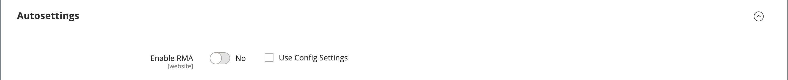

# Product settings - [!UICONTROL Autosettings]

{{ee-feature}}

The _[!UICONTROL Autosettings]_ section includes any attributes that are dependencies for other operations. You can apply the default [RMA configuration](../stores-purchase/rma-configure.md) setting to the product or override it, as needed.

{width="600" zoomable="yes"}
