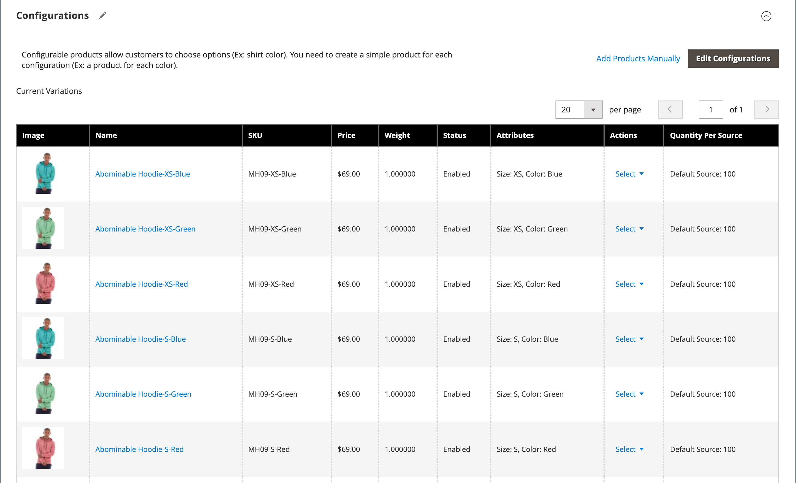

# Product settings - [!UICONTROL Configurations]

The _[!UICONTROL Configurations]_ section lists any existing variations of the product and can be used to generate variations for use with the Configurable product type. For more information, see [Configurable Product](product-create-configurable.md).

{width="600" zoomable="yes"}

{width="600" zoomable="yes"}

## Field reference

|Field|Description|
|--- |--- |
|[!UICONTROL Image]|Product image|
|[!UICONTROL Name]|The unique name for a product|
|[!UICONTROL SKU]|Based on product name|
|[!UICONTROL Price]|Product price|
|[!UICONTROL Quantity]|On-hand stock amounts for each product|
|[!UICONTROL Weight]|The product weight|
|[!UICONTROL Status]|Product status **[!UICONTROL Enabled]** / **[!UICONTROL Disabled]**|
|[!UICONTROL Attributes]|A set of attributes that are used to describe a product|
|[!UICONTROL Actions]|Lists all actions that can be applied to selected products. Actions:  **[!UICONTROL Choose a different Product]** - Removes and replaces the current product with the new selection.  **[!UICONTROL Disable Product]** / **[!UICONTROL Enable Product]** - Disables or enables the selected product.  **[!UICONTROL Remove Product]** - Removes selected product from the current configuration.|

{style="table-layout:auto"}
