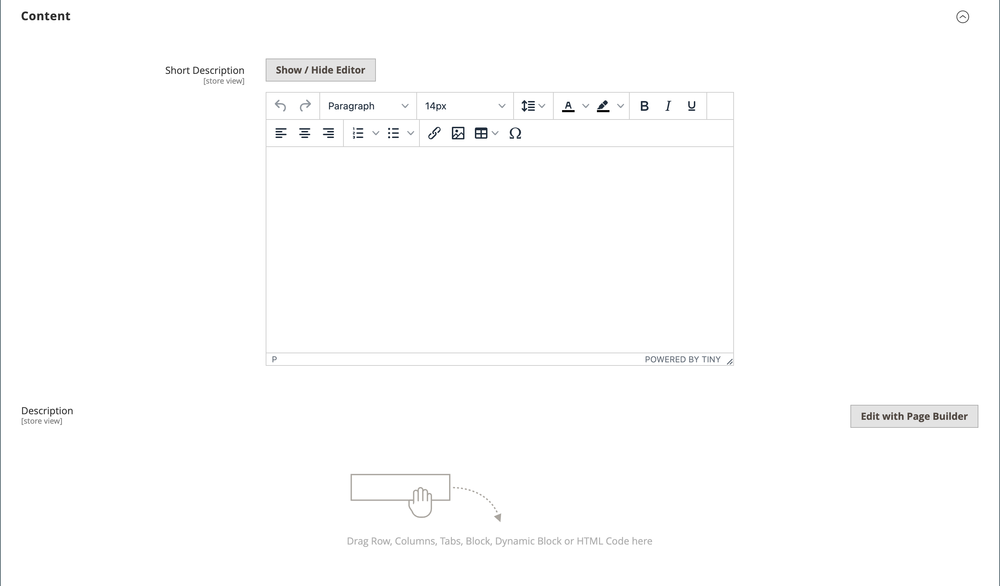
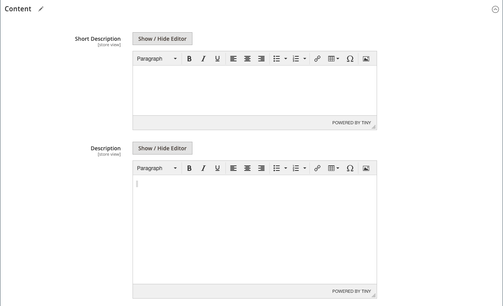

# Product settings - [!UICONTROL Content]

The _[!UICONTROL Content]_ section is used to enter and edit the main product description that appears on the product page. The short description can be used in most RSS feeds, and might also appear in catalog listings, depending on [theme](../content-design/themes.md).

## Add the product description in [!DNL Page Builder]

1. Open the product in edit mode.

1. Scroll down and expand  the **[!UICONTROL Content]** section.

   <!-- zoom -->

1. Enter a **[!UICONTROL Short Description]** of the product and use the [editor toolbar](../content-design/editor.md) to format as needed.

1. At the **[!UICONTROL Description]** label, click **[!UICONTROL Edit with Page Builder]**.

1. Use the [Page Builder](../page-builder/introduction.md) content tools to [edit the existing text](../page-builder/text.md) and add other content (if needed).

## Page Builder preview

When you expand the _[!UICONTROL Content]_ section for an existing product where there is content created with Page Builder, it displays a preview of the **[!UICONTROL Description]** content as it would appear in the product page. Click the content area to open the Page Builder workspace, where you can make any needed updates.

<!-- zoom -->

This content preview is enabled for the product and category forms by default. If performance suffers due to loading the preview, you can disable the preview in the [Content Management configuration](https://docs.magento.com/user-guide/configuration/general/content-management.html#advanced-content-tools) settings.

## Add the product description in the editor

If [!DNL Page Builder] is disabled for your store, use the text editor to add the product content. Enter only plain ASCII characters into the text box. If pasting text from a word processor, save it first as a plain .TXT file to remove any invisible control characters. For more information, see [Using the Editor](../content-design/editor.md).

1. Open the product in edit mode.

1. Scroll down and expand  the **[!UICONTROL Content]** section.

   <!-- zoom -->

1. Enter a **[!UICONTROL Short Description]** of the product and format as needed.

1. Enter the main product **[!UICONTROL Description]** and use the editor toolbar to format as needed.

   You can drag the lower-right corner to change the height of the text box.
