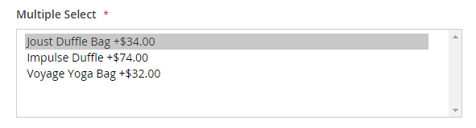

# Bundle product

A bundle is a _build your own_, customizable product. Each item in a bundle can be based on one of the following product types:

- [Simple Product](product-create-simple.md)
- [Virtual Product](product-create-virtual.md)

<!-- zoom -->

The options appear when the customer clicks either **[!UICONTROL Customize]** or **[!UICONTROL Add to Cart]**. Because the products that are included in the bundle vary, the SKU, Price, and Weight can be set to either a dynamic or fixed value.

>[!NOTE]
>
>Minimum Advertised Price (MAP) is not available for Bundle products that use dynamic pricing.

If [Instant Purchase](https://docs.magento.com/user-guide/sales/checkout-instant-purchase.html) is available, the _Instant Purchase_ button appears below the _Add to Cart_ button for each item in the bundle.

<!-- zoom -->

The following instructions take you through the process of creating a bundle product using a [product template](attribute-sets.md), required fields, and basic settings. Each required field is marked with a red asterisk (`*`). When you finish the basics, you can complete the other product settings as needed.

## Step 1: Choose the product type

1. On the _Admin_ sidebar, go to **[!UICONTROL Catalog]** > **[!UICONTROL Products]**.

1. In the upper-right corner on the _[!UICONTROL Add Product]_ ( <!-- {: width="25px"} --> ) menu, choose **[!UICONTROL Bundle Product]**.

   <!-- zoom -->

## Step 2: Choose the attribute set

To choose the [attribute set](attribute-sets.md) that is used as a template for the product, do one of the following:

- For **[!UICONTROL Search]**, enter the name of the attribute set,
- In the list, choose the attribute set that you want to use.

The form is updated to reflect the change.

<!-- zoom -->

## Step 3: Complete the required settings

1. Enter the product **[!UICONTROL Product Name]**.

1. Either accept the default **[!UICONTROL SKU]** that is based on the product name or enter a different value.

   To determine the type of SKU that is assigned to each bundle item, do the following:

   - A **[!UICONTROL Dynamic SKU]** can be assigned automatically to each bundle item by adding a suffix to the default SKU. By default, this is set to `Yes`.

   - If you prefer to assign a unique SKU for each bundle item, set **[!UICONTROL Dynamic SKU]** to `No`.

   <!-- zoom -->

1. To determine the price of the bundle, do one of the following:

   - To have the price reflect the options chosen by the customer, set **[!UICONTROL Dynamic Price]** to `Yes` and leave **[!UICONTROL Price]** blank.

   - To charge a fixed price for the bundle, set **[!UICONTROL Dynamic Price]** to `No` and enter the **[!UICONTROL Price]** that you want to charge for the bundle.

1. Because the product is not yet ready to publish, set set **[!UICONTROL Enable Product]** to `No`.

1. click **[!UICONTROL Save]** and continue.

   When the product is saved, the [Store View](introduction.md#product-scope) chooser appears in the upper-left corner.

1. Choose the **[!UICONTROL Store View]** where the product is to be available.

   <!-- zoom -->

## Step 4: Complete the basic settings

1. If the bundle has Fixed Pricing, set **[!UICONTROL Tax Class]** to one of the following:

   - `None`
   - `Taxable Goods`

   If the bundle has Dynamic Pricing, the tax is determined for **_each_** bundle item. If the bundle has Fixed Pricing, the tax is determined for the **_whole_** bundle product.

1. Take note of the following:

   - The **Quantity** is not available because the value is determined for each bundle item.

   - By default, the **[!UICONTROL Stock Status]** is set to `In Stock`.

1. To determine the weight of the bundle, do one of the following:

   - To have the weight reflect the options chosen by the customer, set **Dynamic Weight** set `Yes` and leave **[!UICONTROL Weight]** blank.

   - To assign a fixed weight to the bundle, set **Dynamic Weight** to `No` and enter the **[!UICONTROL Weight]** of the bundle.

   <!-- zoom -->

1. To feature the product in the list of [new products](../content-design/widget-new-products-list.md), select the **Set Product as New** checkbox.

1. Accept the default **Visibility** setting of `Catalog, Search`.

1. To assign Categories to the product, click the **Select…** box and do either of the following:

   **Choose an existing category:**

   - Start typing in the box to find a match.

   - Select the checkbox of each category that is to be assigned.

   **Create a new category:**

   - Click **New Category**.

   - Enter the **Category Name** and choose the **Parent Category** to determine its position in the menu structure.

   - Click **Create Category**.

1. Choose the **Country of Manufacture**.

   <!-- zoom -->

   There might be additional attributes that describe the product. The selection varies attribute set, and you can complete them later.

## Step 5: Add the bundle items

The Bundle Items section is used to add items to a Bundle product type and to edit the current selection of items.

<!-- zoom -->

1. Scroll down to the _Bundle Items_ section and set **Ship Bundle Items** to one of the following:

   - `Separately`
   - `Together`

   <!-- zoom -->

   If you select `Together`, all bundle items must be assigned the same [source](../inventory-management/sources-manage.md). <!-- Add link to In-Store Delivery when the topic is added -->

1. Click **Add Option** and do the following:

   <!-- zoom -->

   - Enter an **Option Title** to be used as the field label.

   - Set **[!UICONTROL Input Type]** to one of the following:

      - `Drop-down`
      - `Radio buttons`
      - `Checkbox`
      - `Multiple Select`

   - To make the field a required entry, select the **[!UICONTROL Required]** checkbox.

   - Click **Add Products to Option** and select the checkbox of each product that you want to include in this option.

      If there are many products, use the list filters and pagination controls to find the products you need.

   - Click **Add Selected Products**.

      <!-- zoom -->

   - After the items appear in the _Options_ section, choose an item to be the **Default** selection.

   - In the _Default Quantity_ column, enter the quantity of each item that is to be added to the bundle when a customer chooses the item.

   - To allow customers to change the quantity of a bundle item, select **User Defined**.

      
      >[!NOTE]
      >
      >The quantity can be a preset or user-defined value. However, do not assign the _User Defined_ property to checkbox or multiple-select input types.

      By default, the Default Quantity that is included in a bundle item cannot be changed by the customer. However, the customer can enter the quantity of the item that is to be included in the bundle.

      For example, if the Default Quantity of the Sprite Status Ball is set to `2` and the customer orders `4` of that bundle option, the total number of total balls purchased is `8`.

      <!-- zoom -->

1. Repeat these steps for each item you want to add to the bundle.

1. To change the order of items in a bundle section, click the **Move** (  ) icon at the beginning of the row and drag the item into position.

   <!-- zoom -->

   The order of items can also be changed in the data of an exported bundle product and then reimported into the catalog. For more information, see [Importing Bundle Products](https://docs.magento.com/user-guide/system/data-transfer-bundle-products.html).

1. To change the order of sections in a bundle product, click the **Move** (  ) icon in the header of the section and drag the section to the new position.

   To have a better view of the workspace, collapse each section first and then drag them into position.

   <!-- zoom -->

1. To remove any item from the bundle, click the **[!UICONTROL Delete]** (  ) icon.

1. When complete, click **[!UICONTROL Save]**.

## Step 6: Complete the product information

Scroll down and complete the information in the following sections as needed:

- [Content](product-content.md)
- [Images and Videos](product-images-and-video.md)
- [Search Engine Optimization](product-search-engine-optimization.md)
- [Related Products, Up-Sells, and Cross-Sells](related-products-up-sells-cross-sells.md)
- [Customizable Options](settings-advanced-custom-options.md)
- [Products in Websites](settings-basic-websites.md)
- [Design](settings-advanced-design.md)
- [Gift Options](product-gift-options.md)

## Step 7: Publish the product

1. If you are ready to publish the product in the catalog, set **[!UICONTROL Enable Product]** to `Yes` (  ).

1. Do one of the following:

   **Method 1:** Save and preview

   - In the upper-right corner, click **[!UICONTROL Save]**.

   - To view the product in your store, choose **[!UICONTROL Customer View]** on the _Admin_ (  ) menu.

      The store opens in a new browser tab.

   

   **Method 2:** Save and close

    On the _[!UICONTROL Save]_ ( <!-- {: width="25px"} --> ) menu, choose **[!UICONTROL Save & Close]**.

   <!-- zoom -->

## Input controls

|Control|Description|Example|
|--- |--- |--- |
|[!UICONTROL Drop-down]|Displays a drop-down list of options with the product name and price. Only one item can be selected.|<!-- zoom -->|
|[!UICONTROL Radio Buttons]|Displays a radio button for each option, followed by the product name and price.  Only one item can be selected.|<!-- zoom -->|
|[!UICONTROL Checkbox]|Displays a checkbox for each option, followed by the product name and price. Multiple items can be selected.|<!-- zoom -->|
|[!UICONTROL Multiple Select]|Displays a list of options with the product name and price. To select multiple items, hold down the Ctrl key (PC) or the Command key (Mac) and click each item.|<!-- zoom -->|

## Field descriptions

|Field|Description|
|--- |--- |
|[!UICONTROL SKU]|Determines if each item is assigned a variable or dynamic SKU or if a fixed SKU is used for the bundle. Options: `Fixed` / `Dynamic`|
|[!UICONTROL Weight]|Specifies whether the weight is calculated based on the items selected or is a fixed weight for the entire bundle. Options: `Fixed` / `Dynamic`|
|[!UICONTROL Price View]|Determines if the product price is shown as a range, from the least expensive to the most expensive (Price Range) or with the least expensive shown (As Low As). Options: `Price Range` / `As Low As`|
|Ship Bundle Items|Specifies if individual items can be shipped separately.|

## Things to remember

 Customers can _build their own_ bundle product.

 Bundle items can be simple or virtual products without custom options.

 The Price View can be set to either `Price Range` or `As Low As`.

 SKU and Weight can be either `Fixed` or `Dynamic`.

 The quantity can be a preset or user-defined value. However, do not assign the _User Defined_ property to checkbox or multiple-select input types.

 Bundle items can be shipped together or separately.
