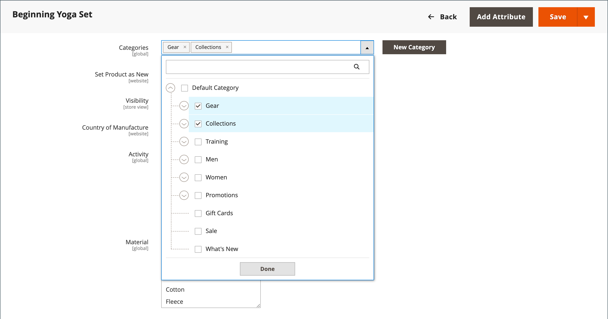
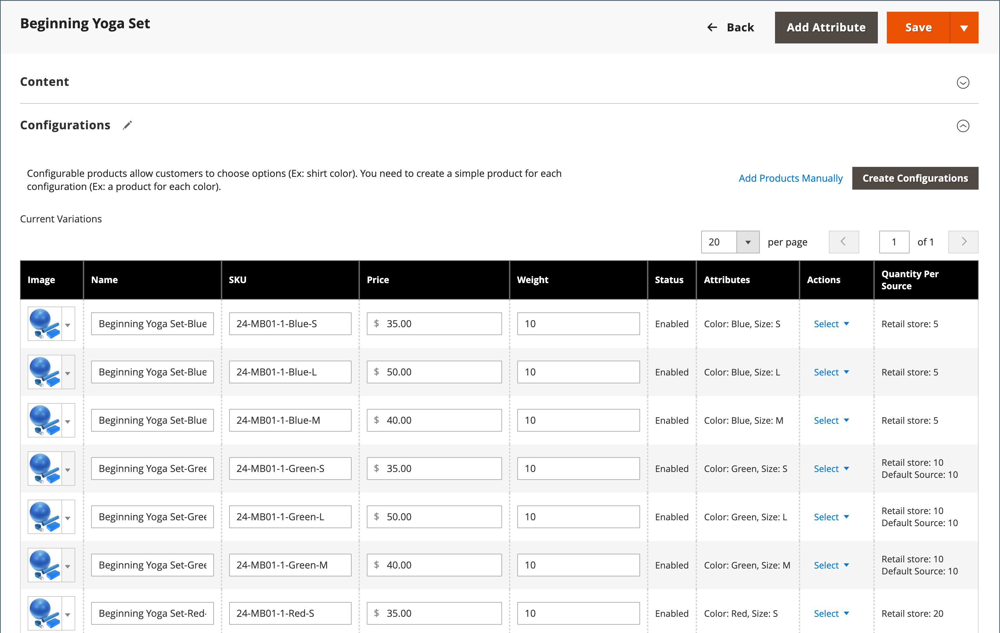

# Configurable product

A configurable product displays as a single product with dropdown options for variations (like color or size). Each variation is a separate simple product with its own SKU, enabling individual inventory tracking—unlike simple products with custom options.

**Best for:** Products with multiple options (color, size, material, etc.) where you need to track inventory for each variation. Initial setup takes longer but provides better scalability.

{width="700" zoomable="yes"}

## Before you begin

### Prerequisites checklist

Before creating a configurable product, ensure you have:

1. **Attribute Set** - An attribute set that includes variation attributes (such as color and size)
1. **Variation Attributes Created** - Attributes configured with the settings below
1. **Product Images** - (Optional but recommended) Images for the parent product and each variation

### Attribute requirements

Each attribute used for product variations must have these settings:

|Property|Required Setting|
|--- |--- |
|[!UICONTROL Scope]|`Global`|
|[!UICONTROL Catalog Input Type for Store Owner]|`Dropdown`, `Visual Swatch`, or `Text Swatch`|
|[!UICONTROL Values Required]|`Yes`|

{style="table-layout:auto"}

For instructions on creating attributes, see [Product Attributes](product-attributes.md).

## Phase 1: Create the product foundation

### Step 1: Choose the product type

1. On the _Admin_ sidebar, go to  **[!UICONTROL Catalog]** > **[!UICONTROL Products]**.

1. On the _[!UICONTROL Add Product]_ ( {width="25"} ) menu at the upper-right corner, choose **[!UICONTROL Configurable Product]**.

   {width="700" zoomable="yes"}

### Step 2: Choose the attribute set

The [attribute set](attribute-sets.md) determines which fields appear in the product form and which attributes are available for variations.

1. Click the attribute set field at the top of the page and do one of the following:

   - For **[!UICONTROL Search]**, enter the name of the attribute set.
   - In the list, choose the attribute set that you want to use.

   The form updates to reflect the selected attribute set.

1. If you need to add another attribute to the attribute set, click **[!UICONTROL Add Attribute]** and follow the instructions in [Adding an Attribute](product-attributes-add.md).

   {width="600" zoomable="yes"}

### Step 3: Enter basic information

1. Enter the product **[!UICONTROL Product Name]**.

1. Accept the default **[!UICONTROL SKU]** based on the product name or enter a different value.

1. Enter the product **[!UICONTROL Price]**.

   >[!NOTE]
   >
   >This price is overridden by the child product prices. The actual price displayed to customers comes from the [!UICONTROL In Stock] child products.

1. Because the product is not yet ready to publish, set **[!UICONTROL Enable Product]** to `No`.

1. Click **[!UICONTROL Save]** and continue.

   When the product is saved, the [Store View](introduction.md#product-scope) chooser appears in the upper-left corner.

1. Choose the **[!UICONTROL Store View]** where the product is to be available.

   {width="600" zoomable="yes"}

### Step 4: Complete basic settings

1. Set **[!UICONTROL Tax Class]** to one of the following:

   - `None`
   - `Taxable Goods`

1. Leave **[!UICONTROL Quantity]** blank. The quantity is determined by the product variations.

1. Leave **[!UICONTROL Stock Status]** as set.

   The stock status of a configurable product is determined by its associated variations. Because the product was saved without a quantity, the **[!UICONTROL Stock Status]** is set to `Out of Stock`.

   >[!NOTE]
   >
   >The **Stock Status** of a configurable product is a **_semi-manually_** controlled setting, partially based on the stock status of its child products. It is part of a **_multi-criteria_** stock status calculation. See [Configure Stock Status](#configure-stock-status) for details.

1. Enter the product **[!UICONTROL Weight]**.

   >[!NOTE]
   >
   >A configurable product must always have a weight. If you select **[!UICONTROL This item has no weight]** from the dropdown, it automatically changes to **[!UICONTROL This item has weight]** when you save the product.

1. Accept the default **[!UICONTROL Visibility]** setting of `Catalog, Search`.

1. To feature the product in the list of [new products](../content-design/widget-new-products-list.md), select the **[!UICONTROL Set Product as New]** checkbox.

1. To assign categories to the product, click the **[!UICONTROL Select…]** box and do one of the following:

   **Choose an existing category:**

   - Start typing in the box to find a match.

   - Select the checkbox of each category to be assigned.

   {width="600" zoomable="yes"}

   **Create a new category:**

   - Click **[!UICONTROL New Category]**.

   - Enter the **[!UICONTROL Category Name]** and choose the **[!UICONTROL Parent Category]** to determine its position in the menu structure.

   - Click **[!UICONTROL Create Category]**.

1. Choose the **[!UICONTROL Country of Manufacture]**.

   Additional attributes may appear depending on the attribute set. You can complete them later.

### Step 5: Save and continue

This is a good time to save your work. Click **[!UICONTROL Save]** in the upper-right corner. In the next phase, you'll set up the configurations for each variation.

## Phase 2: Add product variations

The following steps show how to add configurations for multiple variations. The progress bar at the top of the page shows your current position in the process.

**Example:** For a shirt with 3 colors and 3 sizes, you'll create 9 simple products with unique SKUs (one for each combination). By default, the product name and SKU for each variation is based on the attribute value and the parent product name or SKU.

### Step 6: Choose variation attributes

1. Scroll down to the _[!UICONTROL Configurations]_ section and click **[!UICONTROL Create Configurations]**.

   {width="600" zoomable="yes"} 

1. Select the checkbox of each attribute to include as a variation.

   For this example, `color` and `size` are selected.

   {width="600" zoomable="yes"}

   The list includes all attributes from the attribute set that can be used in a configurable product.

1. If you need to add an attribute, click **[!UICONTROL Create New Attribute]** and do the following:

   - Complete the attribute properties.

   - Click **[!UICONTROL Save Attribute]**.

   - Select the checkbox for the attribute.

1. Click **[!UICONTROL Next]** in the upper-right corner.

### Step 7: Select attribute values

1. For each attribute, select the checkbox of the values that apply to the product.

    {width="600" zoomable="yes"}

1. To rearrange the attributes, grab the _Reorder_ (  ) icon and move the section to a new position.

   The order determines the position of the dropdown lists on the product page.

1. In the progress bar, click **[!UICONTROL Next]**.

### Step 8: Configure images, pricing, and inventory

This step determines the images, pricing, and quantity for each configuration. The available options are the same for each. You can apply the same setting to all SKUs, apply unique settings to each SKU, or skip the settings for now.

#### Configure images

Choose the configuration option that applies:

**Option 1: Apply a single set of images to all SKUs**

1. Select **[!UICONTROL Apply single set of images to all SKUs]**.

1. Browse to each image to include in the product gallery, or drag images to the box.

{width="600" zoomable="yes"}

**Option 2: Apply unique images for each SKU**

Because the parent product image is already uploaded, use this option to upload images for each variation. You can add different images that appear in the shopping cart when someone purchases a specific variation.

1. Select **[!UICONTROL Apply unique images by attribute to each SKU]**.

1. Select the **[!UICONTROL Attribute]** that the images illustrate, such as `color`.

1. For each attribute value, browse to the images to use for that configuration or drag them to the box.

   If you drag an image to a value box, it also appears in the sections for other values. To delete an image, click the _Trash can_ () icon.

   {width="600" zoomable="yes"}

#### Configure pricing

>[!NOTE]
>
>A configurable product does not have its own price in the catalog. The configurable product price is derived from its [!UICONTROL In Stock] child products.

Choose the configuration option that applies:

**Option 1: Apply the same price to all SKUs**

1. If the price is the same for all variations, select **[!UICONTROL Apply single price to all SKUs]**.

1. Enter the **[!UICONTROL Price]**.

   {width="600" zoomable="yes"}

**Option 2: Apply a different price for each SKU**

1. If the price differs for each or some variations, select **[!UICONTROL Apply unique prices by attribute to each SKU]**.

1. Select the **[!UICONTROL Attribute]** that is the basis of the price difference.

1. Enter the **[!UICONTROL Price]** for each attribute value.

   In this example, the XL size costs more.

   {width="600" zoomable="yes"}

#### Configure inventory

Choose the configuration option that applies:

**Option 1: Apply the same quantity to all SKUs**

If the quantity is the same for all SKUs, select **[!UICONTROL Apply single quantity to each SKU]** and specify the quantity.

_Single Source merchants:_

Enter the **[!UICONTROL Quantity]**.

_Multi Source merchants using [Inventory Management](../inventory-management/introduction.md):_

Assign sources and add quantities for all generated product variants:

1. Select the **[!UICONTROL Apply single quantity to each SKU]** option.

1. To add a source, click **[!UICONTROL Assign Sources]**.

1. Browse or search for a source to add. Select the checkbox next to the sources for the product.

1. Enter an on-hand inventory amount per source.

   {width="600" zoomable="yes"}

**Option 2: Apply different quantity by attribute**

_Single Source merchants:_

Enter the **[!UICONTROL Quantity]** for each attribute value.

_Multi Source merchants using [Inventory Management](../inventory-management/introduction.md):_

Assign sources and add quantities for all generated product variants:

1. Select **[!UICONTROL Apply unique quantity by attribute to each SKU]**.

1. Enter the **[!UICONTROL Quantity]** for each variation.

   {width="600" zoomable="yes"}

When configuration for images, price, and quantity is complete, click **[!UICONTROL Next]** in the upper-right corner.

### Step 9: Generate product configurations

Wait a moment for the list of products to appear and do one of the following:

- If you are satisfied with the configurations, click **[!UICONTROL Generate Products]**.

- To make corrections, click **[!UICONTROL Back]**.

{width="600" zoomable="yes"}

The current product variations appear at the bottom of the _Configuration_ section.

{width="600" zoomable="yes"}

### Step 10: Add product images

1. Scroll down and expand  the _[!UICONTROL Images and Videos]_ section.

1. Click the _Camera_ tile and browse to the main image to use for the configurable product.

For more information, see [Images and Video](product-images-and-video.md).

### Step 11: Complete product information

Scroll down and complete the information in the following sections as needed:

- [Content](product-content.md)

- [Related Products, Up-Sells, and Cross-Sells](related-products-up-sells-cross-sells.md)

- [Search Engine Optimization](product-search-engine-optimization.md)

- [Customizable Options](settings-advanced-custom-options.md)

- [Products in Websites](settings-basic-websites.md)

- [Design](settings-advanced-design.md)

- [Gift Options](product-gift-options.md)

## Phase 3: Publish the product

### Step 12: Publish the product

1. If you are ready to publish the product in the catalog, set **[!UICONTROL Enable Product]** to `Yes`.

1. Do one of the following:

   **Method 1: Save and preview**

   - In the upper-right corner, click **[!UICONTROL Save]**.

   - To view the product in your store, choose **[!UICONTROL Customer View]** on the _Admin_ (  ) menu.

   The store opens in a new browser tab.

   {width="600" zoomable="yes"}

   **Method 2: Save and close**

   On the _[!UICONTROL Save]_ ( {width="25"} ) menu, choose **[!UICONTROL Save & Close]**.

## Configure stock status

Configurable product stock status differs from simple product stock status. For a configurable product, stock status is part of a **_multi-criteria_** calculation.

### How stock status works

The key principles of stock status behavior:

|You Set Status To|Result|Controlled By Child Products?|
|---|---|---|
|`Out of Stock` (manual)|Always displays `Out of Stock` in Admin and Storefront|No - remains until manually changed to `In Stock`|
|`In Stock` (manual)|Status is dynamic based on child products|Partial - see details below|

{style="table-layout:auto"}

### When set to "In Stock"

When you manually set the configurable product stock status to `In Stock`, it behaves differently depending on your inventory setup:

**With default source/stock only:**

- **Admin and Storefront:** Stock status automatically reflects child product availability

**With at least one custom source/stock:**

- **Storefront:** Stock status automatically reflects child product availability
- **Admin:** Remains as `In Stock` until manually changed (not controlled by child products)

>[!NOTE]
>
>Custom stocks and sources are part of the [Inventory Management](../inventory-management/sources-stocks.md) extension. It is highly recommended that you use this tool exclusively for managing stock and source. The default source and stock functions are part of the `CatalogInventory` module, which is now deprecated.

### Manual stock status changes

If you manually set the stock status to `Out of Stock` (via Admin user action, file import, or API call), it remains `Out of Stock` on both the Admin and Storefront until you manually change it back to `In Stock`. It is not affected by child product stock status.

## System configuration (optional)

### Display variation images in cart thumbnails

If you have different images for each variation, you can configure the system to display the correct image for the shopping cart thumbnail.

1. On the _Admin_ sidebar, go to **[!UICONTROL Stores]** > _[!UICONTROL Settings]_ > **[!UICONTROL Configuration]**.

1. In the left panel, expand **[!UICONTROL Sales]** and choose **[!UICONTROL Checkout]**.

1. Expand  the _[!UICONTROL Shopping Cart]_ section.

1. Set **[!UICONTROL Configurable Product Image]** to `Product Thumbnail Itself`.

1. Click **[!UICONTROL Save Config]**.

   {width="600" zoomable="yes"}

## Key considerations

- **Variation types:** Shoppers can select options from dropdown, multiple select, visual swatch, and text swatch input types. Each option is a separate, simple product.

- **Inventory tracking:** Unlike simple products with custom options, configurable products track inventory for each variation independently.

- **Child product types:** Child products can be simple or virtual products **without custom options**. To make child products virtual, select `Тhis item has no weight` for the **[!UICONTROL Weight]** setting for each child.

- **Global assignment:** Child products are assigned and unassigned from the configurable product **globally** across all websites, stores, and store views simultaneously.

- **Pricing:** A configurable product does not have its own price in the catalog. The displayed price comes from its [!UICONTROL In Stock] child products.

- **Attributes:** Variation attributes must have a global scope, and customers must be required to choose a value. The attributes must be included in the attribute set used for the configurable product.

- **Cart thumbnails:** The shopping cart thumbnail can display the image from either the configurable product record or the product variation. See [System Configuration](#system-configuration-optional) above.

- **Swatch behavior:** [Swatch attributes](swatches.md#create-swatches-for-products) can be configured to not display corresponding simple product images when the swatch is selected by setting **[!UICONTROL Update Product Preview Image]** to `No` on the attribute edit page.

- **Image gallery behavior:** The theme controls how the Image Gallery behaves when users switch between product configurations. The default behavior for the _Blank_ theme overrides the parent configurable product images with the selected variation. For the Luma theme, the default behavior is to prepend the selected variation images to the parent configurable product images.
