# Configurable product

A configurable product looks like a single product with a drop-down list of each variation. Each list item is actually a separate simple product with a unique SKU, which makes it possible to track inventory for each product variation. You could achieve a similar effect by using a simple product with custom options, but without the ability to track inventory for each variation.

The following instructions demonstrate the process of creating a configurable product using a [product template](attribute-sets.md), required fields, and basic settings. Each required field is marked with a red asterisk (`*`). When you finish the basics, you can complete the other product settings as needed.

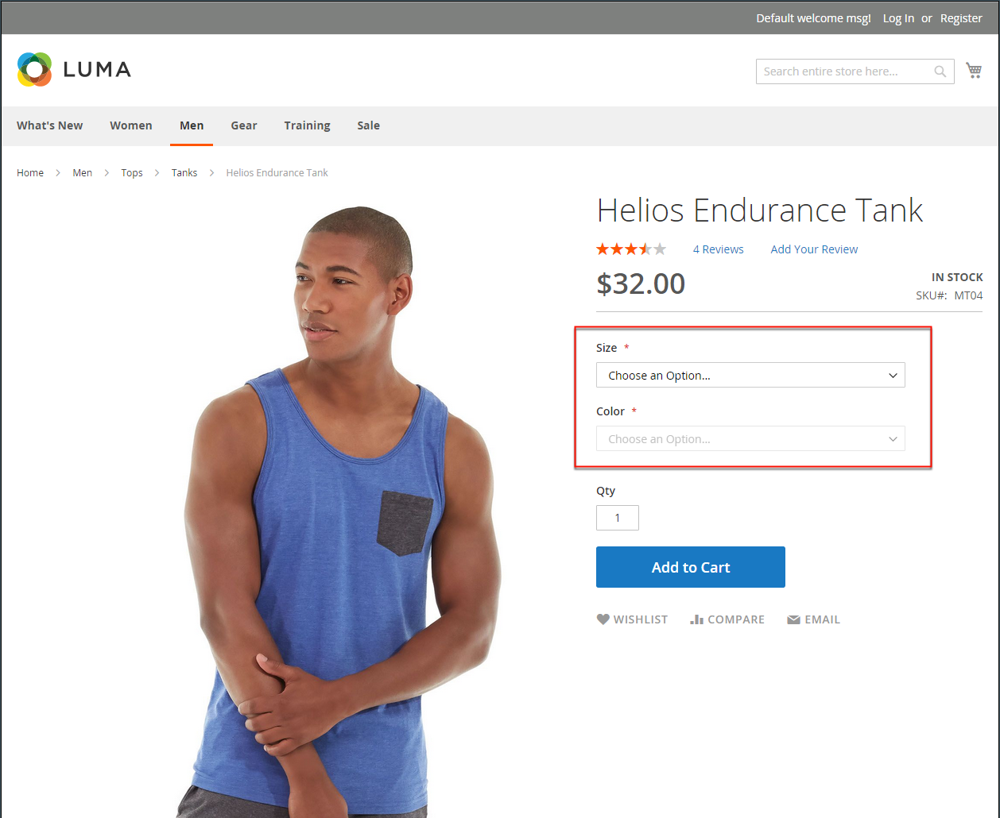<!-- zoom -->

## Part 1: Creating a configurable product

Although a configurable product uses more SKUs and may initially take a little longer to set up, it can save you time in the long run. If you plan to grow your business, the configurable product type is a good choice for products with multiple options.

Before you begin, prepare an [attribute set](attribute-sets.md) that includes an attribute that is set to one of the allowable input types for each product variation. For example, the attribute set might include drop-down attributes for color and size.

The properties of each attribute that is used for a configurable product variation must have the following settings:

### Product variation attribute requirements

|Property|Setting|
|--- |--- |
|[!UICONTROL Scope]|`Global`|
|[!UICONTROL Catalog Input Type for Store Owner]|The input type of any attribute that is used for a product variation must be one of the following: `Dropdown`, `Visual Swatch`, or `Text Swatch`.|
|[!UICONTROL Values Required]|`Yes`|

### Step 1: Choose the product type

1. On the _Admin_ sidebar, go to  **[!UICONTROL Catalog]** > **[!UICONTROL Products]**.

1. On the _[!UICONTROL Add Product]_ ( <!-- {: width="25px"} --> ) menu at the upper-right corner, choose **[!UICONTROL Configurable Product]**.

   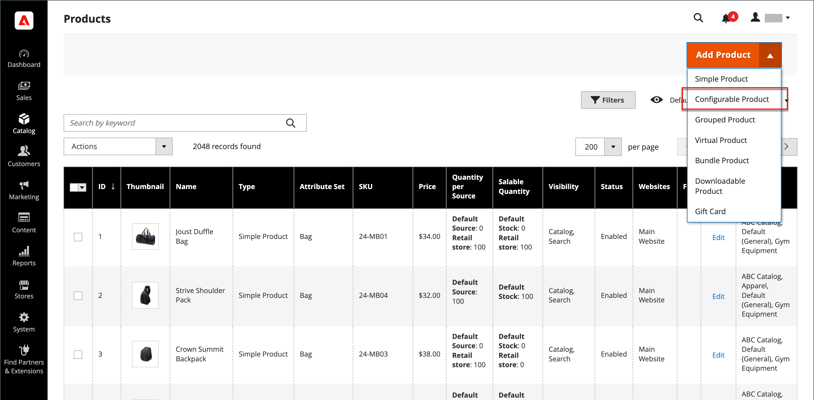<!-- zoom -->

### Step 2: Choose the attribute set

The [attribute set](attribute-sets.md) determines the selection of fields that are used in the product. The attribute set that is used in the following example has attributes for color and size. The name of the attribute set is indicated at the top of the page and is initially set to `Default`.

1. To choose the attribute set for the product, click the field at the top of the page and do one of the following:

   - For **[!UICONTROL Search]**, enter the name of the attribute set.
   - In the list, choose the attribute set that you want to use.

   The form is updated to reflect the change.

1. If you need to add an additional attribute to the attribute set, click **[!UICONTROL Add Attribute]** and follow the instructions in [Adding an Attribute](product-attributes-add.md).

   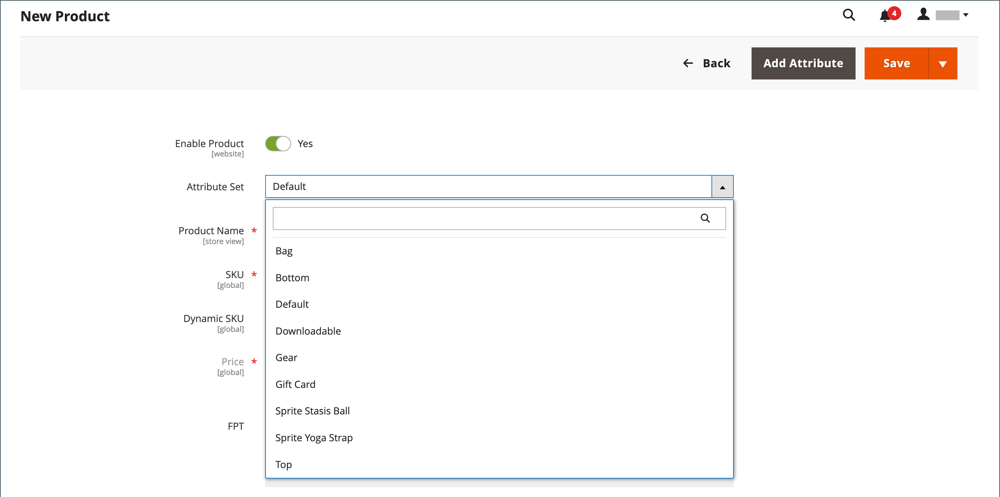<!-- zoom -->

### Step 3: Complete the required settings

1. Enter the product **[!UICONTROL Product Name]**.

1. Accept the default **[!UICONTROL SKU]** that is based on the product name or enter another.

1. Enter the product **[!UICONTROL Price]**.

1. Because the product is not yet ready to publish, set **[!UICONTROL Enable Product]** to `No`.

1. click **[!UICONTROL Save]** and continue.

   When the product is saved, the [Store View](introduction.md#product-scope) chooser appears in the upper-left corner.

1. Choose the **[!UICONTROL Store View]** where the product is to be available.

   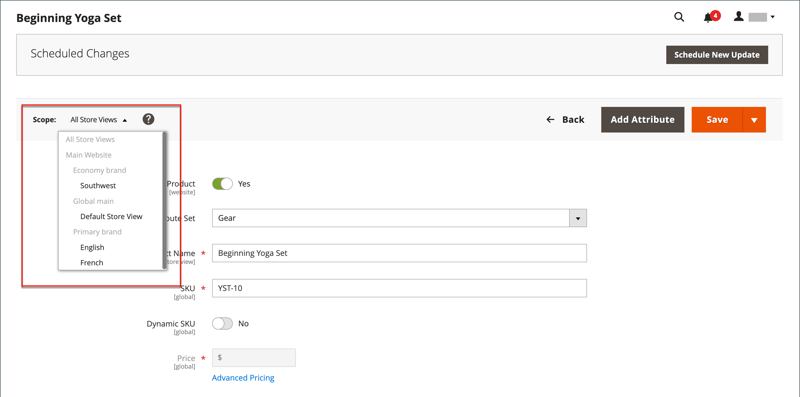<!-- zoom -->

### Step 4: Complete the basic settings

1. Set **[!UICONTROL Tax Class]** to one of the following:

   - `None`
   - `Taxable Goods`

1. The **[!UICONTROL Quantity]** is determined by the product variations, so you can leave it blank.

1. Leave the **[!UICONTROL Stock Status]** as set.

   The Stock Status of a configurable product is determined by each associated configuration. Because the product was saved without entering a quantity, the **[!UICONTROL Stock Status]** is set to `Out of Stock`.

   >[!NOTE]
   >
   >The **Stock Status** of the configurable product is a **_semi-manually_** controlled setting. It is partially controlled by the stock status of its child products. It is a part of a **_multi-criteria_** stock status calculation, which is described in the [Configure the Stock Status](#configure-the-stock-status) section.

1. Enter the product **[!UICONTROL Weight]**.

>[!NOTE]
>
>A configurable product must always have a weight. If you select **This item has no weight** from the drop-down list, it is automatically changed to **This item has weight** after saving the product.

1. Accept the default **Visibility** setting of `Catalog, Search`.

1. To feature the product in the list of[ new products](../content-design/widget-new-products-list.md), select the **Set Product as New** checkbox.

1. To assign Categories to the product, click the **Select…** box and do either of the following:

   - Choose an existing category:

      - Start typing in the box to find a match.

      - Select the checkbox of the category that is to be assigned.

   - Create a new category:

      - Click **New Category**.

      - Enter the **Category Name** and choose the **Parent Category** to determine its position in the menu structure.

      - Click **Create Category**.

1. Choose the **Country of Manufacture**.

   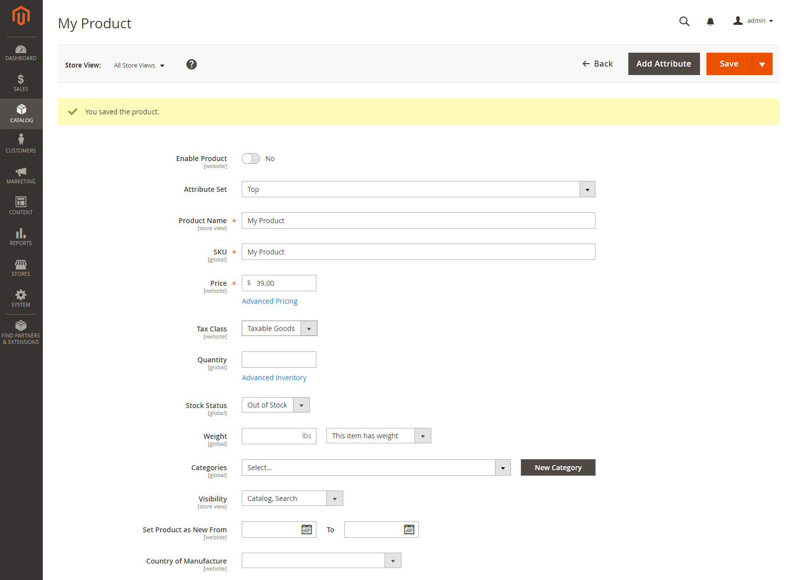<!-- zoom -->

   There might be additional attributes that are used to describe the product. The selection varies by attribute set, and you can complete them later.

### Step 5: Save and continue

This is a good time to save your work. In the upper-right corner, click **[!UICONTROL Save]**. In the next series of steps, you'll set up the configurations for each variation of the product.

## Part 2: Adding configurations

The following example shows how to add configurations for three colors and three sizes. In all, nine simple products will be created with unique SKUs to cover every possible combination of variations. By default, the product name and SKU for each variation is based on the attribute value and either the parent product name or SKU.

The progress bar at the top of the page shows where you are in the process and guides you through each step.

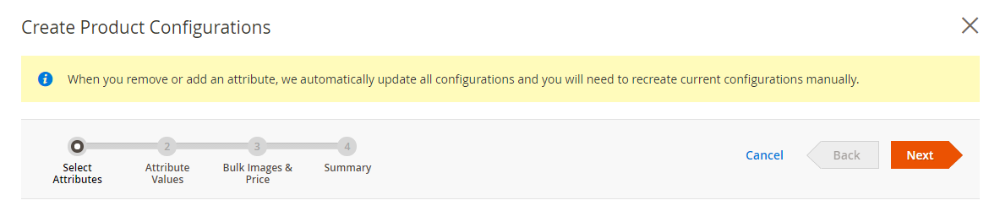<!-- zoom -->

### Step 1: Choose the attributes

1. Continuing from above, scroll down to the _Configurations_ section and click **Create Configurations**.

   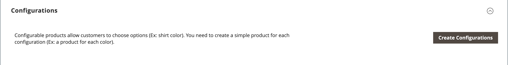<!-- zoom -->

1. Select the checkbox of each attribute that you want to include as a configuration.

   For this example, we choose `color` and `size`.

1. The list includes all attributes from the attribute set that can be used in a configurable product.

   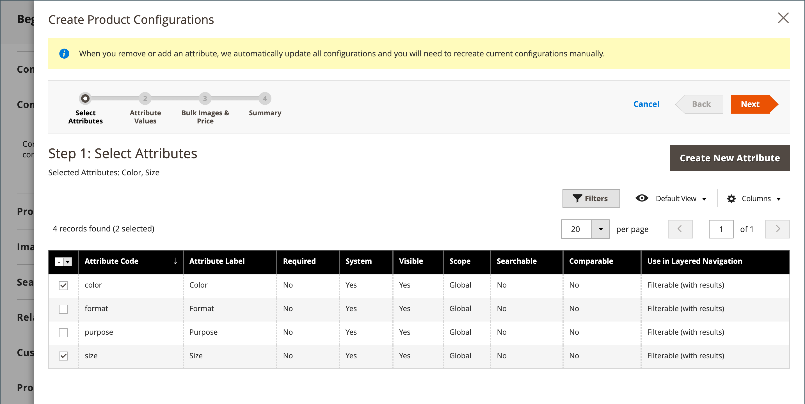<!-- zoom -->

1. If you need to add a new attribute, click **Create New Attribute** and do the following:

   - Complete the attribute properties.

   - Click **[!UICONTROL Save Attribute]**.

   - Select the checkbox to select the attribute.

1. In the upper-right corner, click **[!UICONTROL Next]**.

### Step 2: Enter the attribute values

1. For each attribute, select the checkbox of the values that apply to the product.

    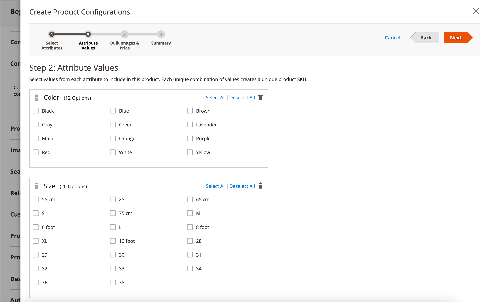<!-- zoom -->

1. To rearrange the attributes, grab the _Change Order_ (  ) icon and move the section to a new position.

   The order determines the position of the drop-down lists on the product page.

1. In the progress bar, click **[!UICONTROL Next]**.

### Step 3: Configure the images, price, and quantity

This step determines the images, pricing, and quantity of each configuration. The available options are the same for each, and you can choose only one. You can apply the same setting to all SKUs, apply a unique setting to each SKU, or skip the settings for now.

Choose the configuration options that apply.

Use one of the following methods to configure the **images**:

**Method 1:** Apply a single set of images to all SKUs

   1. Select **[!UICONTROL Apply single set of images to all SKUs]**.

   1. Browse to each image that you want to include in the product gallery, or drag them to the box.

   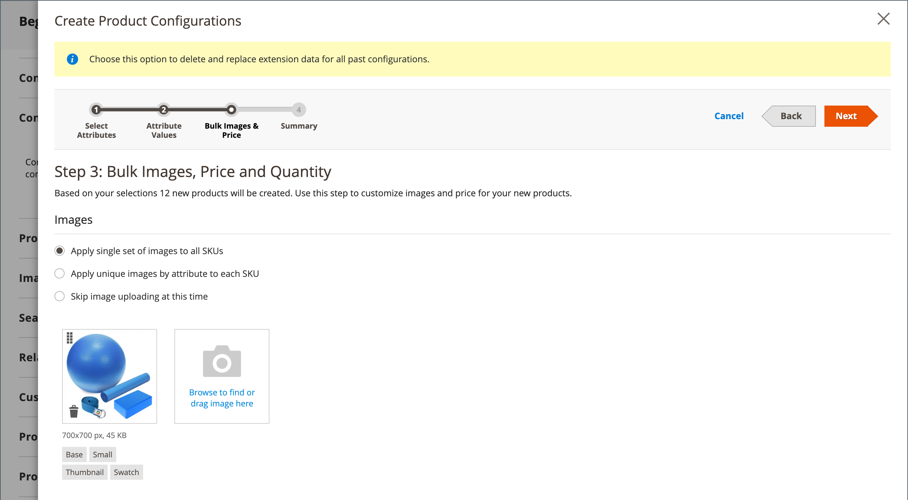<!-- zoom -->

**Method 2:** Apply unique images for each SKU

Because we already uploaded an image for the parent product, we'll use this option to upload an image of each color. This is the image that will appear in the shopping cart when someone buys the shirt in a specific color.

   1. Select **[!UICONTROL Apply unique images by attribute to each SKU]**.

   1. Select the **[!UICONTROL Attribute]** that the images illustrate, such as `color`.

   1. For each attribute value, either browse to the images that you want to use for that configuration or drag them to the box.

      If you drag the an image to a value box, it also appears in the sections for the other values. If you want to delete an image, click the **trashcan** () icon.

      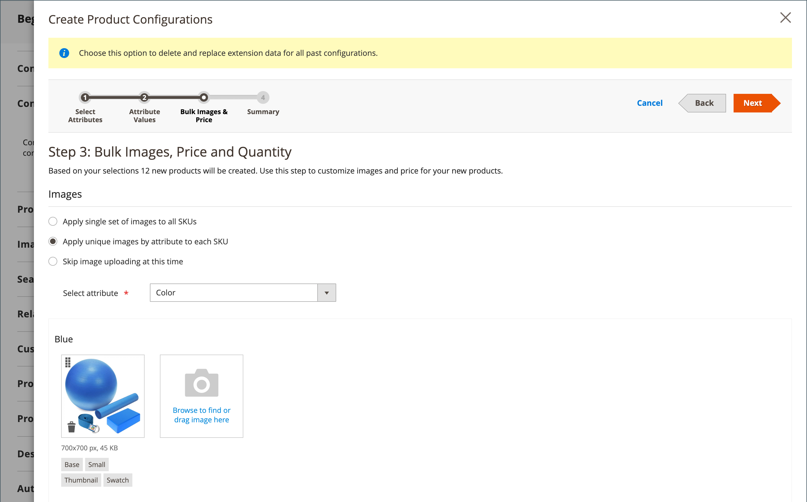<!-- zoom -->

Use one of the following methods to configure the **prices**:

**Method 1:** Apply the same price to all SKUs

1. If the price is the same for all variations, select **[!UICONTROL Apply single price to all SKUs]**.

1. Enter the **[!UICONTROL Price]**.

   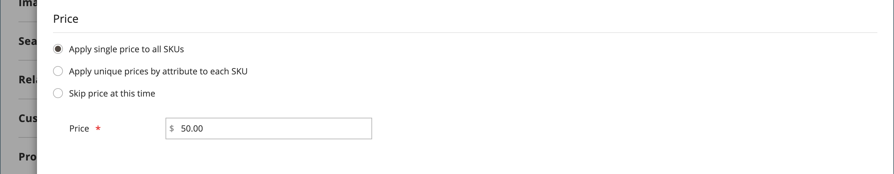<!-- zoom -->

**Method 2:** Apply a different price for each SKU

1. If the price differs for each or for some variations of the product, select **[!UICONTROL Apply unique prices by attribute to each SKU]**.

1. Select the **[!UICONTROL Attribute]** that is the basis of the price difference.

1. Enter the **[!UICONTROL Price]** for each attribute value.

   In this example, the XL size costs more.

   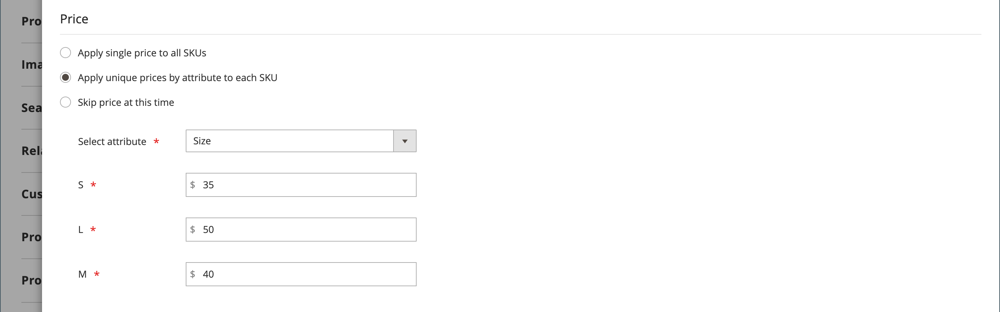<!-- zoom -->

Use one of the following methods to configure the **[!UICONTROL Quantity]**:

**Method 1:** Apply the same quantity to all SKUs

1. If the quantity is the same for all SKUs, select **[!UICONTROL Apply single quantity to each SKU]**.

1. Enter the **[!UICONTROL Quantity]**.

   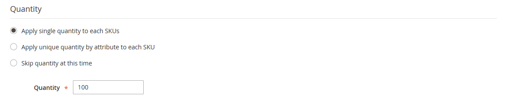<!-- zoom -->

1. If needed, apply the Same Quantity to All SKUs (Inventory Management).

   For Multi Source merchants using [Inventory Management](../inventory-management/introduction.md), assign sources and add quantities for all generated product variants:

   - Select the **[!UICONTROL Apply single quantity to each SKUs]** option.

   - To add a source, click **Assign Sources**.

   - Browse or search for a source you want to add. Select the checkbox next to the sources you want to add for the product.

   - Enter an on-hand inventory amount per source.

   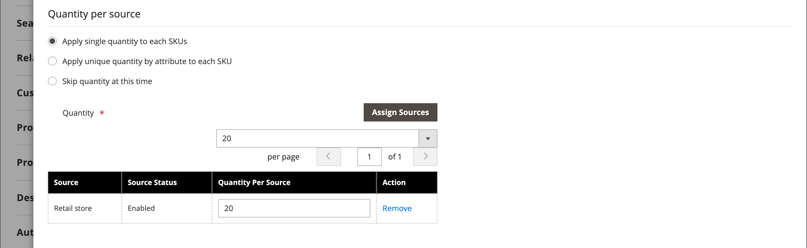<!-- zoom -->

- **Method 2:** Apply Different Quantity by Attribute

1. If the quantity is the different for each SKU, select **[!UICONTROL Apply unique quantity by attribute to each SKU]**.

1. Enter the **[!UICONTROL Quantity]** for each.

   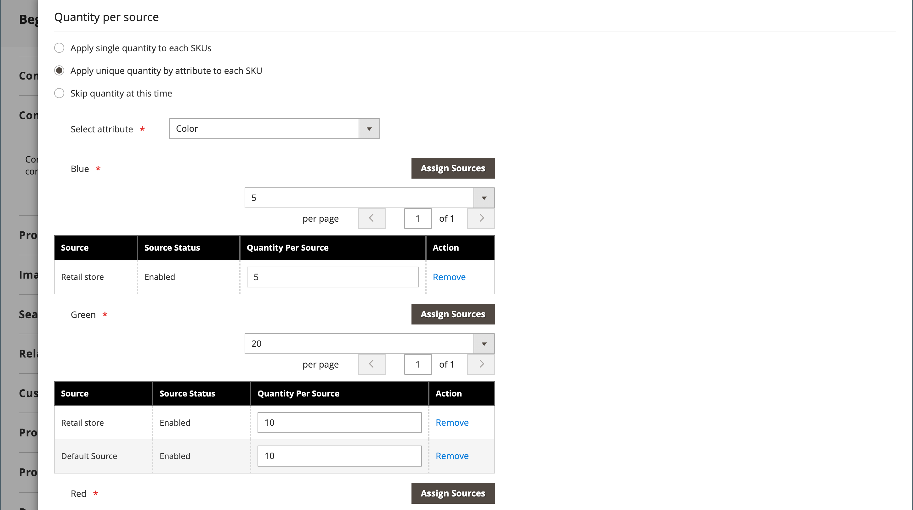<!-- zoom -->

When configuration for images, price, and quantity are complete, click **[!UICONTROL Next]** in the upper-right corner.

### Step 4: Generate the product configurations

Wait a moment for the list of products to appear and do one of the following:

- If you are satisfied with the configurations, click **[!UICONTROL Next]**.

- To make corrections, click **[!UICONTROL Back]**.

The current product variations appear at the bottom of the _Configuration_ section.

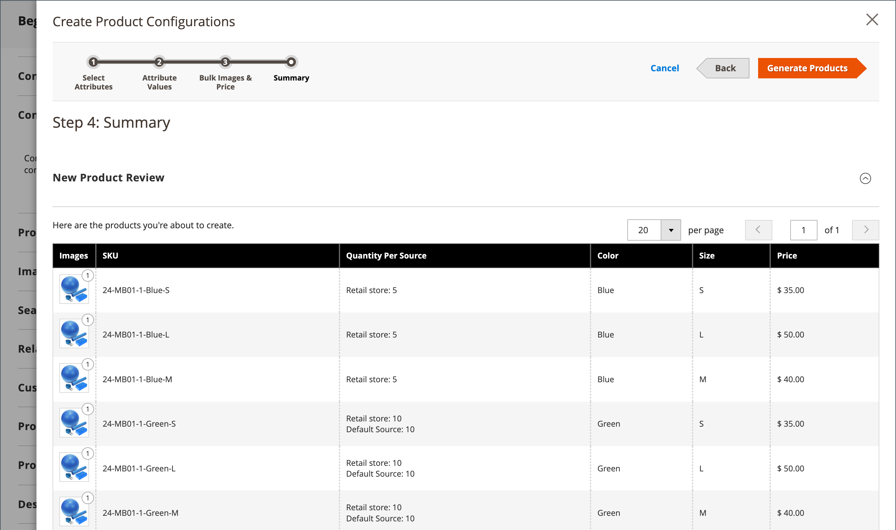<!-- zoom -->

### Step 5: Add a product image

1. Scroll down and expand  the _[!UICONTROL Images and Videos]_ section.

1. Click the _Camera_ tile and browse to the main image that you want to use for the configurable product.

For more information, see [Images and Video](product-images-and-video.md).

### Step 6: Complete the product information

Scroll down and complete the information in the following sections as needed:

- [Content](product-content.md)

- [Related Products, Up-Sells, and Cross-Sells](related-products-up-sells-cross-sells.md)

- [Search Engine Optimization](product-search-engine-optimization.md)

- [Customizable Options](settings-advanced-custom-options.md)

- [Products in Websites](settings-basic-websites.md)

- [Design](settings-advanced-design.md)

- [Gift Options](product-gift-options.md)

### Step 7: Publish the product

1. If you are ready to publish the product in the catalog, set **[!UICONTROL Enable Product]** to `Yes` and do one of the following:

   - **Method 1:** Save and preview

      - In the upper-right corner, click **[!UICONTROL Save]**.

      - To view the product in your store, choose **[!UICONTROL Customer View]** on the _Admin_ (  ) menu.

      The store opens in a new browser tab.

      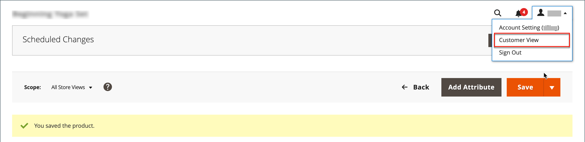<!-- zoom -->

   - **Method 2:** Save and close

      On the _[!UICONTROL Save]_ ( <!-- {: width="25px"} --> ) menu, choose **[!UICONTROL Save & Close]**.

      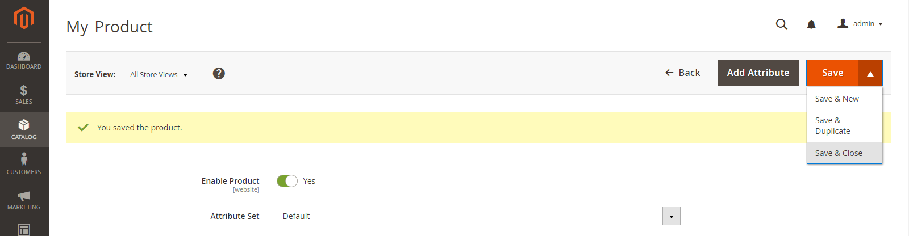<!-- zoom -->

### Step 8: Configure the cart thumbnails

If you have a different image for each variation you can set the configuration to use the correct image for the shopping cart thumbnail.

1. On the _Admin_ sidebar, go to **[!UICONTROL Stores]** > _[!UICONTROL Settings]_ > **[!UICONTROL Configuration]**.

1. In the left panel, expand **[!UICONTROL Sales]** and choose **[!UICONTROL Checkout]** underneath.

1. Expand  the _[!UICONTROL Shopping Cart]_ section.

1. Set **[!UICONTROL Configurable Product Image]** to `Product Thumbnail Itself`.

1. When complete, click **[!UICONTROL Save Config]**.

   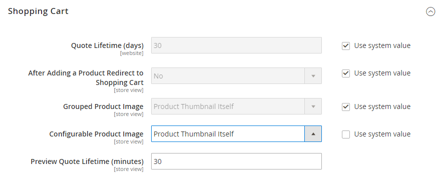<!-- zoom -->

## Configure the Stock Status

The _Stock Status_ of the configurable product is partially controlled by the Stock Status of its child products, and part of a **_multi-criteria_** stock status calculation.

When the configurable product Stock Status is **_manually_** saved as `Out of Stock` or `In Stock` by an Admin user, file import, or API call, it does **_not_** automatically change its stock status value when its child products **_automatically_** become `In Stock` or `Out of Stock` by stock increase and decrease. It remains in its manually set Stock Status until it is changed **_again_** by an Admin user, file import, or API call.

A configurable product that is initially saved as `In Stock` **_automatically_** changes its Stock Status to `Out of Stock` and `In Stock` when its child products statuses are **_manually_** saved as `Out of Stock` and `In Stock` by an Admin user, file import, or API call.

When the Stock Status of the configurable product is `In Stock` in the Admin, and **_all_** its child products are `Out of Stock`, then the configurable product is displayed as `Out of Stock` on the storefront.

With these Stock Status relationships in mind, note the following:

- When you change the **[!UICONTROL Stock Status]** of the configurable product as `Out of Stock` and click **[!UICONTROL Save]**, it is **_not controlled_** by the stock statuses of its child products. It is always displayed as `Out of Stock` in the Admin and on the storefront.

- When you set the **[!UICONTROL Stock Status]** of the configurable product as `In Stock` and click **[!UICONTROL Save]**, it is  **_controlled_** by the stock statuses of its child products, which is reflected in the Admin and on the storefront.

## Things to remember

- A configurable product allows the shopper to choose options from drop-down, multiple select, visual swatch and text swatch input types. Each option is a separate, simple product.

- [Stock Status](../inventory-management/sources-stocks.md) for a configurable product is a semi-manually controlled setting. This is different from the stock status of the simple product, where it is a direct representation of the product availability. In the case of a configurable product, the stock status is a part of a multi-criteria stock status calculation. When child products are sold out or come back in stock, it does not automatically change the stock status for the parent configurable product.

- Configurable child products can be simple or virtual products **without custom options**. To make custom child products virtual, you must select `Тhis item has no weight` for the **[!UICONTROL Weight]** setting for each of them.

- The attributes that are used for product variations must have a global scope and the customer must be required to choose a value. The product variation attributes must be included in the attribute set that is used as a template for the configurable product.

- The attribute set that is used as a template for a configurable product must include the attributes that contain the values that are needed for each product variation.

- The thumbnail image in the shopping cart can be set to display the image from the configurable product record or from the product variation.

- [Swatch attributes](swatches.md#create-swatches-for-products) can be configured to not display corresponding simple product images when the swatch is selected by setting the **[!UICONTROL Update Product Preview Image]** option value to `No` at the attribute edit page in the Admin.

- The theme controls how the Image Gallery behaves when a user switches between product configurations. The default behavior for the _Blank_ theme is to override the parent configurable product images with the selected product variation. For the Luma theme, the default behavior is to prepend the selected product variation images to the parent configurable product images.
