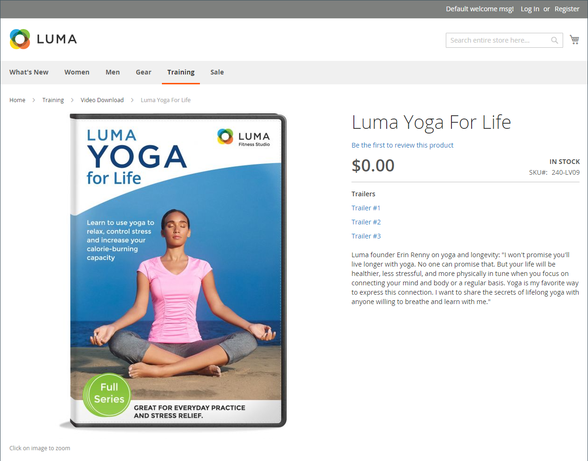
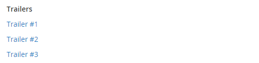
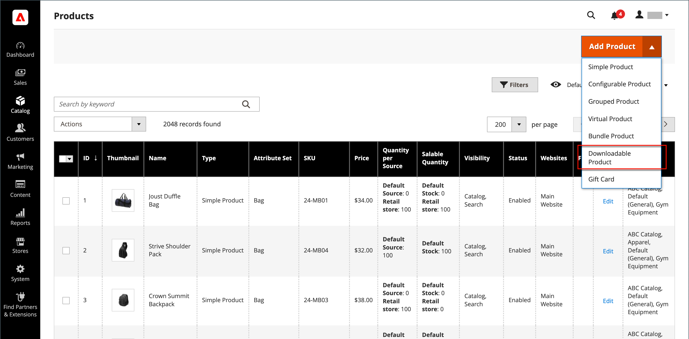
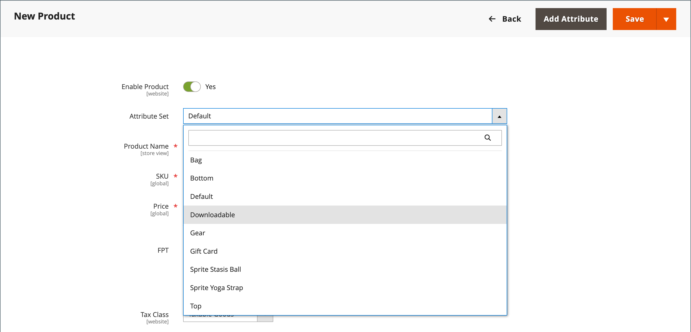
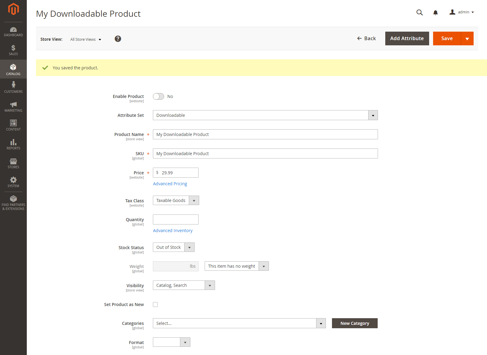
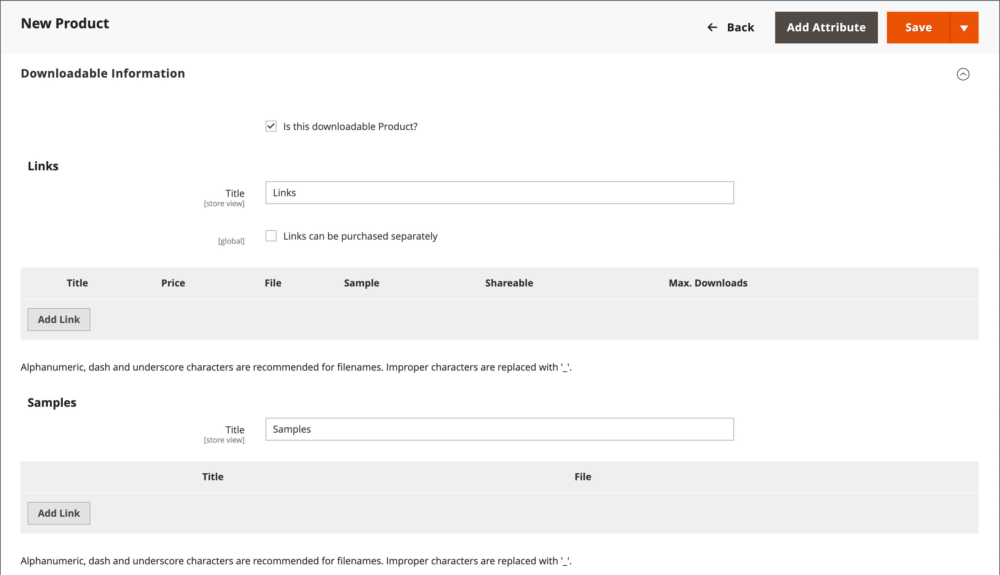
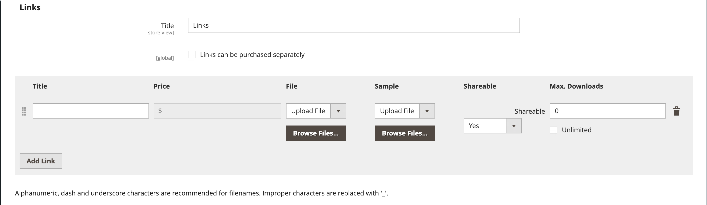
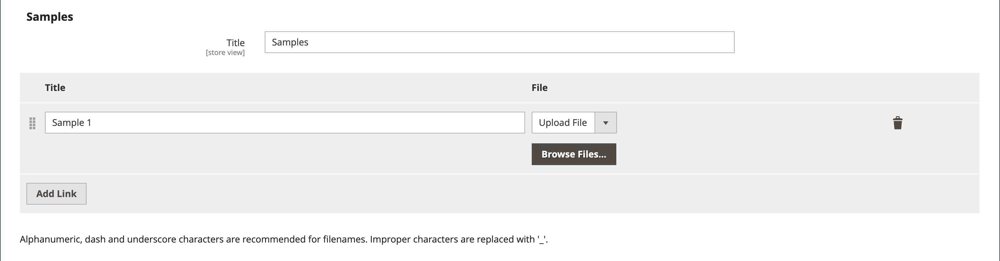
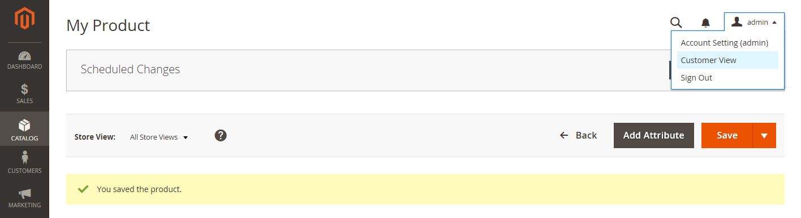

# Downloadable product

A downloadable product can be anything that you can deliver as a file, such as an eBook, music, video, software application, or update. You can offer an album for sale and sell each song individually. You can also use a downloadable product to deliver an electronic version of your product catalog.

Because the actual download is not available until after the purchase, you can provide samples, such as an excerpt from a book, a clip from an audio file, or a trailer from a video that the customer can try before purchasing the product. The files that you make available for download can be either uploaded to your server or from a different server.

<!-- zoom -->

Downloadable products can be configured to require that the customer log in to an account to receive the link or can be sent by email and shared with others. The status of the order before the download becomes available, default values, and other delivery options are set in the configuration.

## Configure the download options

The downloadable configuration settings determine the default values and delivery options for downloadable products and specify if guests can purchase downloads.

1. On the _Admin_ sidebar, go to **[!UICONTROL Stores]** > _[!UICONTROL Settings]_ > **[!UICONTROL Configuration]**.

1. In the left panel, expand **[!UICONTROL Catalog]** and choose **[!UICONTROL Catalog]** underneath.

1. Expand  the _[!UICONTROL Downloadable Product Options]_ section.

   <!-- zoom -->

   For more information about these configuration options, see [_Downloadable Product Options_](https://docs.magento.com/user-guide/configuration/catalog/catalog.html#downloadable-product-options) in the _Configuration Reference_.

1. To determine the status of the order process when the download becomes available, set **[!UICONTROL Order Item Status to Enable Downloads]** to one of the following:

   - `Pending`
   - `Invoiced`

1. To set a default limit on the number of downloads that a single customer can make, enter the number for **[!UICONTROL Default Maximum Number of Downloads]**.

1. Set **[!UICONTROL Shareable]** to one of the following:

   - `Yes` - Allows customers to email the download link to others.
   - `No` - Prevents customers from sharing the download link with others by requiring customers to log in to their accounts to access download links.

1. For **Default Sample Title**, enter the heading that you want to appear above the selection of samples.

   <!-- zoom -->

1. For **Default Link Title**, enter the default text that you want to use for download links.

1. If you want the download link to open in a new browser window, set **Opens Links in New Window** to `Yes`.

   This setting is used to keep the browser window to your store open.

1. To determine how downloadable content is delivered, set **Use Content Disposition** to one of the following:

   - `Attachment` - Delivers the download link by email as an attachment.
   - `Inline` - Delivers the download link as a link on a web page.

1. If you want to require that purchasers register for a customer account and log in before purchasing a download, set **Disable Guest Checkout if Cart Contains Downloadable Items** to `Yes`.

1. When complete, click **[!UICONTROL Save Config]**.

## Create a downloadable product

The following instructions demonstrate the process of creating a downloadable product using a [product template](attribute-sets.md), required fields, and basic settings. Each required field is marked with a red asterisk (`*`). When you finish the basics, you can complete the other product settings as needed.

>[!NOTE]
>
>Downloadable file names can include letters and numbers. Either a dash or underscore character can be used to represent a space between words. Any invalid characters in the file name are replaced with an underscore.

### Step 1: Choose the product type

1. On the _Admin_ sidebar, go to **[!UICONTROL Catalog]** > **[!UICONTROL Products]**.

1. On the _[!UICONTROL Add Product]_ ( <!-- {: width="25px"} --> ) menu at the upper-right corner, choose `Downloadable Product`.

   <!-- zoom -->

### Step 2: Choose the attribute set

The sample data includes an [attribute set](attribute-sets.md) called _Downloadable_ that has special fields for downloadable products. You can use an existing template or create another before the product is saved.

To choose the attribute set that is used as a template for the product, do one of the following:

- For **[!UICONTROL Search]**, enter the name of the attribute set.

- In the list, choose the `Downloadable` attribute set.

The form is updated to reflect the change.

<!-- zoom -->

### Step 3: Complete the required settings

1. Enter the **[!UICONTROL Product Name]**.

1. Accept the default **[!UICONTROL SKU]** that is based on the product name or enter another.

1. Enter the product **[!UICONTROL Price]**.

1. Because the product is not yet ready to publish, set **[!UICONTROL Enable Product]** to `No`.

1. click **[!UICONTROL Save]** and continue.

   When the product is saved, the [Store View](introduction.md#product-scope) chooser appears in the upper-left corner.

1. Choose the **[!UICONTROL Store View]** where the product is to be available.

   <!-- zoom -->

### Step 4: Complete the basic settings

1. Set **[!UICONTROL Tax Class]** to one of the following:

   - `None`
   - `Taxable Goods`

1. Enter the **[!UICONTROL Quantity]** of the product that is currently in stock.

   Take note of the following:

   - By default, **[!UICONTROL Stock Status]** is set to `Out of Stock`.

   - Because downloadable products are not shipped, the **[!UICONTROL Weight]** field is not used. If you enable this feature, it becomes a [Simple product](product-create-simple.md) and the _Is this downloadable product?_ tab cannot be used.

   >[!NOTE]
   >
   >If you enable [Inventory Management](../inventory-management/introduction.md), Single Source merchants set the quantity in this section. Multi Source merchants add sources and quantities in the Sources section. See the following _Assign Sources and Quantities (Inventory Management)_ section.

1. Accept the default **[!UICONTROL Visibility]** setting of `Catalog, Search`.

1. To feature the product in the [list of new products](../content-design/widget-new-products-list.md), select the **[!UICONTROL Set Product as New]** checkbox.

1. To assign _[!UICONTROL Categories]_ to the product, click the **[!UICONTROL Select…]** box and do either of the following:

   - Choose an existing category:

      - Start typing in the box to find a match.

      - Select the checkbox of each category that is to be assigned.

   - Create a new category:

      - Click **[!UICONTROL New Category]**.

      - Enter the **[!UICONTROL Category Name]** and choose the **[!UICONTROL Parent Category]** to determine its position in the [menu structure](category-root.md).

      - Click **[!UICONTROL Create Category]**.

1. Set **[!UICONTROL Format]** to one of the following:

   - `Download`
   - `DVD`

   If necessary, you can edit the [attribute](attribute-product-create.md) to add more values.

   <!-- zoom -->

   There might be additional attributes that describe the product. The selection varies by attribute set and you can complete them later.

{{$include /help/_includes/inventory-assign-sources.md}}

### Step 5: Complete the downloadable information

Scroll down, expand  the _[!UICONTROL Downloadable Information]_ section, and select the **[!UICONTROL Is this downloadable product?]** checkbox.

WHen enabled, the _[!UICONTROL Downloadable Information]_ section has two parts. The first part describes each download link, and the second part describes each sample file. The default value for many of these options can be set in the [configuration](#configure-the-download-options).

<!-- zoom -->

#### Complete the links

1. In the _[!UICONTROL Links]_ section, enter the **[!UICONTROL Title]** that you want to use as a heading for the download links.

1. If applicable, select the **[!UICONTROL Links can be purchased separately]** checkbox.

1. Click **[!UICONTROL Add Link]** and do the following:

   - Enter the **[!UICONTROL Title]** and **[!UICONTROL Price]** of the download.

   - For both **[!UICONTROL File]** and **[!UICONTROL Sample]** files, choose one of the following methods of distribution for the downloads:

      - `Upload File` - Choose this method to upload the distribution file to the server. Browse to the file and select it for upload.
      - `URL` - Choose this method to access the distribution file from a URL. Enter the full URL to the download file.

   >[!NOTE]
   >
   >You cannot use links to external resources as downloadable products. Valid link domains are predefined programmatically in the `env.php` file (see [env.php reference](https://devdocs.magento.com/guides/v2.4/config-guide/prod/config-reference-envphp.html#downloadable_domains) in the developer documentation).

   - Set **[!UICONTROL Shareable]** to one of the following:

      - `No` - Requires customers to log in to their accounts to access the download link.

      - `Yes` - Sends the link by email, which customers can share with others.

      - `Use Config` - Uses the method that is specified in the [Downloadable Product Options](https://docs.magento.com/user-guide/configuration/catalog/catalog.html) configuration.

   - Do one of the following:

      - To limit downloads per customer, enter the maximum number for **[!UICONTROL Max. Downloads]**.
      - To allow unlimited downloads, select the **[!UICONTROL Unlimited]** checkbox.

    <!-- zoom -->

1. To add another link, click **[!UICONTROL Add Link]** and repeat these steps.

#### Complete the samples

1. In the _[!UICONTROL Samples]_ section, enter the **[!UICONTROL Title]** that you want to use as a heading for the samples.

1. To complete the information for each sample, click **[!UICONTROL Add Link]**.

   <!-- zoom -->

1. Complete the link detail as follows:

   - Enter the **[!UICONTROL Title]** of the individual sample.

   - Choose one of the following distribution methods:

      - `Upload File` - Choose this method to upload the distribution file to the server. Browse to the file and select it for upload.
      - `URL` - Choose this method to access the distribution file from a URL. Enter the full URL to the download file.

   - To add another sample, click **[!UICONTROL Add Link]** and repeat these steps.

   - To change the order of the samples, grab the _Change Order_ (  ) icon and drag the sample to a new position.

### Step 6: Complete the product information

Scroll down and complete the information in the following sections as needed:

- [Content](product-content.md)
- [Images and Videos](product-images-and-video.md)
- [Search Engine Optimization](product-search-engine-optimization.md)
- [Related Products, Up-Sells, and Cross-Sells](related-products-up-sells-cross-sells.md)
- [Customizable Options](settings-advanced-custom-options.md)
- [Products in Websites](settings-basic-websites.md)
- [Design](settings-advanced-design.md)
- [Gift Options](product-gift-options.md)

### Step 7: Publish the product

If you are ready to publish the product in the catalog, set **[!UICONTROL Enable Product]** to `Yes` and do one of the following:

**Method 1:** Save and Preview

- In the upper-right corner, click **[!UICONTROL Save]**.

- To view the product in your store, choose **[!UICONTROL Customer View]** on the _Admin_ (  ) menu.

   The store opens in a new browser tab.

   <!-- zoom -->

**Method 2:** Save and Close

On the _[!UICONTROL Save]_ ( <!-- {: width="25px"} --> ) menu, choose **[!UICONTROL Save & Close]**.

<!-- zoom -->

### Things to remember

- Downloadable products can be uploaded to the server or linked to from another server on the internet.

- You can determine the number of times a customer can download a product.

- Customers who purchase a downloadable product can be required to log in before going through checkout.

- The delivery of a downloadable product can be made when the order is in either a `Pending` or `Invoiced` status.

- Because downloadable products are not shipped, the _Shipping_ step of the checkout is skipped when the cart  contains only the downloadable product.
