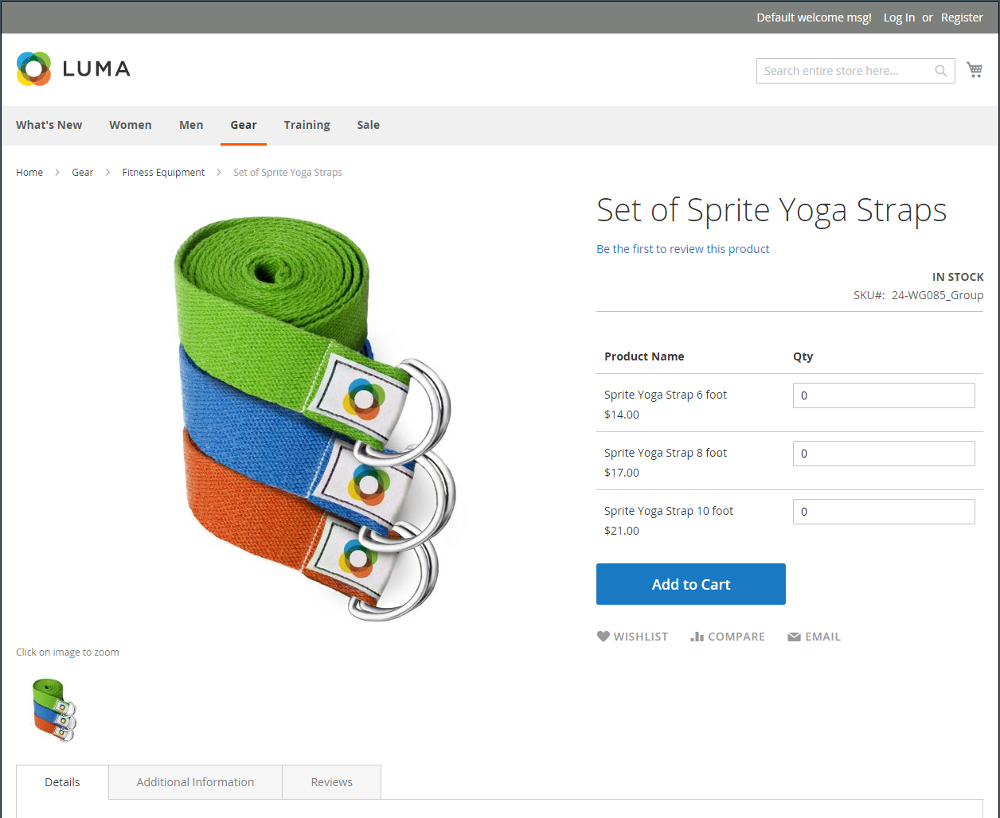
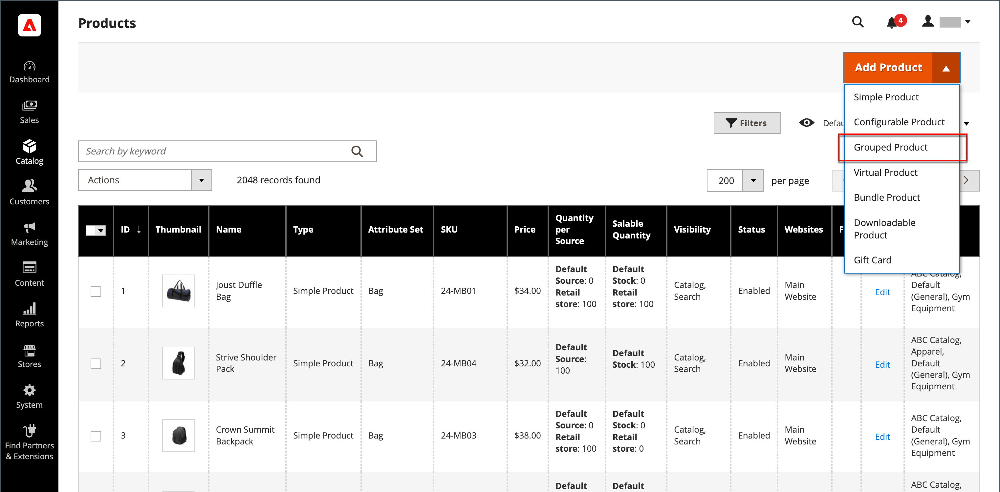
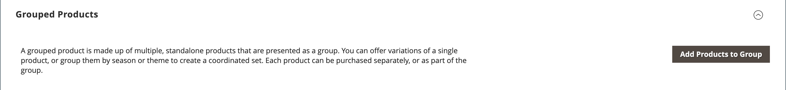
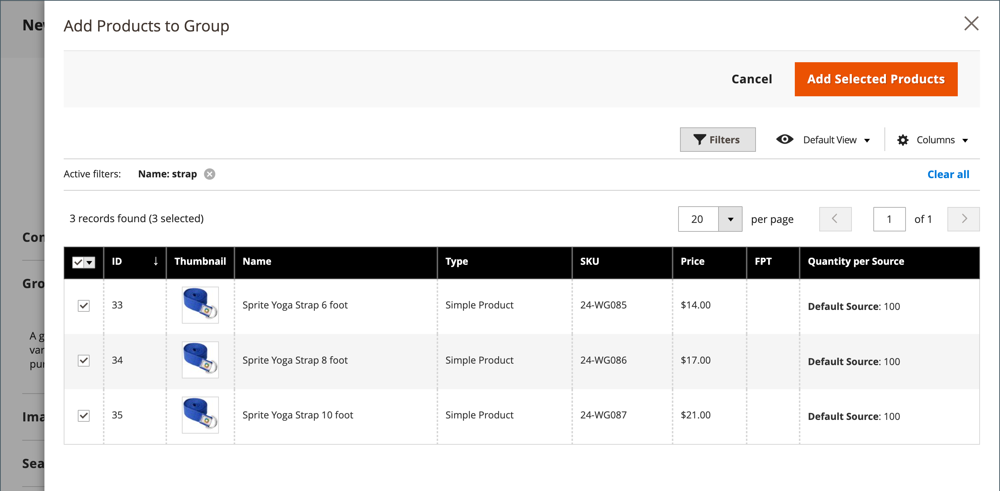
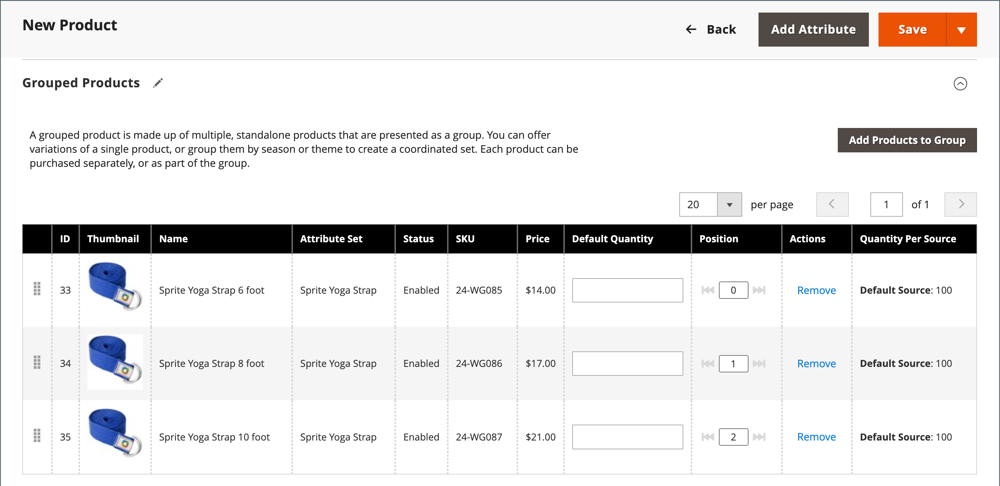
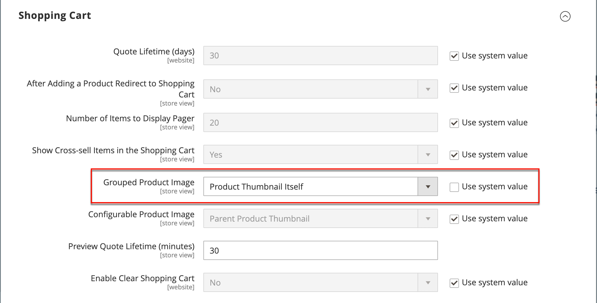

# Grouped product

A grouped product consists of simple standalone products that are presented as a group. You can offer variations of a single product or group them by season or theme. Presenting a grouped product can create an incentive for customers to purchase additional items. A grouped product provides an easy way to offer variations of a product and list them all on the same page.

For example, you might sell open stock flatware and list every type of utensil that is used in a formal place setting. Some might order multiple salad forks, fish forks, dinner forks, dinner knives, fish knives, butter knives, soup spoons, and dessert spoons. Other customers might order a simple fork, knife, and spoon. Customers can order any number of each item as they want.

Although they are presented as a group, each product in the group is purchased as a separate item. In the shopping cart, each item and the quantity purchased is displayed as a separate line item.

The following instructions demonstrate the process of creating a grouped product using a [product template](attribute-sets.md), required fields, and basic settings. Each required field is marked with a red asterisk (`*`). When you finish the basics, you can complete the other product settings as needed.

{width="700" zoomable="yes"}

## Step 1: Choose the product type

1. On the _Admin_ sidebar, go to **[!UICONTROL Catalog]** > **[!UICONTROL Products]**.

1. On the _[!UICONTROL Add Product]_ ( {width="25"} ) menu at the upper-right corner, choose **[!UICONTROL Grouped Product]**.

   {width="700" zoomable="yes"}

## Step 2: Choose the attribute set

To choose the [attribute set](attribute-sets.md) that is used as a template for the product, do one of the following:

- To search, enter the name of the **[!UICONTROL Attribute Set]**.
- In the list, choose the attribute set that you want to use.

The form is updated to reflect the change.

{width="600" zoomable="yes"}

If the needed attributes do not exist, you can add new attributes while creating a product:

- In the upper-right corner, click **[!UICONTROL Add Attribute]**.
- Define a new attribute (see [Adding an Attribute to a Product](product-attributes-add.md)).

   {width="600" zoomable="yes"}

To add an existing attribute to the product, use the [filter controls](../getting-started/admin-grid-controls.md) to find the attribute in the grid and do the following:

- Select the checkbox in the first column of each attribute to be added.
- Click **[!UICONTROL Add Selected]**.

## Step 3: Complete the required settings

1. Enter the **[!UICONTROL Product Name]**.

1. Accept the default **[!UICONTROL SKU]** that is based on the product name or enter another.

   Take note that the **[!UICONTROL Quantity]** field is not available because the value is derived from the individual products that make up the group.

1. Because the product is not yet ready to publish, set **[!UICONTROL Enable Product]** to `No` (  ).

1. Click **[!UICONTROL Save]** and continue.

   When the product is saved, the product name appears at the top of the page, and the [Store View](introduction.md#product-scope) chooser appears in the upper-left corner.

1. Choose the **[!UICONTROL Store View]** where the product is to be available.

   {width="600" zoomable="yes"}

## Step 4: Complete the basic settings

1. Accept the **[!UICONTROL Stock Status]** setting of `In Stock`.

1. To assign **[!UICONTROL Categories]** to the product, click the **[!UICONTROL Select…]** box and do either of the following:

   **Choose an existing category:**

   - Start typing in the box until you find a match.

   - Select the checkbox of the category that is to be assigned.

   **Create a category:**

   - Click **[!UICONTROL New Category]**.

   - Enter the **[!UICONTROL Category Name]** and choose the **[!UICONTROL Parent Category]**, which determines its position in the menu structure.

   - Click **[!UICONTROL Create Category]**.

1. Accept the **[!UICONTROL Visibility]** settings of `Catalog, Search`.

1. To feature the product in the [list of new products](../content-design/widget-new-products-list.md), choose the **[!UICONTROL Set Product as New]** **[!UICONTROL from]** and **[!UICONTROL to]** dates on the calendar.

1. Choose the **[!UICONTROL Country of Manufacture]**.

   There might be additional individual attributes that describe the product. The selection varies attribute set, and you can complete them later.

## Step 5: Add products to the group

1. Scroll down to the **[!UICONTROL Grouped Products]** section and click **[!UICONTROL Add Products to Group]**.

   {width="600" zoomable="yes"}

1. If necessary, use the [filters](../getting-started/admin-grid-controls.md) to find the products that you want to include in the group.

1. In the list, select the checkbox of each item that you want to include in the group.

   >[!NOTE]
   >
   >Only simple, downloadable, and virtual products with no configurable options can be grouped child products. Other product types do not appear in the selection list.

   {width="600" zoomable="yes"}

1. To add them to the product group, click **[!UICONTROL Add Selected Products]**.

   The selected products appear in the _[!UICONTROL Grouped Products]_ section.

   For Multi Source merchants with [Inventory Management](../inventory-management/sources-stocks.md), the grid includes a **[!UICONTROL Quantity per Source]** column with each assigned source and inventory stock amount.

   {width="600" zoomable="yes"}

1. Enter a **[!UICONTROL Default Quantity]** for any of the items.

1. To change the order of the products, grab the _Change Order_ icon (  ) in the first column and drag the product to the new position in the list.

1. To remove a product from the group, click **[!UICONTROL Remove]**.

## Step 5: Complete the product information

Complete the information in the following sections as needed:

- [Content](product-content.md)
- [Images and Videos](product-images-and-video.md)
- [Search Engine Optimization](product-search-engine-optimization.md)
- [Related Products, Up-Sells, and Cross-Sells](related-products-up-sells-cross-sells.md)
- [Customizable Options](settings-advanced-custom-options.md)
- [Products in Websites](settings-basic-websites.md)
- [Design](settings-advanced-design.md)
- [Gift Options](product-gift-options.md)

## Step 6: Publish the product

1. If you are ready to publish the product in the catalog, set **[!UICONTROL Enable Product]** to `Yes`.

1. Do one of the following:

   **Method 1:** Save and Preview

   - In the upper-right corner, click **[!UICONTROL Save]**.

   - To view the product in your store, choose **[!UICONTROL Customer View]** on the _Admin_ (  ) menu.

      The store opens in a new browser tab.

      {width="700" zoomable="yes"}

   **Method 2:** Save and Close

   - On the _[!UICONTROL Save]_ ( {width="25"} ) menu, choose **[!UICONTROL Save & Close]**.

## Step 7: Configure the cart thumbnails (optional)

If you have a different image for each product in the group, you can set the configuration to use the correct image for the shopping cart thumbnail.

1. On the _Admin_ sidebar, go to **[!UICONTROL Stores]** > _[!UICONTROL Settings]_ > **[!UICONTROL Configuration]**.

1. In the left panel, expand **[!UICONTROL Sales]** and choose **[!UICONTROL Checkout]**.

1. Expand  the **[!UICONTROL Shopping Cart]**.

   For a detailed list of these configuration options, see [Shopping Cart](../configuration-reference/sales/checkout.md#shopping-cart) in the _Configuration Reference_.

1. Set **[!UICONTROL Grouped Product Image]** to `Product Thumbnail Itself`.

   {width="600" zoomable="yes"}

   If necessary, deselect the **[!UICONTROL Use system value]** checkbox to set this option.

1. Click **[!UICONTROL Save Config]**.

## Things to remember

- A grouped product is essentially a collection of simple associated products.

- Grouped child products can be simple, downloadable, or virtual products **[!UICONTROL without custom options]**.

- Each item purchased appears individually in the shopping cart, rather than as part of the group.

- The thumbnail image in the shopping cart can be set to display the image from the grouped parent product or associated product.
