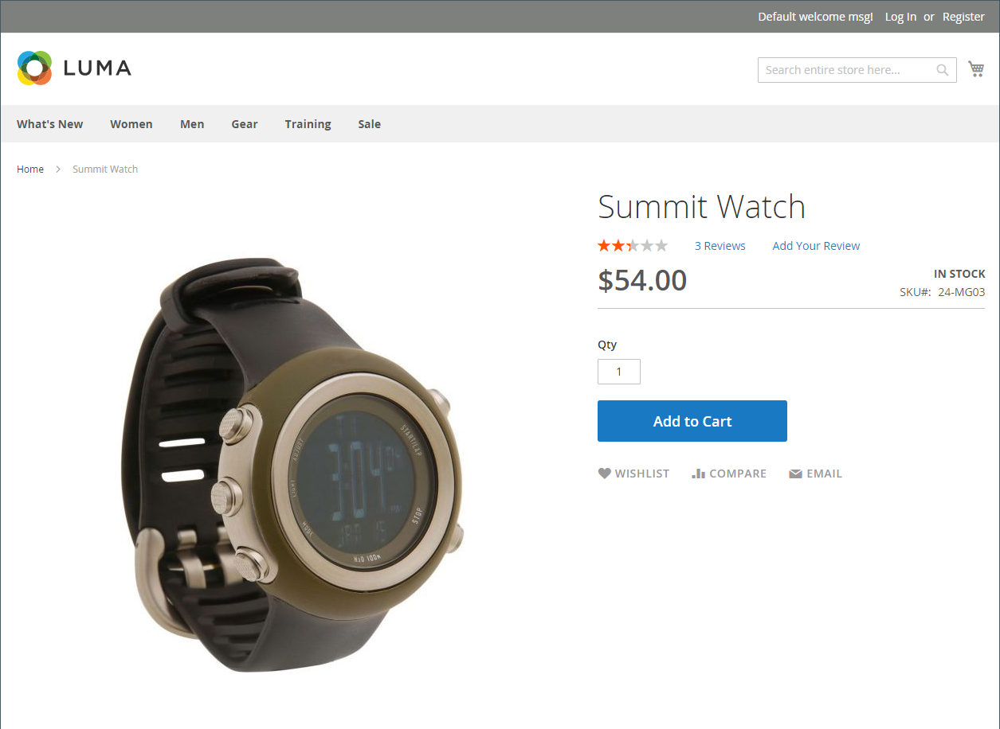
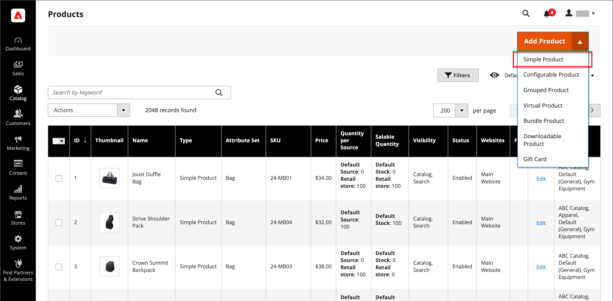

# Simple product

One of the keys to harnessing the power of product types is learning when to use a simple, standalone product. A simple product can be sold individually or as part of a grouped, configurable, or bundle product. A simple product with custom options is sometimes referred to as a _composite product_.

The following instructions demonstrate the process of creating a simple product using a [product template](attribute-sets.md), required fields, and basic settings. Each required field is marked with a red asterisk (`*`). When you finish the basics, you can complete the other product settings as needed.

<!-- zoom -->

## Step 1: Choose the product type

1. On the _Admin_ sidebar, go to **Catalog** > **Products**.

1. On the _Add Product_ ( <!-- {: width="25px"} --> ) menu at the upper-right, choose **Simple Product**.

   <!-- zoom -->

## Step 2: Choose the attribute set

To choose the [attribute set](attribute-sets.md) that is used as a template for the product, do one of the following:

- For **Search**, enter the name of the attribute set.

- In the list, choose the attribute set that you want to use.

The form is updated to reflect the change.

<!-- zoom -->

## Step 3: Complete the required settings

1. Enter the **Product Name**.

1. Accept the default **SKU** that is based on the product name or enter another.

1. Enter the product **Price**.

1. Because the product is not yet ready to publish, set the **Enable Product** option to `No`.

1. Click **Save** and continue.

   When the product is saved, the [Store View](introduction.md#product-scope) chooser appears in the upper-left corner.

1. Choose the **Store View** where the product is to be available.

   <!-- zoom -->

## Step 4: Complete the basic settings

1. Set **Tax Class** to one of the following:

   - `None`
   - `Taxable Goods`
   - `Refund Adjustments`
   - `Gift Options`
   - `Order Gift Wrapping`
   - `Item Gift Wrapping`
   - `Printed Gift Card`
   - `Reward Points`
   - `VAT Reduced`
   - `VAT Standard`

1. Enter the **Quantity** of the product that is currently in stock.

   By default, **Stock Status** is set to `In Stock`.

   >[!NOTE]
   >
   >If you enable [Inventory Management](../inventory-management/introduction.md), Single Source merchants set the quantity in this section. Multi Source merchants add sources and quantities in the Sources section. See the following _Assign Sources and Quantities (Inventory Management)_ section.

1. Enter the **Weight** of the product.

1. Accept the default **Visibility** setting of `Catalog, Search`.

1. To assign _Categories_ to the product, click the **Select…** box and do either of the following:

   - Choose an existing category:

      - Start typing in the box to find a match.

      - Select the checkbox of each category that is to be assigned.

   - Create a new category:

      - Click **New Category**.

      - Enter the **Category Name** and choose the **Parent Category** to determine its position in the menu structure.

      - Click **Create Category**.

1. To feature the product in the list of[ new products](../content-design/widget-new-products-list.md), select the **Set Product as New** checkbox.

1. Choose the **Country of Manufacture**.

   <!-- zoom -->

There might be additional individual attributes that describe the product. The selection varies by attribute set, and you can complete them later.

{{$include /help/_includes/inventory-assign-sources.md}}

## Step 5: Complete the product information

Scroll down and complete the information in the following sections as needed:

- [Content](product-content.md)
- [Images and Videos](product-images-and-video.md)
- [Related Products, Up-Sells, and Cross-Sells](related-products-up-sells-cross-sells.md)
- [Search Engine Optimization](product-search-engine-optimization.md)
- [Customizable Options](settings-advanced-custom-options.md)
- [Products in Websites](settings-basic-websites.md)
- [Design](settings-advanced-design.md)
- [Gift Options](product-gift-options.md)

## Step 6: Publish the product

1. If you are ready to publish the product in the catalog, set the **Enable Product** switch to `Yes`.

1. Do one of the following:

   - **Method 1:** Save and Preview

      - In the upper-right corner, click **Save**.

      - To view the product in your store, choose **Customer View** on the **Admin** () menu.

      The store opens in a new browser tab.

      <!-- zoom -->

   - **Method 2:** Save and Close

      On the _Save_ ( <!-- {: width="25px"} --> ) menu, choose **Save & Close**.

      <!-- zoom -->

## Things to remember

- Simple products can be included in configurable, bundle, and grouped product types.

- Simple product configuration overrides configurable product configurations for a specific product.

- A simple product can have custom options with a variety of input controls, which makes it possible to sell many product variations from a single SKU.
