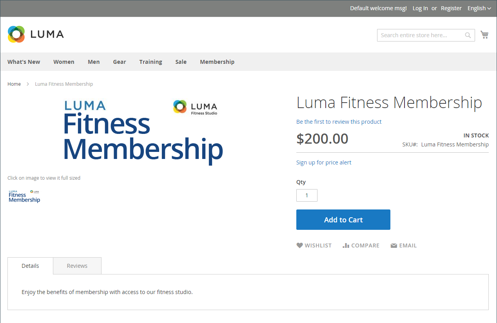
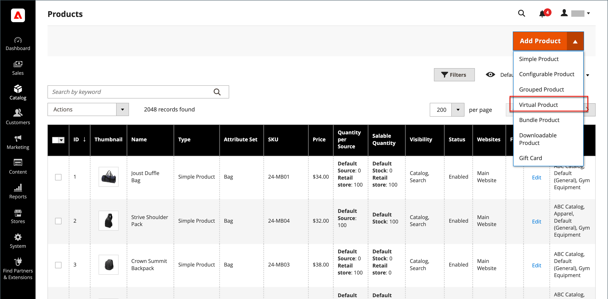

# Virtual product

Virtual products, or digital goods, represent non-tangible items such as memberships, services, warranties, or subscriptions and digital downloads of books, music, videos, or other products. Virtual products can be sold individually or included as part of the [Grouped Product](product-create-grouped.md), [Configurable Product](product-create-configurable.md), or [Bundle Product](product-create-bundle.md) product types.

Aside from the absence of the _[!UICONTROL Weight]_ field, the process of creating a virtual product and a simple product is the same. The following instructions demonstrate the process of creating a virtual product using a [product template](attribute-sets.md), required fields, and basic settings. When you finish the basics, you can complete the other product settings as needed.

>[!NOTE]
>
>PayPal has deprecated support for the sale of digital goods through PayPal Express Checkout. They recommend that you use either [PayPal Payments Standard](../stores-purchase/paypal-payments-standard.md) or any other PayPal payment gateway to process any order that includes virtual products.

<!-- zoom -->

## Step 1: Choose the product type

1. On the _Admin_ sidebar, go to **[!UICONTROL Catalog]** > **[!UICONTROL Products]**.

1. On the _[!UICONTROL Add Product]_ ( <!-- {: width="25px"} --> ) menu at the upper-right corner, choose **[!UICONTROL Virtual Product]**.

   <!-- zoom -->

## Step 2: Choose the attribute set

To choose the [attribute set](attribute-sets.md) that is used as a template for the product, do one of the following:

- Click in the **[!UICONTROL Attribute Set]** field and enter all or part of the name of the attribute set.

- In the displayed list, choose the attribute set that you want to use.

The form is updated to reflect the change.

<!-- zoom -->

## Step 3: Complete the required settings

1. Enter the **[!UICONTROL Product Name]**.

1. Accept the default **[!UICONTROL SKU]** that is based on the product name or enter another.

1. Enter the product **[!UICONTROL Price]**.

1. Because the product is not yet ready to publish, set **[!UICONTROL Enable Product]** to `No`.

1. click **[!UICONTROL Save]** and continue.

   When the product is saved, the [Store View](introduction.md#product-scope) chooser appears in the upper-left corner.

1. Choose the **[!UICONTROL Store View]** where the product is to be available.

   <!-- zoom -->

## Step 4: Complete the basic settings

1. Set **[!UICONTROL Tax Class]** to one of the following:

   - `None`
   - `Taxable Goods`

1. Enter the **[!UICONTROL Quantity]** of the product that is currently in stock and do the following:

   - Accept the default **[!UICONTROL Stock Status]** setting of `In Stock`.

      Because a virtual product is not shipped, the **[!UICONTROL Weight]** field is not used.

   - Accept the default **[!UICONTROL Visibility]** setting of `Catalog, Search`.

   >[!NOTE]
   >
   >If you enable [Inventory Management](../inventory-management/introduction.md), single source merchants set the quantity in this section. Multi source merchants add sources and quantities in the Sources section. See the following _Assign Sources and Quantities (Inventory Management)_ section.

1. To assign **[!UICONTROL Categories]** to the product, click the **[!UICONTROL Select…]** box and do either of the following:

   **Choose an existing category**:

   - Start typing in the box to find a match.

   - Select the checkbox of the category that is to be assigned.

   **Create a category**:

   - Click **[!UICONTROL New Category]**.

   - Enter the **[!UICONTROL Category Name]** and choose the **[!UICONTROL Parent Category]** to determine its position in the menu structure.

   - Click **[!UICONTROL Create Category]**.

   There might be additional individual attributes that describe the product. The selection varies by attribute set and you can complete them later.

### Assign sources and quantities ([!DNL Inventory Management])

{{$include /help/_includes/inventory-assign-sources.md}}

## Step 5: Complete the product information

Complete the information in the following sections as needed:

- [Content](product-content.md)
- [Images and Videos](product-images-and-video.md)
- [Search Engine Optimization](product-search-engine-optimization.md)
- [Related Products, Up-Sells, and Cross-Sells](related-products-up-sells-cross-sells.md)
- [Customizable Options](settings-advanced-custom-options.md)
- [Products in Websites](settings-basic-websites.md)
- [Design](settings-advanced-design.md)
- [Gift Options](product-gift-options.md)

>[!NOTE]
>
>The _[!UICONTROL Is this downloadable product?]_ option is disabled by default. Enabling this feature for a virtual product makes the product [Downloadable](product-create-downloadable.md#downloadable-product).

## Step 6: Publish the product

1. If you are ready to publish the product in the catalog, set **[!UICONTROL Enable Product]** to `Yes`.

1. Do one of the following:

   - **Method 1:** Save and preview

      - At the upper-right corner, click **[!UICONTROL Save]**.

      - To view the product in your store, choose **[!UICONTROL Customer View]** on the _Admin_ (  ) menu.

      The store opens in a new browser tab.

      <!-- zoom -->

   - **Method 2:** Save and close

      On the _[!UICONTROL Save]_ (<!-- {: width="25px"} --> ) menu, choose **[!UICONTROL Save & Close]**.

      <!-- zoom -->

## Things to remember

- Virtual products are used for non-tangible products such as services, subscriptions, and warranties.

- Virtual products are much like simple products, but without weight.

- Shipping options do not appear during checkout unless there is a tangible product in the cart.
