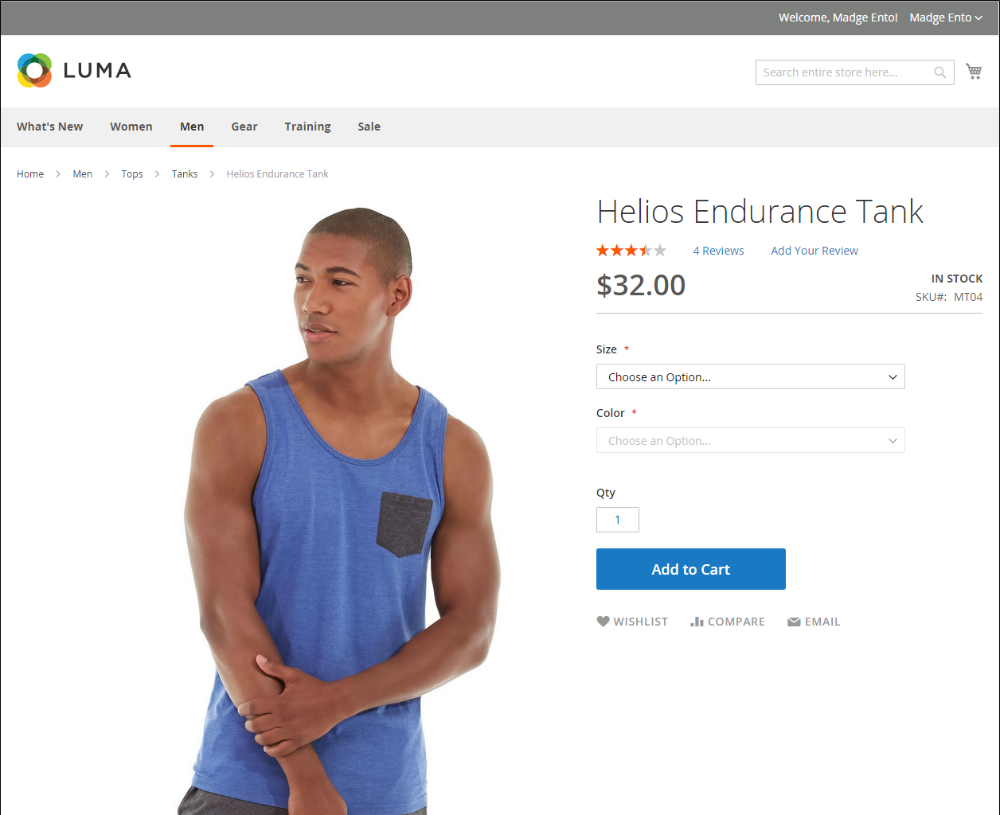
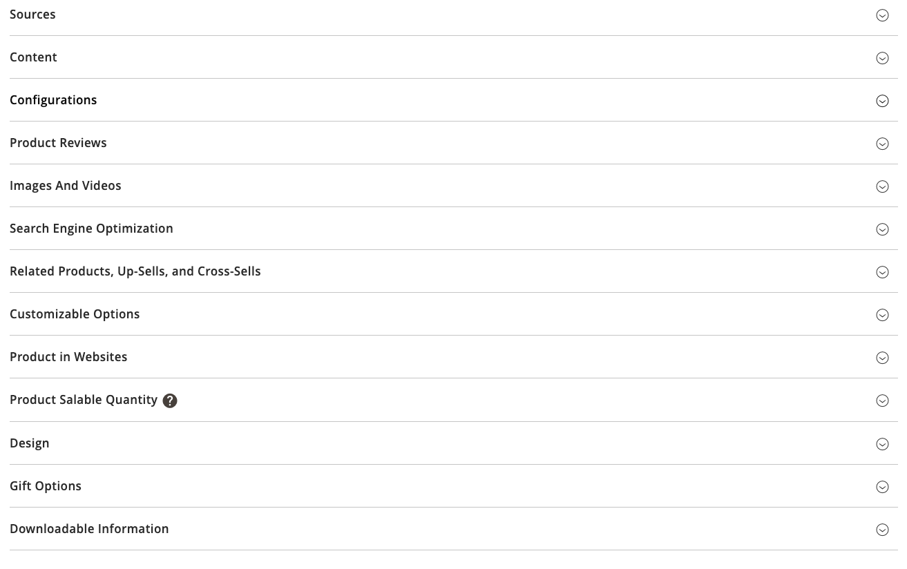
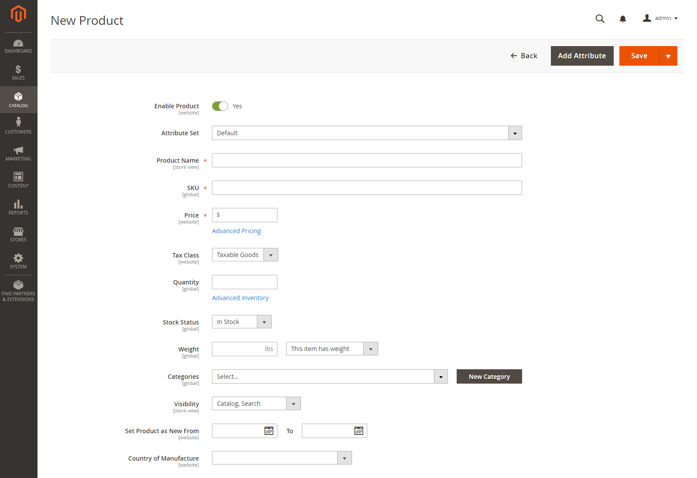

# Create a product

Choosing a product type is one of the first things that you must do to create a product. If you are just beginning to construct your product catalog, you can create a few sample products to experiment with each product type. In addition to the basic product types, the term _complex product_ is sometimes used to refer to products with multiple options, such as a configurable product that is available in various colors and sizes.

>[!NOTE]
>
>For a deeper understanding, refer to catalog [navigation](navigation.md), how to set up [categories](categories.md) and [attributes](product-attributes.md), and the catalog [URL options](catalog-urls.md) that are available. After you understand these concepts, the most efficient way to add many products to the catalog is to [import](../systems/data-import.md) them from a CSV file.

<!-- zoom -->

## Product types

**[Simple product](product-create-simple.md)** - A simple product is a physical item with a single SKU. Simple products have various pricing and of input controls which makes it possible to sell variations of the product. Simple products can be used in association with grouped, bundle, and configurable products.

**[Configurable product](product-create-configurable.md)** - A configurable product appears to be a single product with lists of options for each variation. However, each option represents a separate, simple product with a distinct SKU, which makes it possible to track inventory for each variation.

**[Grouped product](product-create-grouped.md)** - A grouped product presents multiple, standalone products as a group. You can offer variations of a single product, or group them for a promotion. The products can be purchased separately or as a group.

**[Virtual products](product-create-virtual.md)** - A virtual product is not a tangible product, and is typically used for products such as services, memberships, warranties, and subscriptions. Virtual products can be used in association with grouped and bundle products.

**[Bundle product](product-create-bundle.md)**  - A bundle product lets customers "build their own" from an assortment of options. The bundle could be a gift basket, computer, or anything else that can be customized. Each item in the bundle is a separate, standalone product.

**[Downloadable product](product-create-downloadable.md)** - A digitally downloadable product consists of one or more files that are downloaded. The files can reside on your server or be provided as URLs to any other server.

**[Gift card](product-gift-card-create.md)** - ([Adobe Commerce](../landing/home.md#product-editions) only) There are three kinds of gift cards. _Virtual_ gift cards are sent by email. _Physical_ gift cards are shipped to the recipient. _Combined_ gift cards that are a combination of virtual and physical. Each has a unique code, which is redeemed during checkout. Gift cards can also be included in a grouped product.

## Product settings

The most frequently used product settings and attributes are located at the top of the page, followed by custom attributes. Any other product settings are in expandable sections at the bottom of the page.

<!-- zoom -->

|Setting|Description|
|--- |--- |
|[[!UICONTROL Sources]](../inventory-management/sources-assign-per-product.md)|Lists the sources from which the product can be distributed.|
|[[!UICONTROL Content]](product-content.md)|Used to enter and edit the main product description that appears on the storefront product page.|
|[[!UICONTROL Configurations]](product-configurations.md)| Lists any existing variations of the product and can be used to generate variations for use with the Configurable product type.|
|[[!UICONTROL Product Reviews]](settings-advanced-product-reviews.md)|Lists all reviews that customers have submitted for the product.|
|[[!UICONTROL Search Engine Optimization]](product-search-engine-optimization.md)|Specifies the URL Key and metadata fields that are used by search engines to index the product.|
|[[!UICONTROL Related Products, Up-Sells, and Cross-Sells]](related-products-up-sells-cross-sells.md)|Used to set up simple promotional blocks on the storefront that present a selection of additional products that might be of interest to the customer.|
|[[!UICONTROL Customizable Options]](settings-advanced-custom-options.md)|Adds customizable options to a product.|
|[[!UICONTROL Product in Websites]](settings-basic-websites.md)| Identifies each website where the product is available, according to the store hierarchy.|
|[[!UICONTROL Design]](settings-advanced-design.md)|Used to apply a different theme to the product page, change the column layout, determine where product options appear, and enter custom XML code.|
|[[!UICONTROL Gift options]](product-gift-options.md)|Used to enable or disable a gift message option during checkout at the product level.|
|[[!UICONTROL Product In Shared Catalogs]](../b2b/catalog-shared.md) |  (Available with [B2B for Adobe Commerce](../b2b/introduction.md) only) Enables the ability to maintain shared catalogs with custom pricing for different companies, with access to two types of shared catalogs using different pricing structures.|

{style="table-layout:auto"}

## Advanced pricing and inventory

To access the advanced pricing and inventory settings, click the link below **[!UICONTROL Price]** and **[!UICONTROL Quantity]**. For more information, see [Managing Pricing](pricing-advanced.md) and [Inventory Management](../inventory-management/introduction.md).

<!-- zoom -->
