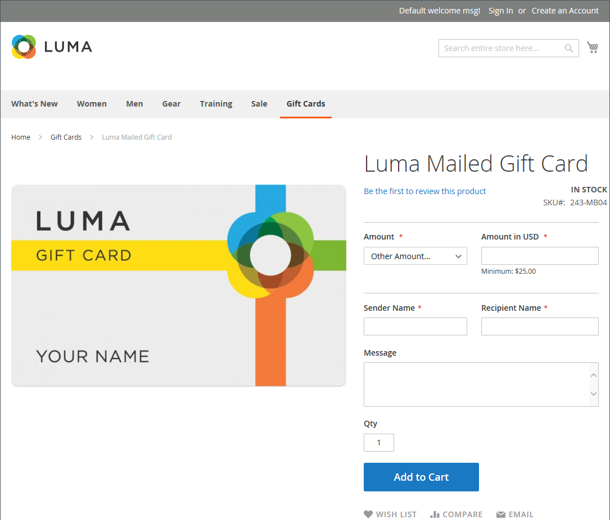
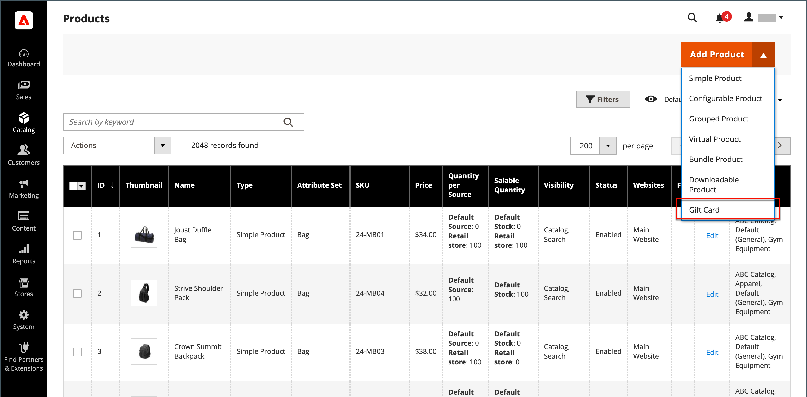
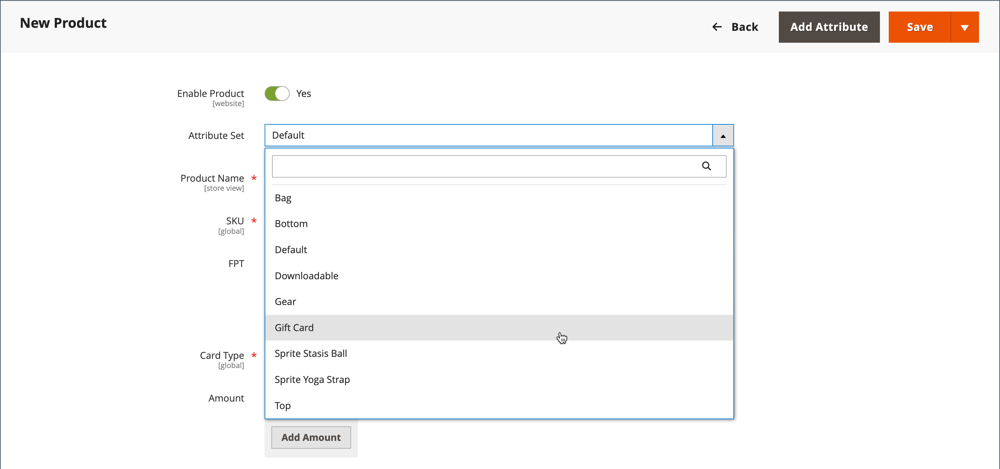
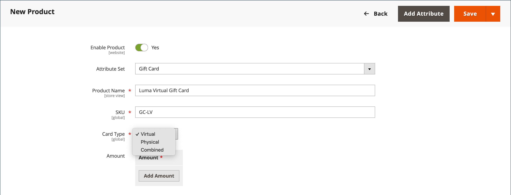
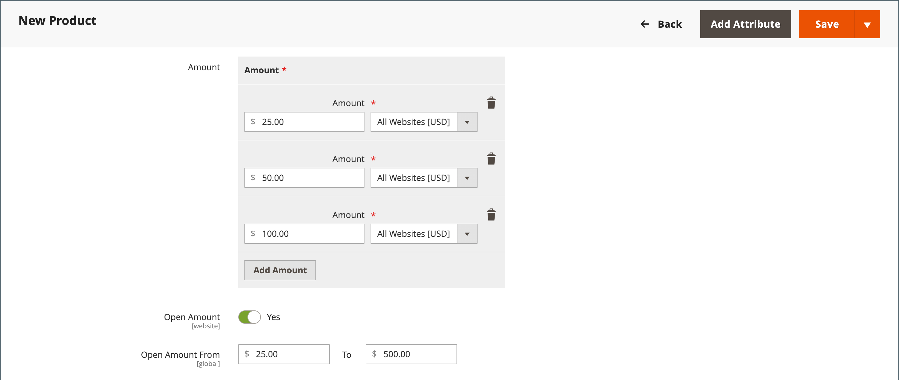
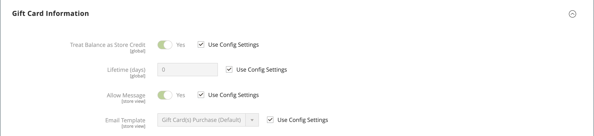

# Gift card product

{{ee-feature}}

Each gift card has a unique code, which can be redeemed by only one customer during checkout. A [code pool](../stores-purchase/product-gift-card-accounts.md#step-3-establish-the-gift-card-code-pool) must be established before gift cards can be sold. See [Gift card workflow](../stores-purchase/product-gift-card-workflow.md) for information about how gift cards are redeemed in the shopping cart.

{width="700" zoomable="yes"}

There are three kinds of gift card products:

- **Virtual** - A virtual gift card is sent to the recipient's email address, which is required during the purchase of the gift card. A shipping address is not necessary.

- **Physical** - A physical gift card is shipped to recipient's address, which is required during the purchase of the gift card.

- **Combined** - A combined gift card is shipped and emailed to the recipient. The recipient's email and shipping address is required during the purchase of the gift card.

## Create a gift card product

The following instructions demonstrate the process of creating a gift card using a [product template](attribute-sets.md), required fields, and basic settings. Each required field is marked with a red asterisk (`*`). When you finish the basics, you can complete the other product settings as needed.

### Step 1: Choose the product type

1. On the _Admin_ sidebar, go to **[!UICONTROL Catalog]** > **[!UICONTROL Products]**.

1. In the upper-right corner on the _[!UICONTROL Add Product]_ ( {width="25"}  ) menu, choose **[!UICONTROL Gift Card]**.

   {width="700" zoomable="yes"}
     
### Step 2: Choose the attribute set

You can use the default `Gift Card` attribute set or choose another. To choose the attribute set that is used as a template for the product, do one of the following:

- Click in the **[!UICONTROL Attribute Set]** field and enter all or part of the name of the attribute set.

- In the displayed list, choose the attribute set that you want to use.

{width="600" zoomable="yes"}

### Step 3: Complete the required settings

1. Enter a **[!UICONTROL Product Name]** for the gift card.

   You might also indicate the type of gift card in the name. For example, _Luma Virtual Gift Card_.

1. Enter a **[!UICONTROL SKU]** for the product.

   By default, the Product Name is used as the default SKU.

1. Set **[!UICONTROL Card Type]** to one of the following:

   - `Virtual` - Virtual gift cards are delivered by email to the recipient.
   - `Physical` - Physical gift cards can be mass produced in advance and embossed with unique codes.
   - `Combined` - A combined gift card has the characteristics of both a virtual and physical gift card.

   {width="600" zoomable="yes"}

1. To offer the customer a choice of fixed amounts, click **[!UICONTROL Add Amount]** and enter the first fixed value of the card as a decimal.

   To enter the selection of fixed amounts, repeat this step for each.

1. To give customers the ability to set the value of the gift card, do the following:

   - Set **[!UICONTROL Open Amount]** to `Yes`.

   - To define the range of minimum and maximum acceptable values, enter the **[!UICONTROL Open Amount From]** and **[!UICONTROL To]** values.

   You can create gift cards with fixed pricing, open amount pricing, or both.

   >[!NOTE]
   >
   >A gift card product does not have its own price in the catalog. The gift card price is derived from the selected gift card amount during the purchase.

   {width="600" zoomable="yes"}

### Step 4: Complete the basic settings

1. For a physical or combined gift card, enter the **[!UICONTROL Quantity]** in stock.

1. If the gift card that is to be shipped, enter the **[!UICONTROL Weight]** of the package.

1. In the **[!UICONTROL Categories]** field, choose `Gift Card`.

There might be additional individual attributes that describe the product. The selection varies attribute set, and you can complete them later.

### Step 5: Complete the gift card information

The _[!UICONTROL Gift Card Information]_ section of the product settings can be used to override the [gift card configuration](../configuration-reference/sales/gift-cards.md) settings that determine how the card is managed.

1. Scroll down to the _[!UICONTROL Gift Card Information]_ section.

   The default settings in this section are determined by the system configuration.

   {width="600" zoomable="yes"}

1. Change additional fields according to how you want the gift card to function:

   - **[!UICONTROL Treat Balance as Store Credit]** - Determines if the gift card holder can redeem the balance as store credit.

   - **[!UICONTROL Lifetime (days)]** - Determines the number of days after purchase until the gift card expires. If you do not want to set a limit for the lifetime of the card, leave this field blank.

   - **[!UICONTROL Allow Message]** - Determines if the purchaser of the gift card can enter a message for to the recipient. A gift message can be included for both virtual (emailed) and physical (shipped) gift cards.

   - **[!UICONTROL Email Template]** - Determines the email template that is used for the notification sent to the recipient of a gift card.

### Step 6: Complete the product information

Complete the information in the following sections as needed:

- [Content](product-content.md)
- [Images and Videos](product-images-and-video.md)
- [Related Products, Up-Sells, and Cross-Sells](related-products-up-sells-cross-sells.md)
- [Search Engine Optimization](product-search-engine-optimization.md)
- [Customizable Options](settings-advanced-custom-options.md)
- [Products in Websites](settings-basic-websites.md)
- [Design](settings-advanced-design.md)
- [Gift Options](product-gift-options.md)

### Step 7: Publish the product

1. If you are ready to publish the product in the catalog, set the **Enable Product** switch to `Yes`.

1. Do one of the following:

   **Method 1:** Save and Preview

   - In the upper-right corner, click **[!UICONTROL Save]**.

   - To view the product in your store, choose **[!UICONTROL Customer View]** on the _Admin_ (  ) menu,

   {width="600" zoomable="yes"}

   **Method 2:** Save and Close

   On the _[!UICONTROL Save]_ ( {width="25"} ) menu, choose **[!UICONTROL Save & Close]**.

## Things to remember

- A _code pool_ of unique numbers must be generated before a gift card can be offered for sale.

- Gift cards can be set to `Redeemable` or `Non-Redeemable`.

- Taxes are **_not applied_** to gift cards during the gift card purchase. Taxes are applied to products only when a purchased gift card is used to buy products. 

- The lifetime of a gift card can be unlimited or set to a specified number of days.

- The value of a gift card can be set to a fixed amount or set to an open amount with a minimum and maximum value.

- A gift card product does not have its own price in the catalog. The gift card price is derived from the selected gift card amount during the purchase.

- A gift card account for the customer can be created when the order is placed or at the time of invoice.
