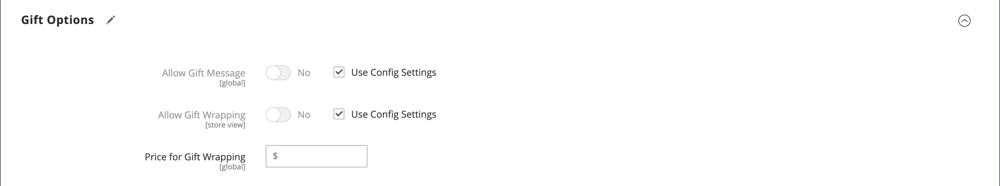
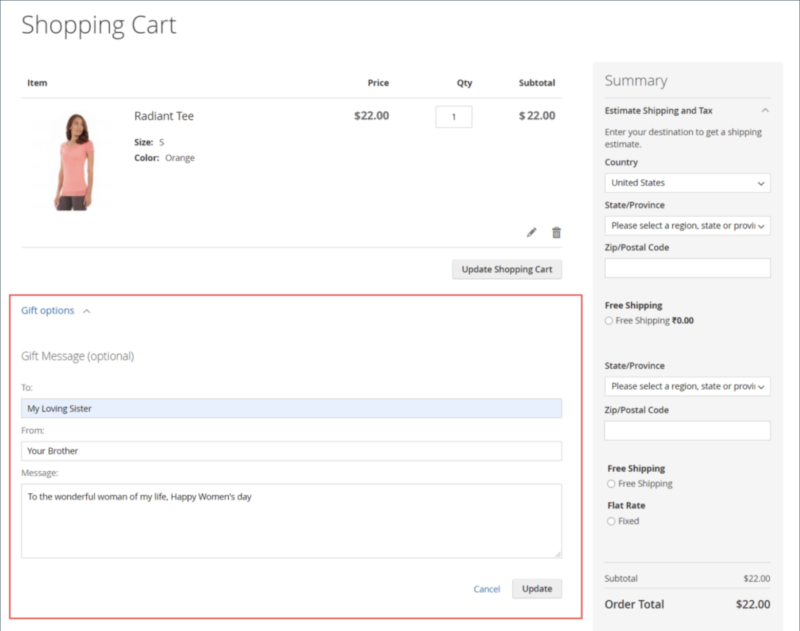

# Product settings - [!UICONTROL Gift Options]

In the _[!UICONTROL Gift Options]_ section, you can set gift message and gift-wrapping options at checkout at the product level. To override the default configuration setting, deselect the **[!UICONTROL Use Config Settings]** checkbox.

<!-- zoom -->

## Set gift options for a single product

1. Open the product in edit mode.

1. Scroll down and expand  the _[!UICONTROL Gift Options]_ section and do the following:

   - To override the default setting, deselect the **[!UICONTROL Use Config Settings]** checkbox.

   - Set **[!UICONTROL Allow Gift Message]** as needed for the product.

   -  ([Adobe Commerce](../landing/home.md#product-editions) only) Set **[!UICONTROL Allow Gift Wrapping]** as needed for the product.

   -  ([Adobe Commerce](../landing/home.md#product-editions) only) If applicable, enter the **[!UICONTROL Price for Gift Wrapping]**.

1. When complete, click **[!UICONTROL Save]**.

## Enable gift messages for your store

By default, Commerce allows the customers to add a personalized gift message to their orders and products during the checkout process.

You can provide this feature to customers by enabling _gift message_ for your store:

1. On the _Admin_ sidebar, go to **[!UICONTROL Stores]** > _[!UICONTROL Settings]_ > **[!UICONTROL Configuration]**.

1. In the left panel, expand **[!UICONTROL Sales]** and choose **[!UICONTROL Sales]** underneath.

1. Expand  **[!UICONTROL Gift Options]** on the page.

1. For **[!UICONTROL Allow Gift Messages on Order Level]**, select `Yes` to enable a single gift message for the whole order.

1. For **[!UICONTROL Allow Gift Messages for Order Items]**, select `Yes` to enable adding gift messages separately to individual items in the customer shopping cart.

1. Click **[!UICONTROL Save Config]**.

With this configuration, customers can add a gift message to the cart page from storefront as shown in the following example:

<!-- zoom -->
