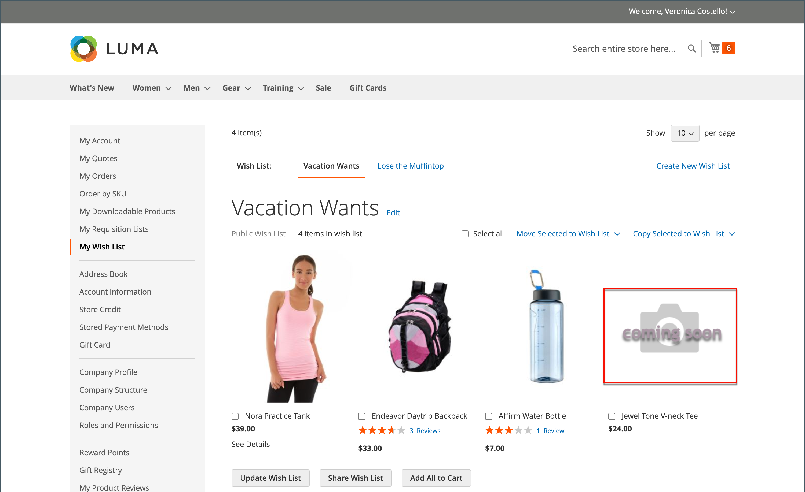

# Product image configuration 

If you plan to upload large images for viewing on the _Product Details_ page, you may want to consider setting a maximum pixel size (width and height) and automatically resize the files prior to upload. To support this type of product image upload, there is an option to enable automatic resizing of larger image files as you upload. For product that you want to add to your catalog but you do not yet have an image asset to display, you can configure a placeholder image.

## Product image resizing

When uploading product images, you may add larger images with varying sizes to provide detailed, high quality zooms on the _Product Details_ page. To ensure all images have a similar size and look, we provide an image upload resizing option to ensure all images match a specific pixel size. This option automatically resizes all product images using the configuration settings, which can help with performance of zoom, faster loading of images and keep a uniform look to your product images.

>[!NOTE]
>
>For the best compatibility, it is recommended to upload all product images with the `sRGB` color profile. All other color profiles are automatically converted to the `sRGB` color profile during the product image upload, which could cause color inconsistency in the uploaded image.

Setting a maximum pixel width and height resizes the image to the physical dimensions by pixel. Commerce resizes the image according to the higher amount of either width or height while keeping the proportions. Reducing the quality amount for JPG images reduces the file size.

For example, a 3000 x 2100 pixel JPG at 100% could be a 5mb+ image file. Resizing this image would reduce the width to 1920 pixels, keeping proportions, and quality to 80% to provide much smaller file size with high quality.

### Enable image resizing

1. On the _Admin_ sidebar, go to **Stores** > _Settings_ > **Configuration**.

1. In the left panel, expand **Advanced** and choose **System**.

1. Expand  the _Images Upload Configuration_ section.

   To change default settings, you may need to deselect the **Use system value** checkbox.

1. To enable, make sure **Enable Frontend Resize** is set to `Yes`.

1. Enter a **Quality** setting between 1 to 100%.

   We recommend a setting between 80-90% for a reduced file size and high quality.

1. Set the **Maximum Width** in pixels for the image.

   When the image is resized, it does not exceed this width and retains proportions.

1. Set the **Maximum Height** in pixels for the image.

   When the image is resized, it does not exceed this height and retains proportions.

   <!-- zoom -->
   
   See also [_Image Upload Configuration_](https://docs.magento.com/user-guide/configuration/advanced/system.html)

1. When complete, click **Save Config**.

### Field descriptions

|Field|[Scope](https://docs.magento.com/user-guide/configuration/scope.html)|Description|
|--- |--- |--- |
|Quality|Global|Determines the JPG quality for the resized image. Lower quality reduces the file size. We recommend 80-90% to help reduce file size with high quality. Default: 80|
|Enable Frontend Resize|Global|Enable to allow Commerce to resize large, oversized images you may upload for the _Product Details_ page. Commerce resizes the image files using JavaScript prior to uploading the file. When the image is resized, it keeps the exact proportions, meeting and not exceeding the largest size for Maximum Width or Maximum Height. Default: `Yes`|
|Maximum Width|Global|Determines the maximum pixel width for the image. When the image is resized, it does not exceed this width. Default: `1920`|
|Maximum Height|Global|Determines the maximum pixel height for the image. When the image is resized, it does not exceed this height. Default: `1200`|

## Image placeholders

Adobe Commerce and Magento Open Source use temporary images as placeholders until the permanent product images become available. A different placeholder can be uploaded for each role. The initial placeholder image is a sample logo, which you can replace with the image of your choice.

<!-- zoom -->

To upload placeholder images:

1. On the _Admin_ sidebar, go to **Stores** > _Settings_ > **Configuration**.

1. In the left panel, expand **Catalog** and choose **Catalog** underneath.

1. Expand  the _Product Image Placeholders_ section.

1. For each image role, click **Choose File**, find the image on your computer, and upload the file.

   You can use the same image for all three roles, or you can upload a different placeholder image for each role.

   <!-- zoom -->
   
   See also [_Product Image Placeholders_](https://docs.magento.com/user-guide/configuration/catalog/catalog.html)

1. When complete, click **Save**.

For information about image roles and recommended sizes, see [Upload an image](product-image.md#upload-an-image).
