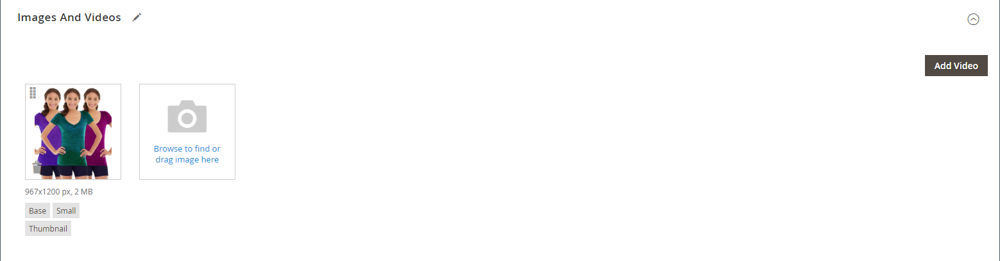
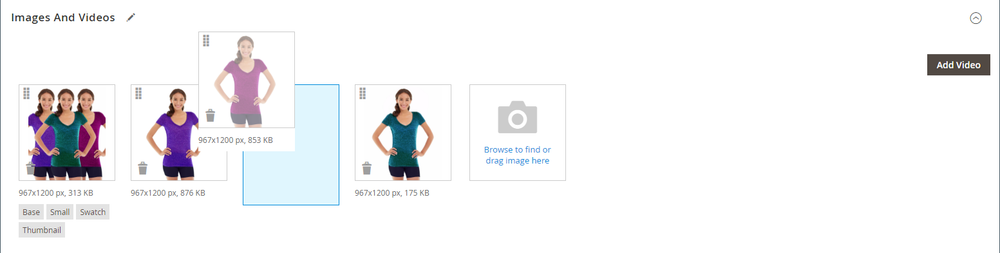
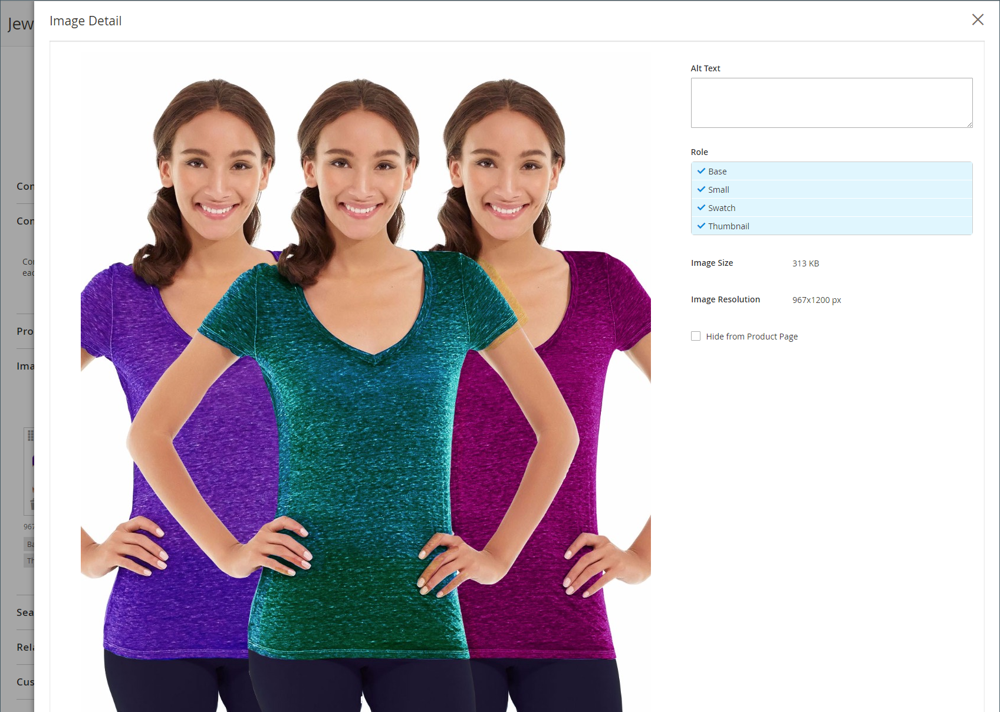
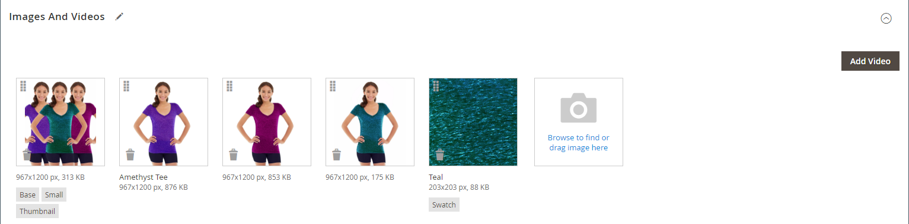
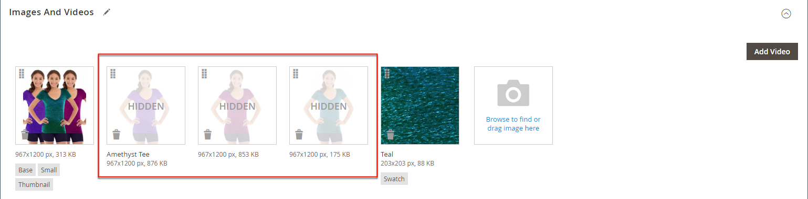
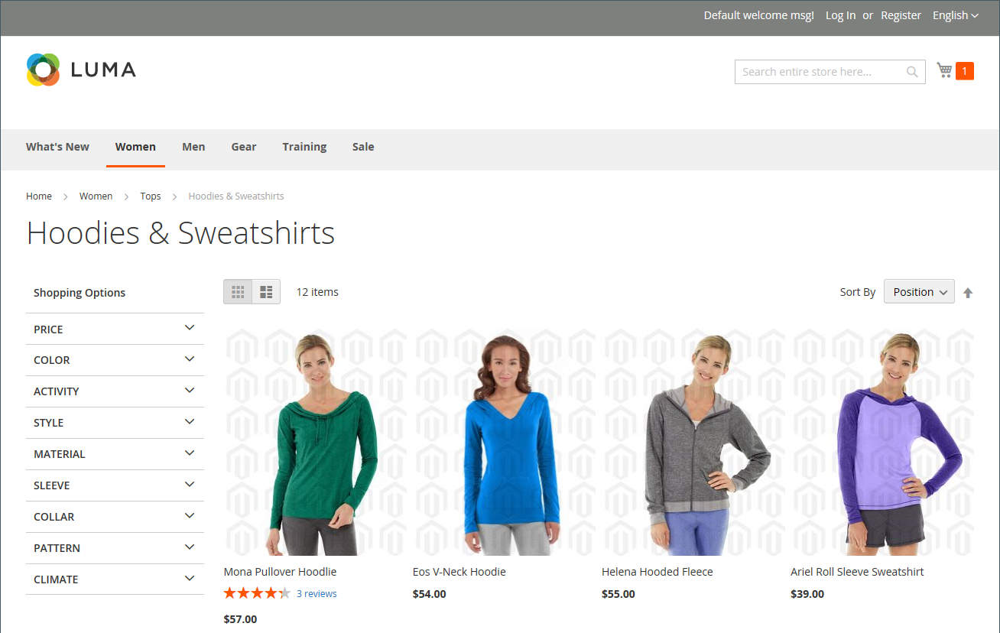
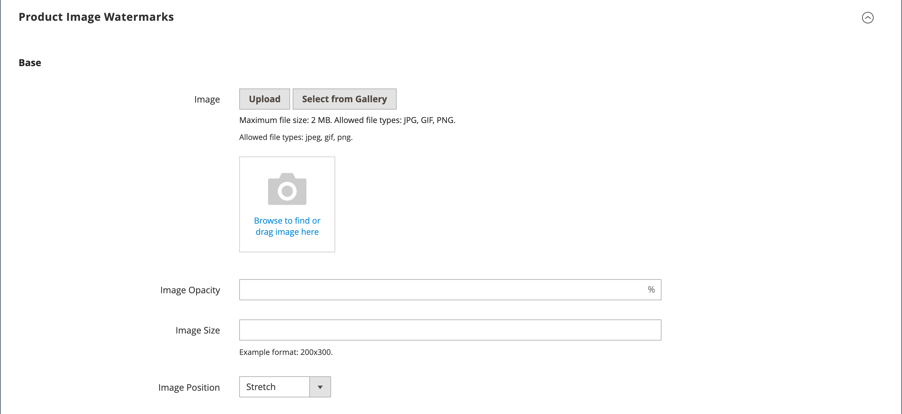
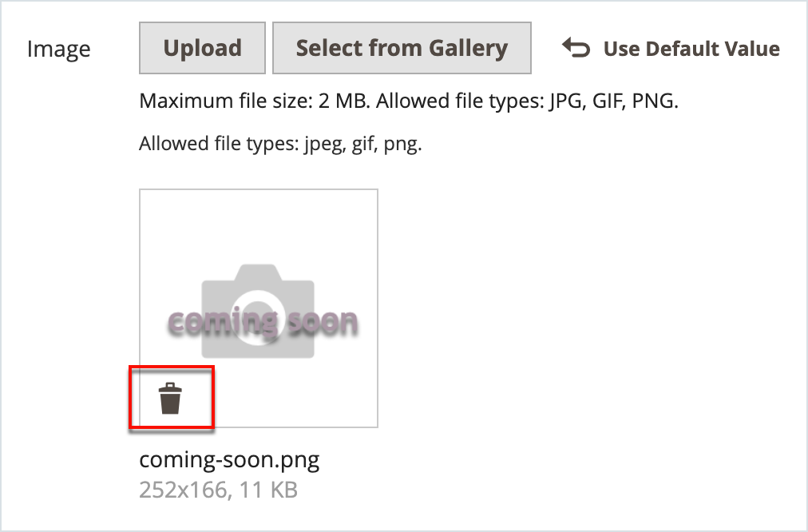

# Manage product images

For each product, you can upload multiple images, rearrange their order images, and control how each image is used. If you have a large quantity of images to manage, you may prefer to import them as a batch, rather than upload each one individually. For more information, see [Importing Product Images](https://docs.magento.com/user-guide/system/data-import-product-images.html).

If you plan to upload large images for viewing on the _Product Details_ page, you may want to consider setting a maximum pixel size (width and height) and automatically resize the files prior to upload. We provide an option to enable automatic resizing of larger image files as you upload. For more information, see [Product image resizing](product-image-config.md#product-image-resizing).

## Update the product images

1. Open the product in edit mode.

1. To work with a specific store view, set the **Store View** chooser in the upper-left corner to the applicable view.

   >[!NOTE]
   >
   >New product images are **_always_** uploaded and visible in **_all_** store views, even if the `All Store Views` scope is not used for upload.   To hide any product image from a specific store view, you must switch to that Store View , select the **Hide from Product Page** checkbox for the image, and click **Save**.

1. Scroll down and expand the _Images and Videos_ section.

### Upload an image

For the best compatibility, it is recommended to upload all product images with the `sRGB` color profile. All other color profiles are automatically converted to the `sRGB` color profile during the product image upload, which could cause color inconsistency in the uploaded image.

The image file name length, including extension, cannot exceed 90 characters.

To upload an image, do one of the following:

- Drag an image from your desktop and drop it on the **camera** ( ) tile in the _Images_ box.

- In the _Images_ box, click the **camera** ( ) tile, select the image file on your computer, and click **Open**.

   <!-- zoom -->

### Rearrange images

To change the order of images in the gallery, click the **Sort** (  ) icon at the bottom of the image tile and  drag the image to a different position in the _Images_ box.

<!-- zoom -->

### Delete an image

To remove an image from the gallery, click the **Delete** (  ) icon in the upper-right corner of the image tile and click **Save**.

### Set image details

Click the image that you want to open in detail view and do any of the following:

   <!-- zoom -->

   To close detail view, click **Close** (  ) in the upper-right corner.

   When complete, click **Save**.

#### Enter alt text

Image Alt text is referenced by screen readers to improve web accessibility and by search engines when indexing the site. Some browsers display the Alt text on mouseover. Alt text can be several words long and include carefully selected key words.

In the _Alt Text_ box, enter a brief description of the image.

#### Assign roles

By default, all roles are assigned to the first image that is uploaded to the product. To reassign a role to another image, do the following:

In the _Role_ box, choose the role that you want to assign to the image.

When you return to the _Images and Videos_ section, the currently assigned roles appear below each image.

<!-- zoom -->

#### Hide an image

To exclude an image from the thumbnail gallery, select the **Hidden** checkbox and click **Save**.

<!-- zoom -->

## Image roles

|Image Role|Description|
|--- |--- |
|Thumbnail|Thumbnail images appear in the thumbnail gallery, shopping cart and in some blocks such as Related Items. Example size: 50 x 50 pixels|
|Small Image|The small image is used for the product images in listings on category and search results pages and to display the product images needed for sections such as for Up-sells, Cross-sells, and the New Products List. Example size: 470 x 470 pixels|
|Base Image|The base image is the main image on the product detail page. Image zoom is activated if you upload an image that is larger image than the image container. Depending on the level of zoom that you want to achieve, the base image should be two or three times the size of the container. Example sizes: 470 x 470 pixels (without Zoom), 1100 x 1100 pixels (with Zoom)|
|Swatch|A [swatch](swatches.md) can be used to illustrate the color, pattern, or texture. Example size: 50 x 50 pixels|

### Watermarks

If you go to the expense of creating your own original product images, there is not much you can do to prevent unscrupulous competitors from stealing them with the click of a mouse. However, you can make them a less attractive target by placing a watermark on each image to identify them as your property. A watermark file can be either a JPG (JPEG), GIF, or PNG image. Both GIF and PNG file types support transparent layers, which can be used to give the watermark a transparent background.

The watermark used for the _small_ image in the following example is a black logo with a transparent background and saved as a PNG file with the following settings:

- Size: 50x50
- Opacity: 5
- Position: Tile

<!-- zoom -->

### Add watermarks to product images

1. On the _Admin_ sidebar, go to **Content** > _Design_ > **Configuration**.

1. Find the store view that you want to configure and click **Edit** in the _Action_ column.

1. Under _Other Settings_, expand  the _Product Image Watermarks_ section.

1. Complete the **Base**, **Thumbnail**, **Small**, and **Swatch Image** image settings as follows.

   The fields in each section are the same.

   - Enter the **Image Opacity** as a percentage. For example: `40`

   - Enter the **Image Size** in pixels. For example: `200 x 200`

   - Click **Upload** and choose the image file that you want to use.

   - Set **Image Position** to determine where the watermark appears.

   <!-- zoom -->
    
   See also [_Product Image Watermarks - Base_](../content-design/configuration.md)

1. When complete, click **Save Config**.

1. When prompted to refresh the cache, click **Cache Management** in the system message and refresh the invalid cache.

   <!-- zoom -->

>[!TIP]
>
>You can click **Use Default Value**  to restore the default value.

### Delete a watermark

1. In the lower-left corner of the image, click the **Delete** (  ) icon.

   <!-- zoom -->

1. Click **Save Config**.

1. When prompted to refresh the cache, click **Cache Management** in the system message and refresh the invalid cache.

   If the watermark image persists in the storefront, return to Cache Management and click **Flush Magento Cache**.
