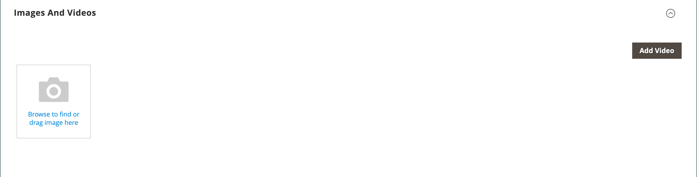
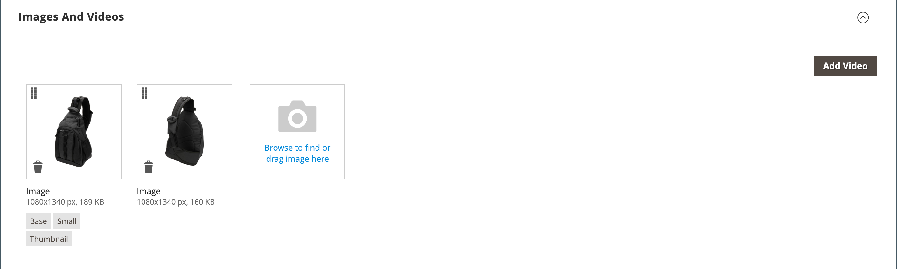
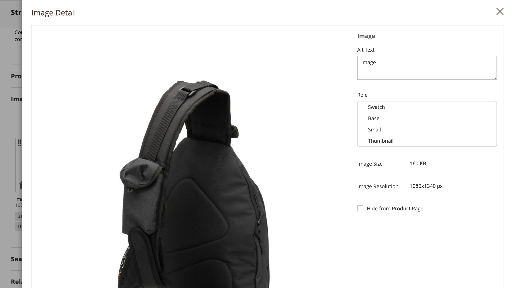

# Product settings - Images and Videos

From the _Images and Videos_ section, you can perform basic image management tasks such as upload multiple images, rearrange the order of images, and control how each image is used. For additional control over individual images, you can open each image in _detail view_. For more information, see [Catalog Images and Video](catalog-images-video.md).

## Upload a new image

1. Open the product in edit mode.

1. Scroll down and expand  the _Images and Videos_ section.

   <!-- zoom -->

1. If you are ready to add a product image, do one of the following:

   - Drag an image from your desktop and drop it on the **camera** () tile.

   - Click the **camera** () tile, select the image file, and click **Open**.

A [placeholder](product-image-config.md#image-placeholders) image appears in the catalog until a product image is available.

## Image Detail

As you add product images, you can customize the display in the  customize the display in the _Image Detail_ window.

<!-- zoom -->

To set image displaying options for a product:

1. Click the product image.

1. Enter the **Alt text**.

1. Choose a **Role** for displaying the image (all roles can be selected for one image):

   - **Swatch**
   - **Base**
   - **Small**
   - **Thumbnail**

   All of these roles are selected for the first added image by default.

   <!-- zoom -->

To hide the product image from the product page, select the **Hide from Product Page** checkbox.
